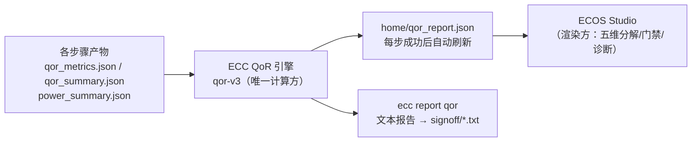

# ECC QoR 参考手册（质量评分 · 可行性门禁 · 证据与诊断）

本文整理 ECC 当前 QoR 方案（**ECC-QoR draft 3**，评分引擎标识 `qor-v3`，报告 `schema_version: 3`），面向使用 ECC CLI 与 ECOS Studio 的工程师：分数怎么算、报告怎么读、参数怎么配、诊断怎么用。全部公式、阈值与默认值均核对自实现源码 [chipcompiler/analysis/qor/](../analysis/qor/)（分支 `yell/qor_v2`，2026-09）。

- 命令用法与安装 → [ECC CLI 用户指南](ecc-user-guide.cn.md)；从零上手 → [入门教程](ecc-tutorial.cn.md)
- 每步工具配置参数 → [ECC Flow 工具配置参考](ecc-config-ref.cn.md)
- 本文不要求 flow 跑完：跑到哪一步，QoR 就评估到哪一步（未执行的步骤按"未验证"处理，见 §2.2）。

## 0. 一图看懂



三条设计原则，理解了它们就读懂了全部输出：

1. **质量 ≠ 可行性 ≠ 证据**（§2）。五个质量分数再高，只要一条物理签核门禁失败，总分恒为 0；证据不全则不给分（NOT_RATED），而不是编造一个分数。
2. **相对基准，跨设计可比**（§3）。布线质量按"相对几何下界（HPWL）的膨胀率"评分，而不是绝对线长阈值——大设计的 50000 µm 布线与小设计的 3000 µm 可以直接比较。
3. **缺数据 = 显式 UNKNOWN**（§2.3）。"测得 0"（如 DRC 违规数为 0，是好消息）与"没测到"（步骤没跑/报告损坏，是未知）严格区分，后者绝不折算成 0 分。

## 1. 快速上手

### 1.1 在哪里看 QoR

| 入口 | 产物 | 刷新时机 |
|---|---|---|
| flow 引擎自动写 | `<workspace>/home/qor_report.json`（机器可读，JSON Schema v3，见 §10） | 每个步骤成功后（含跳过已成功步骤时）自动刷新 |
| `ecc report qor` | `<workspace>/signoff/<design>_qor_report.txt`（人类可读文本报告） | 每次执行都按当前产物现算快照 |
| ECOS Studio | 项目看板 QoR 卡、五维分解、诊断列表 | 读取 `home/qor_report.json`，无报告或陈旧时显示 NOT_RATED（§10.2） |

```bash
ecc report qor --project gcd          # 写 signoff/gcd_qor_report.txt
ecc report qor --plain                # key=value 摘要（脚本可解析）
ecc report qor -o /tmp/qor.txt        # 自定义输出路径
```

`--plain` 摘要字段：`overall_score`（总分或 null）、`qor_status`（GREEN/YELLOW/ORANGE/RED/FAIL/NOT_RATED）、`gate_status`（可行性状态）、`dimensions[]`（各维度 score/state）。

### 1.2 文本报告样例（gcd 参考数值）

```
==============================================================================
  ECC QoR ANALYSIS REPORT - Design: gcd
  Workspace: ~/ecc-demo/gcd/ws_0001
==============================================================================
  FEASIBILITY STATUS : PASS [All 7 Physical Signoff Gates Clean]
  EVIDENCE STATE     : HIGH [Integrity: 100.0%, Coverage: 100.0%, Consistency: 100.0%]
  QoR COMPOSITE      : 99.0 / 100 (Status: GREEN, Profile: balanced)
------------------------------------------------------------------------------
  [PHYSICAL QoR RECORD BREAKDOWN]
    Timing Quality (Q_T)      : 100.0 / 100 [OPPORTUNITY] (WS: +16.622ns, WNS: 0ns)
    Interconnect Quality (Q_I): 100.0 / 100 [PASS] (I_place: 1.213 (INCOMPATIBLE route side), S_cong: 0.00)
    Area Efficiency (Q_A)     : 100.0 / 100 [PASS] (Core Util: 52.0%)
    Power Quality (Q_P)       : — / 100 [UNKNOWN] (No budget declared)
    Robustness (Q_R)          : 94.1 / 100 [PASS] (CTS Imbal: 0.0, PVT Spread: 2.36ns)
------------------------------------------------------------------------------
  [PRIMARY DIAGNOSES]
    (No active feasibility blockers detected)

  [WATCH & OPPORTUNITY DIAGNOSES]
  [OPPORTUNITY] diag.timing.over_provisioned (Severity: 0.79, Confidence: HIGH)
       Timing margin (+16.622ns) exceeds the over-provisioning threshold (4ns); the design appears over-constrained.
------------------------------------------------------------------------------
  [PRIORITIZED INTERVENTION HYPOTHESES]
    1. [Tier 3 (Opportunity)] Intervention hypothesis: downsize drive strengths to recover power and area correlated with the excess margin.
==============================================================================
```

读法：**FEASIBILITY** 是能不能造（§5）；**EVIDENCE** 是数据可不可信（§6）；**QoR COMPOSITE** 是综合分与状态色（§4）；五维 BREAKDOWN 是质量分解（§3）；DIAGNOSES 是确定性问题定位，INTERVENTIONS 是排好序的干预假设（§7）。

## 2. 三层语义：质量、可行性、证据

### 2.1 物理质量 Qphys（五维坐标）

```
Qphys = (Q_T, Q_I, Q_A, Q_P, Q_R)，每维 ∈ [0, 100] 或 null（显式 UNKNOWN）
```

| 维度 | 名称 | 评什么 | 输入 |
|---|---|---|---|
| Q_T | 时序质量 | 有符号最差裕量相对 guardband 的位置 | `sta_setup_wns`（跨 corner 最小值，有符号）、`frequency_max` |
| Q_I | 互连质量 | 布线线长相对 HPWL 几何下界的膨胀率 × 拥塞惩罚 | `place_hpwl`、`place_grwl`、`route_wirelength`、拥塞代理 |
| Q_A | 面积质量 | 已布局 core 利用率落在目标区间的程度 | `core_utilization` |
| Q_P | 功耗质量 | 签核总功耗相对申报预算的剩余比例 | `qor_power_budget_w`、STA 功耗 |
| Q_P 未申报预算时恒为 null | | | |

某维无法评估（步骤没跑到、数据缺失、无预算）时该维为 null 并标 `UNKNOWN`，**不折算为 0**，也不偷偷参与总分（见 §4.2 权重重归一）。

### 2.2 物理可行性 Feasibility（七条签核门禁）

可行性回答"这个版图能不能签核出货"，由 7 条零容忍门禁归约（详见 §5）：

```
PHYSICAL_FAIL（任一门禁 failed）≻ UNKNOWN（证据损坏）≻ NOT_VERIFIED（步骤未执行）≻ PASS
```

- **PHYSICAL_FAIL ⇒ 总分恒为 0**：不可制造的设计不能靠面积/功耗高分掩盖。
- **未验证 ≠ 失败**：某签核步骤没跑成功 → `NOT_VERIFIED`；步骤成功但证据缺失/损坏（如 hold 报告缺失——ECC 的 hold STA 输出是可选的）→ `UNKNOWN`。两者都只是不给分（NOT_RATED），都不是失败。

### 2.3 缺失数据三态

| 状态 | 含义 | 例 |
|---|---|---|
| 测得 0 | 物理量被成功测量且为 0，高置信证据 | `drc_count = 0`、`egr_total = 0` |
| UNKNOWN | 步骤执行了但报告缺失/损坏/不可解析 | qor_metrics.json 缺失 → 相关维度 null |
| NOT_APPLICABLE | 前置步骤被有意省略或结构前提不满足 | 未申报功耗预算的 Q_P；网络群体不兼容时的跨阶段比值 |

## 3. 五维怎么算

以下公式中的默认阈值都是**校准的工程经验值**（CALIBRATED_HEURISTIC / USER_PROJECT_CONSTRAINT），不是物理定律，集中定义在 [calibration.py](../analysis/qor/calibration.py)，当前未开放为用户参数。

### 3.1 Q_T 时序质量

前提：理解 **WS 与 WNS 的区别**（ECC 修正了行业惯用的语义混淆）：

- **WS（Signed Worst Slack，有符号最差裕量）**：关键路径的代数裕量，可正可负（如 +16.622 ns 或 −0.25 ns）。ECC 的 `sta_setup_wns` 指标虽然名字带 "wns"，携带的实际是**有符号 WS**（跨 corner 取最小值，不钳位）。
- **WNS = min(0, WS)**：仅用于门禁与违规诊断，**绝不作为连续质量输入**——钳位后 +5 ps 与 +2 ns 无法区分。

$$
Q_T=\begin{cases}50\cdot\max\!\big(0,\;1-|WS|/\tau_{fail}\big) & WS<0\\[4pt]50+50\cdot\min\!\big(WS/\tau_{gb},\;1\big) & WS\ge 0\end{cases}
$$

- 参数：τ_gb = 0.05·T_clk（guardband）、τ_fail = 0.20·T_clk；T_clk = 1000 / `frequency_max`（MHz→ns）。`frequency_max` 缺失或非法 → Q_T = null。
- 性质：WS = 0 处连续（两侧极限都是 50）；正裕量连续分化（+5 ps≈55 分，guardband 满分 100）；负裕量线性降到 0。
- 维度状态（TimingState）：`WS<0 → FAIL`；`0≤WS<τ_gb → WATCH`；`τ_gb≤WS≤τ_over → PASS`；`WS>τ_over → OPPORTUNITY`（过约束，τ_over = 0.20·T_clk，提示可以缩驱动换面积/功耗）。
- 频率指标 `sta_frequency_mhz` 与 Q_T 解耦，仅作诊断特征展示。

### 3.2 Q_I 互连质量

**膨胀率分解**（相对 HPWL 几何下界；HPWL ≤ RSMT 是可证明的下界）：

$$
I_{total}=\frac{RWL}{HPWL}=\underbrace{\frac{GRWL}{HPWL}}_{I_{place}}\times\underbrace{\frac{RWL}{GRWL}}_{I_{route}}
$$

- `I_place`（全局布线实现开销）：网格离散化、层约束、绕行；
- `I_route`（详细布线膨胀）：引脚接入、换层过孔、DRC 避让；
- 分母为 0/缺失时比值严格为 UNKNOWN，**禁止 ε 填充**（会破坏恒等式）。

**跨阶段兼容性（当前实现的降级路径）**：`I_route`/`I_total` 的分子分母来自不同阶段（place → route），CTS 会在两阶段之间插入时钟树网络。当前工具链没有输出网络级映射，因此：

- CTS 插入了缓冲（或计数未知）→ place→route 判 `INCOMPATIBLE`，`I_route`/`I_total` 严格 UNKNOWN；
- Q_I 退化为按 `I_place`（place 阶段内部，同一网表，`EXACT_COMPATIBLE`）评分，报告中如实标注 `INCOMPATIBLE route side`；
- 待工具链输出网络映射后启用完整 `I_total` 路径（届时同一设计 Q_I 会变化，见 §4.4 示例）。

**评分**（单边单调成本校准 ψ_cost，越接近下界越好、不惩罚接近下界的设计）：

$$
Q_I=100\cdot\psi_{cost}(I;\;\tau_{pref}{=}1.25,\;\tau_{fail}{=}1.75)\cdot\big(1-\min(1,S_{cong})\big)
$$

- I ≤ 1.25 满分；1.25–1.75 线性降到 0；≥ 1.75 为 0（无拥塞时）。
- 拥塞严重度（取最大项归一）：

$$
S_{cong}=\max\Big(\frac{RUDY_{max}}{1.0},\;\frac{EGR_{max}}{20},\;\frac{EGR_{total}}{100}\Big)
$$

- 拥塞项是策略性惩罚：S_cong ≥ 1 时 Q_I 直接归 0。拥塞详情同时在诊断里独立呈现（`diag.place.congestion`，§7）。

### 3.3 Q_A 面积质量

已布局 core 利用率 `core_utilization` 的双侧目标区间校准（欠利用=浪费硅面积，过利用=布通风险）：

$$
Q_A=100\cdot\psi_{target}(U_{core};\;0.45,\;0.70,\;0.85)
$$

- U ∈ [0.45, 0.70] 满分；U < 0.45 按 U/0.45 线性降分；U ∈ (0.70, 0.85] 按 (0.85−U)/0.15 线性降到 0。
- 注意用的是**已布局 core 利用率**，不是布图规划密度（synthesis 面积 / core 面积，后者只是早期可行性指标 `F_PLAN_DENSITY`，不参与评分）。

### 3.4 Q_P 功耗质量

只在显式申报功耗预算时计分（策略性预算消耗评估）：

$$
Q_P=100\cdot\mathrm{clamp}\Big(\frac{P_{budget}-P_{total}}{P_{budget}},\;0,\;1\Big)
$$

| 工作点 | Q_P |
|---|---|
| P_total = 0 | 100.0 |
| P_total = 0.5·P_budget | 50.0 |
| P_total ≥ P_budget | 0.0（钳位） |
| 未申报预算 | null（UNKNOWN，排除出总分） |

- P_total 取**签核 STA** 各 corner 中总功耗（dynamic + leakage，单位 µW）最大者；STA 功耗不可得时回退综合后 post-synthesis STA 功耗估计（报告 `power.source_kind` 标明 `signoff` / `synthesis`）。
- 预算单位是**瓦**：`qor_power_budget_w = 0.5` 即 0.5 W（§8）。

### 3.5 Q_R 鲁棒性质量

结构时钟树不平衡 + 多 corner PVT 离散度，等权聚合：

$$
Q_R=100\cdot\Big(1-\big[0.5\cdot F_{CTS\_IMBAL}+0.5\cdot\min(1,\Delta_{PVT})\big]\Big)
$$

- `F_CTS_BUF_IMBAL = (B_max − B_min) / B_max`（时钟沉端路径缓冲深度不对称，hold 风险代理）；
- Δ_PVT = max(Δ_setup, Δ_hold) / T_clk，其中 Δ 为各 corner WS 的极差（现场从逐 corner `qor_summary.json` 归约）；
- 某贡献量缺失时**权重在可用项中重归一**（只有 PVT 数据 → w_PVT=1.0；两者皆缺 → Q_R = null）。

### 3.6 维度状态映射

质量坐标 → 展示状态（timing 维除外，用 §3.1 的 TimingState）：`≥80 → PASS`；`60–80 → WATCH`；`<60 → FAIL`。

## 4. 总分 Q_summary 与状态色

### 4.1 计算规则

```
Q_summary = 0.0                          若 Feasibility = PHYSICAL_FAIL（否决不变量）
          = null（NOT_RATED）            若 Feasibility ∈ {NOT_VERIFIED, UNKNOWN}
          = null（NOT_RATED）            若 PASS 但没有任何可评估维度
          = Σ(w_d · Q_d) / Σ(w_d)        其余情况——只在"已评估维度"上归一
```

**权重重归一**是本方案的关键语义：Q_P 为 null（无预算）时，其余维度权重按和归一，满分设计照样得 100——不会像旧方案那样因缺功耗数据被封顶在 75 分。

### 4.2 设计意图档案（profile）

四个预置权重档案（`qor_profile` 参数选择，§8）：

| Profile | Q_T | Q_I | Q_A | Q_P | Q_R |
|---|---|---|---|---|---|
| `balanced`（默认） | 0.30 | 0.25 | 0.15 | 0.15 | 0.15 |
| `timing_critical` | 0.45 | 0.20 | 0.10 | 0.10 | 0.15 |
| `low_power` | 0.20 | 0.15 | 0.15 | 0.35 | 0.15 |
| `area_optimized` | 0.20 | 0.25 | 0.35 | 0.10 | 0.10 |

### 4.3 状态色

`GREEN ≥90` / `YELLOW ≥75` / `ORANGE ≥60` / `RED <60`；门禁失败 → `FAIL`（分数 0）；未评级 → `NOT_RATED`（分数 null）。ECOS Studio Home 的 pass/fail 线是 60 分，恰与 RED 边界重合。

### 4.4 完整算例（gcd 参考夹具）

输入：T_clk = 20 ns（frequency_max = 50 MHz）、WS = +16.622 ns、HPWL = 3143.52 µm、GRWL = 3812.00 µm、RWL = 4315.53 µm、U_core = 0.52、B_max = B_min = 4、Δ_setup = 2.358 ns、Δ_hold = 0.174 ns、无功耗预算。

| 维度 | 当前实现（I_place 降级路径） | 完整 I_total 路径（工具链支持后） |
|---|---|---|
| Q_T | WS = 16.622 ≥ τ_gb = 1.0 → **100.0**（OPPORTUNITY） | 同左 |
| Q_I | I_place = 3812/3143.52 = **1.213** ≤ 1.25 → **100.0** | I_total = 4315.53/3143.52 = 1.373 → ψ_cost = (1.75−1.373)/0.5 = 0.754 → **75.4** |
| Q_A | 0.52 ∈ [0.45, 0.70] → **100.0** | 同左 |
| Q_P | 无预算 → **null** | 同左 |
| Q_R | 0.5·0 + 0.5·(2.358/20) = 0.1179 → **94.1** | 同左 |
| 总分 | (0.30+0.25+0.15)·100 + 0.15·94.105，除以 0.85 → **98.96 GREEN** | 77.97/0.85 → **91.7 GREEN** |

## 5. 可行性门禁（7 条）

| 门禁 | 阶段 | 输入指标 | 通过谓词 |
|---|---|---|---|
| GATE_DRC | DRC | `drc_count` | == 0 |
| GATE_LVS | LVS | `lvs_count` | == 0 |
| GATE_SETUP_SLACK | STA | `sta_setup_wns`（WS） | ≥ 0.0 ns |
| GATE_HOLD_SLACK | STA | `sta_hold_wns`（WS） | ≥ 0.0 ns |
| GATE_SETUP_NVP | STA | `sta_setup_violation_count` | == 0 |
| GATE_HOLD_NVP | STA | `sta_hold_violation_count` | == 0 |
| GATE_HARDEN_ARTIFACTS | Harden | `harden_artifact_missing_count` | == 0（GDS/LEF/LIB 齐全） |

要点：

- **RCX 不是门禁**——寄生提取的 corner 覆盖进**证据指数**（§6），提取缺失会压低证据等级或触发 UNKNOWN，但本身不构成物理失败。
- 门禁不可用（`unavailable`）分两种：`not_verified`（该步骤未成功执行）与 `corrupt`（步骤成功但证据缺失/损坏）。前者 → 总体 NOT_VERIFIED，后者 → UNKNOWN，都不是 FAIL。
- 中间步骤的异常（布线中的 DR 违规、布局拥塞溢出）只触发特征级 WATCH/FAIL 诊断，不触发 PHYSICAL_FAIL——只有**最终签核检查**持续失败才算。
- 时序门禁附带完整 slack 视图：`ws_ns`（有符号）、`wns_ns`（钳位）、`tns_ns`、`nvp`、`worst_corner`。

## 6. 证据完整性指数 I_E

```
I_E = 100 × E_integrity × E_coverage × E_consistency（乘性合成，故意保守）
状态：HIGH ≥90 / MODERATE ≥70 / LIMITED ≥50 / INSUFFICIENT <50 / NOT_VERIFIED
```

| 分量 | 公式 | 说明 |
|---|---|---|
| E_integrity | 1 − (解析失败 + 无效 selector) / (已分析步骤 + 解析失败) | 各步 qor_metrics.json 的解析健康度与溯源有效性 |
| E_coverage | STA corner 装载率与 RCX SPEF 覆盖率的均值 | 装载 = 期望 − 缺失；任一域无期望 → 该域不计 |
| E_consistency | C1–C3 通过率（见下） | 语义一致性检查 |

一致性检查：

- **C1**：`RWL ≥ place_hpwl`（网群体兼容时才计，INCOMPATIBLE → 不适用）；
- **C2**：`(WS ≥ 0) ⇔ (NVP = 0)`（同 scope/corner/端点总体时才计，防假扣分）；
- **C3**：`via_count > 0 ⇒ RWL > 0`（单向拓扑健全性）。

补充规则：STA 只输出 setup（无 hold 报告）时，HIGH 降级为 MODERATE。零分母条件一律 NOT_APPLICABLE，不做除零或假满分。

## 7. 诊断与干预假设

诊断是**对观测的确定性分类**（对当前指标确定成立）；干预永远只是**假设**（correlates with，不承诺因果），每条带 `validation_procedure` 要求试跑验证。所有文案使用非因果措辞（"margin was consumed across placement"，不写 "placement caused"）。

严重度闭式计算，Tier 1 恒 ≥ 0.80，严格压过质量瓶颈：

| 诊断类型 | diagnosis_id | 触发 | 严重度 |
|---|---|---|---|
| 签核门禁违规 | `diag.signoff.<gate_id>` | 对应门禁 failed | 0.80 + 0.20·µ（µ 为归一化违规幅度） |
| 质量瓶颈 | `diag.quality.<dimension>` | 维度分 < 80 | (100 − Q_d)/100 |
| 时序过约束 | `diag.timing.over_provisioned` | WS > 0.20·T_clk | (WS − τ_over)/(T_clk − τ_over) |
| 布局拥塞 | `diag.place.congestion` | S_cong > 0 | min(1, S_cong) |

µ 的归一基准：时序类 |WS|/τ_fail；DRC count/100；LVS count/50；Harden missing/3；NVP 无端点总数数据，任意违规取满带（evidence-limited，已知限制）。

干预假设按三层字典序排序输出：

1. **Tier 1（可行性阻断）**：按门禁严重度降序——最严重的物理缺陷排最前；
2. **Tier 2（质量瓶颈）**：按瓶颈严重度降序，先于优化机会；
3. **Tier 3（优化机会）**：过约束裕量的降驱动/缩尺寸建议。

示例干预与参数旋钮（`parameter_knob` 字段）：互连瓶颈 → `route.dr_search_depth`（需试跑重布线验证）；面积 → floorplan 利用率目标；鲁棒性 → CTS 平衡与多 corner skew 目标。

## 8. 用户可配置参数

QoR 读取工作区参数（`<workspace>/home/params.toml` 的 `[params]` 表，flat snake_case）：

| 参数 | 取值 | 作用 | 缺省 |
|---|---|---|---|
| `qor_profile` | `balanced` / `timing_critical` / `low_power` / `area_optimized` | 总分权重档案（§4.2） | `balanced` |
| `qor_power_budget_w` | 正数，单位**瓦**（如 `0.5`） | 申报功耗预算，激活 Q_P（§3.4） | 不声明 → Q_P = null |
| `frequency_max` | 正数，MHz | 目标频率 → T_clk = 1000/frequency_max，Q_T/Q_R 及 guardband 的基准 | 综合已有参数（见 [配置参考](ecc-config-ref.cn.md)） |

设置方式（当前版本，参数为工作区局部）：

```toml
# <workspace>/home/params.toml
[params]
qor_profile = "timing_critical"
qor_power_budget_w = 0.5
```

- 非法值（未知 profile、非正预算）不报错中断：降级为默认并写入报告的 `CONFIG WARNING` 行与 `config_warnings` 字段。
- `qor_profile` / `qor_power_budget_w` 尚未纳入 `ecc param` 已审核参数表与 GUI 参数面板（规划中）；当前直接编辑 `home/params.toml` 后重跑任意一步（或 `ecc report qor`）即可生效。
- 评分阈值（τ_I_pref=1.25 等）当前为引擎常量，未开放配置；如需工艺校准请向工具链维护者反馈。

## 9. 数据来源与指标目录

### 9.1 引擎读什么

| 来源 | 路径 | 用途 |
|---|---|---|
| 逐步指标 | `<step_dir>/analysis/qor_metrics.json`（schema v3，各步 metrics.py 产出，**保持不变**） | 指标值与溯源 |
| 逐 corner 时序 | `sta_ecc/feature/<corner>/Cworst/qor_summary.json` | 有符号 setup/hold WS、TNS、NVP；PVT 离散度 |
| 功耗 | `sta_ecc/feature/<corner>/Cworst/power_summary.json`（回退 `Synthesis_yosys/feature/post_synthesis/power_summary.json`） | P_total |
| 步骤状态 | `home/flow.json` | 只有状态为 `Success` 的步骤参与分析（invalidation 后的陈旧产物不计分） |
| 参数 | `home/params.toml` | profile / 预算 / 频率 |

同一指标 id 被多步产出时按 `project_role` 优选（final > gate > trend），同优先级后写者胜。

### 9.2 引擎消费的指标目录（权威副本见 [metric_registry.py](../analysis/qor/metric_registry.py)）

综合：`synthesis_cell_area`、`synthesis_cell_count`、`synthesis_wire_count`、`synthesis_power_dynamic_uw`、`synthesis_power_leakage_uw`；
布图：`die_area`、`core_area`、`core_utilization`；
布局：`place_hpwl`、`place_grwl`、`place_flute_wirelength`、`place_congestion_egr_overflow_max/total`、`place_rudy_utilization_max`、`place_lutrudy_utilization_max`；
CTS：`cts_buffer_count`、`cts_inverter_count`、`clock_path_max_buffer/min_buffer`、`clock_wirelength`；
布线：`route_wirelength`、`route_via_count`；
RCX：`rcx_spef_file_count`、`rcx_expected/missing_corner_count`、`rcx_spef_parse_failure_count`、`rcx_worst_total/coupling_capacitance_ff`；
STA：`sta_setup/hold_wns`（有符号 WS）、`sta_setup/hold_tns`、`sta_setup/hold_violation_count`、`sta_frequency_mhz`、`sta_corner_count`、`sta_expected/missing_corner_count`、`sta_worst_setup_corner`；
签核：`drc_count`、`lvs_count`、`harden_artifact_missing_count`。

### 9.3 派生特征目录（见 [feature_registry.py](../analysis/qor/feature_registry.py)）

| 特征 | 公式 | 认识论分类 |
|---|---|---|
| F_SYN_LEAK_FRAC | P_leak / (P_dyn + P_leak) | EXACT_TRANSFORMATION |
| F_PLAN_DENSITY | synthesis_cell_area / core_area | DERIVED_ENGINEERING |
| F_PL_I_PLACE | GRWL / HPWL | DERIVED_ENGINEERING |
| F_PL_CONG_CONC | EGR_max / EGR_total | DERIVED_ENGINEERING |
| F_CTS_BUF_IMBAL | (B_max − B_min) / B_max | DERIVED_ENGINEERING |
| F_RT_I_ROUTE | RWL / GRWL | DERIVED_ENGINEERING（需 MAPPED 兼容） |
| F_RT_I_TOTAL | RWL / HPWL | DERIVED_ENGINEERING（需 MAPPED 兼容） |
| F_RT_VIA_DENSITY | via_count / RWL | DERIVED_ENGINEERING |
| F_RCX_CPL_FRAC | C_cpl / C_tot | DERIVED_ENGINEERING |
| F_STA_HEADROOM | WS / T_clk | DERIVED_ENGINEERING |
| F_STA_FREQ_MARGIN | (F_max − F_target) / F_target | DERIVED_ENGINEERING（仅诊断） |
| F_STA_PVT_SETUP/HOLD/MAX_DISP | 各 corner WS 极差 / T_clk | EMPIRICAL_STATISTICAL |
| S_CONG | max(RUDY/1, EGR_max/20, EGR_total/100) | CALIBRATED_HEURISTIC |

每个特征记录携带：值（或 null）、公式串、认识论分类、状态、输入指标 id、溯源工件（path + selector）、兼容性契约、解释文本——从顶层诊断可直接回溯到原始报告 selector。

## 10. JSON 报告契约（home/qor_report.json）

### 10.1 结构（节选，真实字段名）

```json
{
  "schema_version": 3,
  "scoring_engine": "qor-v3",
  "design": "gcd",
  "workspace": "/home/user/ecc-demo/gcd/ws_0001",
  "timestamp": "2026-09-09T12:34:56.789012+00:00",
  "profile": "balanced",
  "tclk_ns": 20.0,
  "feasibility": {
    "status": "PASS",
    "gates": [
      {"id": "GATE_DRC", "stage": "DRC", "state": "passed",
       "predicate": "drc_count == 0", "blocks_tapeout": true,
       "metrics": ["drc_count"], "availability": null, "timing_slack": null},
      {"id": "GATE_SETUP_SLACK", "stage": "STA", "state": "passed",
       "predicate": "sta_setup_wns >= 0.0", "blocks_tapeout": true,
       "metrics": ["sta_setup_wns"], "availability": null,
       "timing_slack": {"ws_ns": 16.622, "wns_ns": 0.0, "tns_ns": 0.0,
                        "nvp": 0, "worst_corner": null}}
    ]
  },
  "evidence": {"index": 100.0, "state": "HIGH",
               "integrity": 1.0, "coverage": 1.0, "consistency": 1.0},
  "qor_record": {
    "timing":       {"key": "timing",       "value": 100.0, "state": "OPPORTUNITY", "features": ["…F_STA_HEADROOM 记录…"]},
    "interconnect": {"key": "interconnect", "value": 100.0, "state": "PASS",        "features": ["…六个特征记录…"]},
    "area":         {"key": "area",         "value": 100.0, "state": "PASS",        "features": ["…F_PLAN_DENSITY…"]},
    "power":        {"key": "power",        "value": null,  "state": "UNKNOWN",     "features": ["…F_SYN_LEAK_FRAC…"]},
    "robustness":   {"key": "robustness",   "value": 94.1,  "state": "PASS",        "features": ["…四个特征记录…"]}
  },
  "scalar_summary": {"score": 98.96, "status": "GREEN", "profile": "balanced",
                     "weights": {"timing": 0.30, "interconnect": 0.25, "area": 0.15,
                                 "power": 0.15, "robustness": 0.15}},
  "diagnoses": ["…§7 结构的诊断记录…"],
  "inflation": {"i_place": 1.2127, "i_route": null, "i_total": null,
                "congestion_severity": 0.0, "compatibility_status": "INCOMPATIBLE"},
  "power": {"total_uw": null, "budget_uw": null, "source_path": null,
            "source_kind": null, "corner": null},
  "flow_steps": {"Synthesis": "Success", "Floorplan": "Success", "place": "Success",
                 "CTS": "Success", "route": "Success", "drc": "Success",
                 "lvs": "Success", "RCX": "Success", "sta": "Success",
                 "Harden": "Success"},
  "config_warnings": []
}
```

字段速查：`feasibility`（门禁）、`evidence`（证据）、`qor_record`（五维 + 特征明细）、`scalar_summary`（总分/状态/权重）、`diagnoses`（诊断 + 干预）、`inflation`（膨胀分解与兼容状态）、`power`（功耗观测与来源）、`flow_steps`（写报告时的步骤状态快照）、`config_warnings`（参数降级告警）。

### 10.2 ECOS Studio 的消费方式（硬切语义）

- Studio **不重复计分**：评分/状态/门禁只认 `home/qor_report.json`（校验 `schema_version: 3` 与 `scoring_engine: "qor-v3"`）。
- **陈旧检测**：报告内 `flow_steps` 快照与当前 `home/flow.json` 不一致（如手改/重跑后报告未刷新）→ 视同无报告，一律 **NOT_RATED**——宁可缺分，不可错分。重跑任意一步即恢复。
- 逐步指标明细、跨 workspace 指标对比、趋势与回归检测仍读各步 `qor_metrics.json`，仅作数据展示，不产生分数。

## 11. 与旧评分方案的区别（迁移说明）

| 维度 | 旧方案（qor-v3 之前） | 当前方案（qor-v3） |
|---|---|---|
| 阈值 | 绝对值（如 route_wirelength fail=6000 µm），只对标 GCD 量级，跨设计不可比 | 相对膨胀率（I = 实际/几何下界），跨设计可比 |
| 缺维 | 权重不归一，缺功耗维时满分只有 75 | 已评估维度权重归一，满分恒 100 |
| 可行性 | 无否决，DRC 失败可被平均分掩盖 | PHYSICAL_FAIL ⇒ 总分 ≡ 0 |
| 正裕量 | slack ≥ 0 一律 100 分 | WS 连续分化 + 过约束识别（OPPORTUNITY） |
| 缺数据 | "没测到"与"测得 0"不可区分 | 三态语义 + null 维度 |
| 时序计权 | WNS/TNS/frequency/NVP 四指标等权重复计 | 一个连续 Q_T；WNS/TNS/NVP 仅门禁与诊断 |
| 实现 | TS(GUI) 与 Python(CLI) 双份移植，阈值表三份 | ECC 单一实现，GUI 渲染报告 |

迁移影响（升级时须知）：

1. **分数刻度与颜色语义变化**：旧 75 分（当时的"满分"）在新刻度下属 YELLOW；GREEN 线从 40 提到 90。对比历史趋势时注意刻度切换点。
2. **存量 workspace 置空**：升级前完成、没有 `qor_report.json` 的 workspace 显示 NOT_RATED，**重跑任意一步（或整体重跑）即恢复评分**。
3. 报告字段 `scoring_engine: "qor-v3"` 可用于程序化辨识新评分。

## 12. 常见问题

**Q：分数是 NOT_RATED / 显示 "—"，为什么？**
任一情形：无 `home/qor_report.json`（升级前完成的旧 workspace）；报告陈旧（`flow_steps` 与 flow.json 不一致）；可行性为 NOT_VERIFIED（某门禁依赖的步骤没跑成功）/ UNKNOWN（步骤成功但证据缺失或损坏，如 hold 报告缺失——ECC 的 hold STA 输出是可选的）；所有维度都不可评估。重跑相关步骤（补出对应证据）即可闭合。

**Q：维度分都不低，总分却是 0 / FAIL？**
可行性否决：七条门禁有任一 failed（最常见是 setup/hold slack < 0 或 DRC/LVS 计数非 0）。看报告 `PRIMARY DIAGNOSES` 的 Tier 1 项。

**Q：Q_P 为什么是 "— / UNKNOWN"？**
没有申报功耗预算。在 `home/params.toml` 的 `[params]` 加 `qor_power_budget_w = <瓦>` 并重跑。

**Q：Q_I 显示 "I_place …（INCOMPATIBLE route side）" 是什么意思？**
当前工具链在 CTS 后没有网络级映射，place→route 线长比值按规范判不兼容、严格 UNKNOWN；Q_I 退化为 place 阶段内部的 I_place 评分（§3.2）。这不是错误，是保守降级。

**Q：时序 100 分但状态是 OPPORTUNITY，需要处理吗？**
WS 超过 0.20·T_clk 的过约束提示：设计可能过度缓冲，可尝试缩驱动强度回收面积/漏功（见干预假设 Tier 3）。是否行动取决于项目余量策略。

**Q：WS 和 WNS 到底哪个是真的？**
两个都是真的：`ws_ns` 是有符号最差裕量（连续质量与裕量分析用）；`wns_ns = min(0, ws_ns)` 是钳位负裕量（门禁与违规幅度用）。ECC 指标名 `sta_setup_wns` 历史上借用 wns 缩写，携带的是有符号值。

**Q：阈值（1.25/1.75、0.45/0.70 等）能改吗？**
当前是引擎常量（calibration.py），未开放为用户参数。它们是校准的工程默认值，随版本演进可能调整；对特定工艺的校准需求请反馈给工具链维护者。

**Q：`ecc report qor` 和 `home/qor_report.json` 数值会不一致吗？**
正常不会：报告每步成功后自动刷新，CLI 每次现算。若你手改了产物文件或正在并发跑 flow，两者可能短暂不一致；flow 走完后以重跑的 `ecc report qor` 为准。
