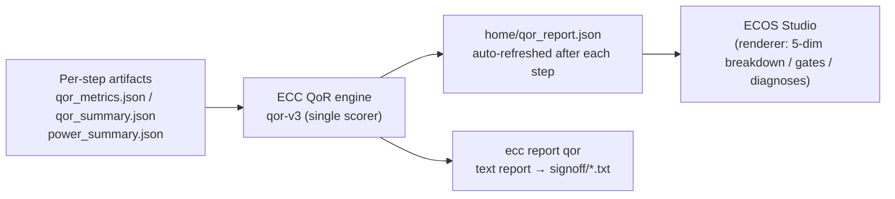

# ECC QoR Reference (Quality Scoring · Feasibility Gates · Evidence & Diagnosis)

This manual documents ECC's current QoR scheme (**ECC-QoR draft 3**, scoring engine id `qor-v3`, report `schema_version: 3`) for engineers using the ECC CLI and ECOS Studio: how scores are computed, how to read the report, which parameters apply, and how to use the diagnoses. All formulas, thresholds, and defaults were verified against the implementation in [chipcompiler/analysis/qor/](../analysis/qor/) (branch `yell/qor_v2`, 2026-09).

- Command usage and installation → [ECC CLI User Guide](ecc-user-guide.en.md); first run from zero → [Tutorial](ecc-tutorial.en.md)
- Per-step tool configuration → [ECC Flow Tool Configuration Reference](ecc-config-ref.en.md)
- The flow does not have to be complete: QoR evaluates whatever stages have run (unexecuted stages are treated as "not verified", see §2.2).

## 0. The Big Picture



Three design principles explain every line of the output:

1. **Quality ≠ Feasibility ≠ Evidence** (§2). However high the five quality scores are, a single failed physical signoff gate pins the composite to 0; incomplete evidence yields no score at all (NOT_RATED) rather than a fabricated number.
2. **Relative baselines, comparable across designs** (§3). Interconnect quality is scored as inflation relative to the HPWL geometric lower bound — not against absolute wirelength thresholds — so a 50,000 µm route on a large design compares directly with a 3,000 µm route on a small one.
3. **Missing data is explicitly UNKNOWN** (§2.3). "Measured zero" (e.g., DRC count = 0 — good news) and "not measured" (stage skipped / report corrupt — unknown) are strictly distinguished; the latter never becomes a zero score.

## 1. Quick Start

### 1.1 Where to see QoR

| Entry point | Artifact | Refresh |
|---|---|---|
| Flow engine (automatic) | `<workspace>/home/qor_report.json` (machine-readable, JSON Schema v3, see §10) | After every successful step (including skips of already-succeeded steps) |
| `ecc report qor` | `<workspace>/signoff/<design>_qor_report.txt` (human-readable text report) | Rebuilt from current artifacts on every invocation |
| ECOS Studio | Project dashboard QoR card, 5-dimension breakdown, diagnosis list | Reads `home/qor_report.json`; missing or stale → NOT_RATED (§10.2) |

```bash
ecc report qor --project gcd          # writes signoff/gcd_qor_report.txt
ecc report qor --plain                # key=value summary (script-friendly)
ecc report qor -o /tmp/qor.txt        # custom output path
```

`--plain` summary fields: `overall_score` (composite or null), `qor_status` (GREEN/YELLOW/ORANGE/RED/FAIL/NOT_RATED), `gate_status` (feasibility status), `dimensions[]` (per-dimension score/state).

### 1.2 Text report sample (gcd reference numbers)

```
==============================================================================
  ECC QoR ANALYSIS REPORT - Design: gcd
  Workspace: ~/ecc-demo/gcd/ws_0001
==============================================================================
  FEASIBILITY STATUS : PASS [All 7 Physical Signoff Gates Clean]
  EVIDENCE STATE     : HIGH [Integrity: 100.0%, Coverage: 100.0%, Consistency: 100.0%]
  QoR COMPOSITE      : 99.0 / 100 (Status: GREEN, Profile: balanced)
------------------------------------------------------------------------------
  [PHYSICAL QoR RECORD BREAKDOWN]
    Timing Quality (Q_T)      : 100.0 / 100 [OPPORTUNITY] (WS: +16.622ns, WNS: 0ns)
    Interconnect Quality (Q_I): 100.0 / 100 [PASS] (I_place: 1.213 (INCOMPATIBLE route side), S_cong: 0.00)
    Area Efficiency (Q_A)     : 100.0 / 100 [PASS] (Core Util: 52.0%)
    Power Quality (Q_P)       : — / 100 [UNKNOWN] (No budget declared)
    Robustness (Q_R)          : 94.1 / 100 [PASS] (CTS Imbal: 0.0, PVT Spread: 2.36ns)
------------------------------------------------------------------------------
  [PRIMARY DIAGNOSES]
    (No active feasibility blockers detected)

  [WATCH & OPPORTUNITY DIAGNOSES]
  [OPPORTUNITY] diag.timing.over_provisioned (Severity: 0.79, Confidence: HIGH)
       Timing margin (+16.622ns) exceeds the over-provisioning threshold (4ns); the design appears over-constrained.
------------------------------------------------------------------------------
  [PRIORITIZED INTERVENTION HYPOTHESES]
    1. [Tier 3 (Opportunity)] Intervention hypothesis: downsize drive strengths to recover power and area correlated with the excess margin.
==============================================================================
```

How to read it: **FEASIBILITY** answers "can it be manufactured" (§5); **EVIDENCE** answers "can the data be trusted" (§6); **QoR COMPOSITE** is the profile-weighted score and status color (§4); the BREAKDOWN is the quality decomposition (§3); DIAGNOSES are deterministic observations and INTERVENTIONS are prioritized hypotheses (§7).

## 2. Three Semantic Layers: Quality, Feasibility, Evidence

### 2.1 Physical Quality Qphys (five coordinates)

```
Qphys = (Q_T, Q_I, Q_A, Q_P, Q_R), each ∈ [0, 100] or null (explicit UNKNOWN)
```

| Dimension | Name | What it evaluates | Inputs |
|---|---|---|---|
| Q_T | Timing quality | Position of the signed worst slack relative to the guardband | `sta_setup_wns` (cross-corner minimum, signed), `frequency_max` |
| Q_I | Interconnect quality | Wirelength inflation over the HPWL geometric lower bound × congestion penalty | `place_hpwl`, `place_grwl`, `route_wirelength`, congestion proxies |
| Q_A | Area quality | Placed core utilization within its target interval | `core_utilization` |
| Q_P | Power quality | Remaining fraction of the declared power budget | `qor_power_budget_w`, STA power |
| Q_P is null whenever no budget is declared | | | |

When a dimension cannot be evaluated (stage not run, data missing, no budget) it is null with state `UNKNOWN` — **never folded into a zero** — and it silently drops out of the composite via weight re-normalization (§4.1).

### 2.2 Physical Feasibility (seven signoff gates)

Feasibility answers "can this layout be signed off", reduced from seven zero-tolerance gates (details in §5):

```
PHYSICAL_FAIL (any gate failed) ≻ UNKNOWN (corrupt evidence) ≻ NOT_VERIFIED (stage not executed) ≻ PASS
```

- **PHYSICAL_FAIL ⇒ composite is pinned to 0**: excellent area or power can never mask an unmanufacturable chip.
- **Unverified ≠ failed**: a signoff stage that did not run successfully → `NOT_VERIFIED`; a stage that ran but whose evidence is missing or corrupt (e.g., no hold report — ECC's hold STA output is optional) → `UNKNOWN`. Both merely withhold the score (NOT_RATED); neither is a failure.

### 2.3 Missing-data trichotomy

| State | Meaning | Example |
|---|---|---|
| Measured zero | The quantity was measured and equals zero — high-confidence evidence | `drc_count = 0`, `egr_total = 0` |
| UNKNOWN | The stage ran but its report is missing/corrupt/unparseable | missing qor_metrics.json → affected dimensions null |
| NOT_APPLICABLE | A prerequisite stage was intentionally omitted or a structural precondition fails | Q_P with no budget; cross-stage ratios with incompatible net populations |

## 3. How Each Dimension Is Computed

The default thresholds below are **calibrated engineering values** (CALIBRATED_HEURISTIC / USER_PROJECT_CONSTRAINT), not physical laws. They are centrally defined in [calibration.py](../analysis/qor/calibration.py) and are not user-facing parameters today.

### 3.1 Q_T — Timing Quality

Prerequisite: understand **WS vs. WNS** (ECC corrects a long-standing industry naming confusion):

- **WS (Signed Worst Slack)**: the algebraic slack of the critical path, positive or negative (e.g., +16.622 ns or −0.25 ns). Although ECC's metric id `sta_setup_wns` carries the "wns" suffix, its runtime value is the **signed WS** (cross-corner minimum, never clamped).
- **WNS = min(0, WS)**: used only for gating and violation diagnostics, **never as a continuous quality input** — after clamping, +5 ps and +2 ns are indistinguishable.

$$
Q_T=\begin{cases}50\cdot\max\!\big(0,\;1-|WS|/\tau_{fail}\big) & WS<0\\[4pt]50+50\cdot\min\!\big(WS/\tau_{gb},\;1\big) & WS\ge 0\end{cases}
$$

- Parameters: τ_gb = 0.05·T_clk (guardband) and τ_fail = 0.20·T_clk; T_clk = 1000 / `frequency_max` (MHz→ns). Missing/invalid `frequency_max` → Q_T = null.
- Properties: continuous at WS = 0 (both one-sided limits are 50); positive margins are continuously differentiated (+5 ps ≈ 55, full 100 at the guardband); negative margins decay linearly to 0.
- Dimension state (TimingState): `WS<0 → FAIL`; `0≤WS<τ_gb → WATCH`; `τ_gb≤WS≤τ_over → PASS`; `WS>τ_over → OPPORTUNITY` (over-constrained; τ_over = 0.20·T_clk — a hint to trade margin for area/power).
- The frequency metric `sta_frequency_mhz` is decoupled from Q_T and appears only as a diagnostic feature.

### 3.2 Q_I — Interconnect Quality

**Inflation decomposition** (relative to the HPWL geometric lower bound; HPWL ≤ RSMT is a proven bound):

$$
I_{total}=\frac{RWL}{HPWL}=\underbrace{\frac{GRWL}{HPWL}}_{I_{place}}\times\underbrace{\frac{RWL}{GRWL}}_{I_{route}}
$$

- `I_place` (global-routing realization overhead): grid discretization, layer constraints, detours;
- `I_route` (detailed-routing inflation): pin access, via transitions, DRC avoidance;
- With a zero/missing denominator the ratio is strictly UNKNOWN — **epsilon padding is prohibited** (it would break the algebraic identity).

**Cross-stage compatibility (current degraded path)**: `I_route`/`I_total` divide quantities from different stages (place → route), and CTS inserts clock-tree nets between them. The toolchain does not yet emit a net-level mapping, therefore:

- CTS inserted buffers (or its counts are unknown) → place→route is `INCOMPATIBLE` and `I_route`/`I_total` are strictly UNKNOWN;
- Q_I degrades to scoring `I_place` (intra-placement, one netlist, `EXACT_COMPATIBLE`), and the report states `INCOMPATIBLE route side` explicitly;
- Once the toolchain emits net mappings, the full `I_total` path activates (the same design's Q_I will then change — see the worked example in §4.4).

**Scoring** (one-sided monotone cost calibration ψ_cost — closer to the bound is better; approaching the bound is never penalized):

$$
Q_I=100\cdot\psi_{cost}(I;\;\tau_{pref}{=}1.25,\;\tau_{fail}{=}1.75)\cdot\big(1-\min(1,S_{cong})\big)
$$

- I ≤ 1.25 scores full marks; 1.25–1.75 decays linearly to 0; ≥ 1.75 is 0 (without congestion).
- Congestion severity (max of normalized terms):

$$
S_{cong}=\max\Big(\frac{RUDY_{max}}{1.0},\;\frac{EGR_{max}}{20},\;\frac{EGR_{total}}{100}\Big)
$$

- The congestion factor is a policy penalty: S_cong ≥ 1 drives Q_I to 0. Congestion detail is also surfaced independently as a diagnosis (`diag.place.congestion`, §7).

### 3.3 Q_A — Area Quality

Two-sided target-interval calibration of the placed core utilization `core_utilization` (under-utilization wastes silicon; over-utilization risks routability):

$$
Q_A=100\cdot\psi_{target}(U_{core};\;0.45,\;0.70,\;0.85)
$$

- U ∈ [0.45, 0.70] scores full marks; U < 0.45 decays as U/0.45; U ∈ (0.70, 0.85] decays as (0.85−U)/0.15 to 0.
- Note this is the **placed** core utilization, not the planning density (synthesis area / core area — that is an early indicator `F_PLAN_DENSITY` and is never scored).

### 3.4 Q_P — Power Quality

Scored only when a power budget is explicitly declared (policy-level budget-consumption assessment):

$$
Q_P=100\cdot\mathrm{clamp}\Big(\frac{P_{budget}-P_{total}}{P_{budget}},\;0,\;1\Big)
$$

| Operating point | Q_P |
|---|---|
| P_total = 0 | 100.0 |
| P_total = 0.5·P_budget | 50.0 |
| P_total ≥ P_budget | 0.0 (clamped) |
| No budget declared | null (UNKNOWN, excluded from the composite) |

- P_total is the **worst (maximum) total signoff power** across STA corners (dynamic + leakage, µW); when signoff power is unavailable it falls back to the post-synthesis STA estimate (the report's `power.source_kind` says `signoff` / `synthesis`).
- The budget unit is **watts**: `qor_power_budget_w = 0.5` means 0.5 W (§8).

### 3.5 Q_R — Robustness Quality

Structural clock-tree imbalance + multi-corner PVT dispersion, equal weights:

$$
Q_R=100\cdot\Big(1-\big[0.5\cdot F_{CTS\_IMBAL}+0.5\cdot\min(1,\Delta_{PVT})\big]\Big)
$$

- `F_CTS_BUF_IMBAL = (B_max − B_min) / B_max` (clock sink path buffer-depth asymmetry; hold-risk proxy);
- Δ_PVT = max(Δ_setup, Δ_hold) / T_clk, where Δ is the cross-corner range of WS (reduced on the fly from the per-corner `qor_summary.json` files);
- Missing contributors **re-normalize over the available ones** (PVT only → w_PVT = 1.0; neither → Q_R = null).

### 3.6 Dimension state mapping

Quality coordinate → display state (timing excepted; it uses the TimingState of §3.1): `≥80 → PASS`; `60–80 → WATCH`; `<60 → FAIL`.

## 4. Composite Q_summary and Status Colors

### 4.1 Rules

```
Q_summary = 0.0                          if Feasibility = PHYSICAL_FAIL (veto invariant)
          = null (NOT_RATED)             if Feasibility ∈ {NOT_VERIFIED, UNKNOWN}
          = null (NOT_RATED)             if PASS but no dimension is evaluable
          = Σ(w_d · Q_d) / Σ(w_d)        otherwise — normalized over evaluated dimensions only
```

**Weight re-normalization** is the key semantic: when Q_P is null (no budget), the remaining weights re-normalize so a perfect design still scores 100 — unlike the legacy scheme, where a missing power dimension silently capped the score at 75.

### 4.2 Design-intent profiles

Four preset weight profiles (selected with the `qor_profile` parameter, §8):

| Profile | Q_T | Q_I | Q_A | Q_P | Q_R |
|---|---|---|---|---|---|
| `balanced` (default) | 0.30 | 0.25 | 0.15 | 0.15 | 0.15 |
| `timing_critical` | 0.45 | 0.20 | 0.10 | 0.10 | 0.15 |
| `low_power` | 0.20 | 0.15 | 0.15 | 0.35 | 0.15 |
| `area_optimized` | 0.20 | 0.25 | 0.35 | 0.10 | 0.10 |

### 4.3 Status colors

`GREEN ≥90` / `YELLOW ≥75` / `ORANGE ≥60` / `RED <60`; a failed gate → `FAIL` (score 0); unevaluated → `NOT_RATED` (score null). ECOS Studio's Home pass/fail line is 60, coinciding exactly with the RED boundary.

### 4.4 Worked example (gcd reference fixture)

Inputs: T_clk = 20 ns (frequency_max = 50 MHz), WS = +16.622 ns, HPWL = 3143.52 µm, GRWL = 3812.00 µm, RWL = 4315.53 µm, U_core = 0.52, B_max = B_min = 4, Δ_setup = 2.358 ns, Δ_hold = 0.174 ns, no power budget.

| Dimension | Current implementation (I_place degraded path) | Full I_total path (once the toolchain supports it) |
|---|---|---|
| Q_T | WS = 16.622 ≥ τ_gb = 1.0 → **100.0** (OPPORTUNITY) | same |
| Q_I | I_place = 3812/3143.52 = **1.213** ≤ 1.25 → **100.0** | I_total = 4315.53/3143.52 = 1.373 → ψ_cost = (1.75−1.373)/0.5 = 0.754 → **75.4** |
| Q_A | 0.52 ∈ [0.45, 0.70] → **100.0** | same |
| Q_P | no budget → **null** | same |
| Q_R | 0.5·0 + 0.5·(2.358/20) = 0.1179 → **94.1** | same |
| Composite | (0.30+0.25+0.15)·100 + 0.15·94.105 over 0.85 → **98.96 GREEN** | 77.97/0.85 → **91.7 GREEN** |

## 5. Feasibility Gates (7)

| Gate | Stage | Input metric | Pass predicate |
|---|---|---|---|
| GATE_DRC | DRC | `drc_count` | == 0 |
| GATE_LVS | LVS | `lvs_count` | == 0 |
| GATE_SETUP_SLACK | STA | `sta_setup_wns` (WS) | ≥ 0.0 ns |
| GATE_HOLD_SLACK | STA | `sta_hold_wns` (WS) | ≥ 0.0 ns |
| GATE_SETUP_NVP | STA | `sta_setup_violation_count` | == 0 |
| GATE_HOLD_NVP | STA | `sta_hold_violation_count` | == 0 |
| GATE_HARDEN_ARTIFACTS | Harden | `harden_artifact_missing_count` | == 0 (GDS/LEF/LIB present) |

Key points:

- **RCX is not a gate** — parasitic-extraction corner coverage feeds the **evidence index** (§6): missing extraction lowers the evidence grade or triggers UNKNOWN, but it is not by itself a physical failure.
- An unavailable gate comes in two flavors: `not_verified` (the stage did not complete successfully) and `corrupt` (the stage succeeded but its evidence is missing/corrupt). The former → overall NOT_VERIFIED; the latter → UNKNOWN. Neither is FAIL.
- Intermediate-stage anomalies (detailed-routing violations, placement congestion overflow) only trigger feature-level WATCH/FAIL diagnoses — only **final signoff checks** that persist trigger PHYSICAL_FAIL.
- Timing gates carry a full slack view: `ws_ns` (signed), `wns_ns` (clamped), `tns_ns`, `nvp`, `worst_corner`.

## 6. Evidence Completeness Index I_E

```
I_E = 100 × E_integrity × E_coverage × E_consistency (multiplicative, deliberately conservative)
States: HIGH ≥90 / MODERATE ≥70 / LIMITED ≥50 / INSUFFICIENT <50 / NOT_VERIFIED
```

| Component | Formula | Meaning |
|---|---|---|
| E_integrity | 1 − (parse failures + invalid selectors) / (analyzed steps + parse failures) | Parse health and provenance validity of the per-step qor_metrics.json |
| E_coverage | mean of the STA corner load ratio and the RCX SPEF coverage ratio | loaded = expected − missing; a domain with no expectation is skipped |
| E_consistency | pass rate of C1–C3 below | Semantic consistency checks |

Consistency checks:

- **C1**: `RWL ≥ place_hpwl` (counted only under compatible net populations; INCOMPATIBLE → not applicable);
- **C2**: `(WS ≥ 0) ⇔ (NVP = 0)` (counted only under identical scope/corner/endpoint population, preventing false penalties);
- **C3**: `via_count > 0 ⇒ RWL > 0` (one-way topological sanity).

Additional rule: STA with setup-only output (no hold report) is downgraded from HIGH to MODERATE. Zero-denominator conditions are uniformly NOT_APPLICABLE — no division by zero, no fake perfect score.

## 7. Diagnoses and Intervention Hypotheses

A diagnosis is a **deterministic classification of observations** (it holds with certainty for the current metrics); an intervention is always only a **hypothesis** ("correlates with", never a causal promise), each carrying a `validation_procedure` that demands a trial run. All wording is non-causal ("margin was consumed across placement", never "placement caused").

Severities are closed-form; Tier 1 is always ≥ 0.80, strictly outranking quality bottlenecks:

| Diagnosis type | diagnosis_id | Trigger | Severity |
|---|---|---|---|
| Signoff gate violation | `diag.signoff.<gate_id>` | corresponding gate failed | 0.80 + 0.20·µ (µ = normalized violation magnitude) |
| Quality bottleneck | `diag.quality.<dimension>` | dimension score < 80 | (100 − Q_d)/100 |
| Timing over-provisioning | `diag.timing.over_provisioned` | WS > 0.20·T_clk | (WS − τ_over)/(T_clk − τ_over) |
| Placement congestion | `diag.place.congestion` | S_cong > 0 | min(1, S_cong) |

Normalization bases for µ: timing |WS|/τ_fail; DRC count/100; LVS count/50; Harden missing/3; NVP has no endpoint population in the artifacts, so any violation takes the full band (a known evidence-limited simplification).

Intervention hypotheses are ordered by a three-tier lexicographic policy:

1. **Tier 1 (feasibility blockers)**: descending gate severity — the most severe physical defect first;
2. **Tier 2 (quality limiters/bottlenecks)**: descending bottleneck severity, ahead of optimization opportunities;
3. **Tier 3 (optimization opportunities)**: downsizing suggestions for over-provisioned margins.

Example interventions and parameter knobs (the `parameter_knob` field): interconnect bottleneck → `route.dr_search_depth` (requires a trial reroute); area → floorplan utilization targets; robustness → CTS balancing and multi-corner skew targets.

## 8. User-Configurable Parameters

QoR reads workspace parameters (the `[params]` table of `<workspace>/home/params.toml`, flat snake_case):

| Parameter | Values | Effect | Default |
|---|---|---|---|
| `qor_profile` | `balanced` / `timing_critical` / `low_power` / `area_optimized` | composite weight profile (§4.2) | `balanced` |
| `qor_power_budget_w` | positive number, **watts** (e.g., `0.5`) | declares the power budget, activating Q_P (§3.4) | undeclared → Q_P = null |
| `frequency_max` | positive, MHz | target frequency → T_clk = 1000/frequency_max, the basis for Q_T/Q_R and the guardbands | existing synthesis parameter (see the [configuration reference](ecc-config-ref.en.md)) |

How to set them (current version; the parameters are workspace-local):

```toml
# <workspace>/home/params.toml
[params]
qor_profile = "timing_critical"
qor_power_budget_w = 0.5
```

- Invalid values (unknown profile, non-positive budget) do not abort: they degrade to the default and are surfaced as `CONFIG WARNING` lines in the report and in the `config_warnings` field.
- `qor_profile` / `qor_power_budget_w` are not yet part of the reviewed `ecc param` vocabulary or the GUI parameter panel (planned); for now edit `home/params.toml` and rerun any step (or run `ecc report qor`) to apply.
- Scoring thresholds (τ_I_pref = 1.25 etc.) are engine constants, not configurable; contact the toolchain maintainers for technology-specific calibration.

## 9. Data Sources and Metric Catalog

### 9.1 What the engine reads

| Source | Path | Purpose |
|---|---|---|
| Per-step metrics | `<step_dir>/analysis/qor_metrics.json` (schema v3, emitted by each step's metrics.py — **unchanged**) | metric values and provenance |
| Per-corner timing | `sta_ecc/feature/<corner>/Cworst/qor_summary.json` | signed setup/hold WS, TNS, NVP; PVT dispersion |
| Power | `sta_ecc/feature/<corner>/Cworst/power_summary.json` (falls back to `Synthesis_yosys/feature/post_synthesis/power_summary.json`) | P_total |
| Step states | `home/flow.json` | only steps whose state is `Success` are analyzed (stale artifacts after invalidation never score) |
| Parameters | `home/params.toml` | profile / budget / frequency |

When several steps emit the same metric id, selection prefers `project_role` (final > gate > trend) and, at equal priority, the later step wins.

### 9.2 Metric catalog consumed by the engine (authoritative copy in [metric_registry.py](../analysis/qor/metric_registry.py))

Synthesis: `synthesis_cell_area`, `synthesis_cell_count`, `synthesis_wire_count`, `synthesis_power_dynamic_uw`, `synthesis_power_leakage_uw`;
Floorplan: `die_area`, `core_area`, `core_utilization`;
Placement: `place_hpwl`, `place_grwl`, `place_flute_wirelength`, `place_congestion_egr_overflow_max/total`, `place_rudy_utilization_max`, `place_lutrudy_utilization_max`;
CTS: `cts_buffer_count`, `cts_inverter_count`, `clock_path_max_buffer/min_buffer`, `clock_wirelength`;
Routing: `route_wirelength`, `route_via_count`;
RCX: `rcx_spef_file_count`, `rcx_expected/missing_corner_count`, `rcx_spef_parse_failure_count`, `rcx_worst_total/coupling_capacitance_ff`;
STA: `sta_setup/hold_wns` (signed WS), `sta_setup/hold_tns`, `sta_setup/hold_violation_count`, `sta_frequency_mhz`, `sta_corner_count`, `sta_expected/missing_corner_count`, `sta_worst_setup_corner`;
Signoff: `drc_count`, `lvs_count`, `harden_artifact_missing_count`.

### 9.3 Derived feature catalog (see [feature_registry.py](../analysis/qor/feature_registry.py))

| Feature | Formula | Epistemic class |
|---|---|---|
| F_SYN_LEAK_FRAC | P_leak / (P_dyn + P_leak) | EXACT_TRANSFORMATION |
| F_PLAN_DENSITY | synthesis_cell_area / core_area | DERIVED_ENGINEERING |
| F_PL_I_PLACE | GRWL / HPWL | DERIVED_ENGINEERING |
| F_PL_CONG_CONC | EGR_max / EGR_total | DERIVED_ENGINEERING |
| F_CTS_BUF_IMBAL | (B_max − B_min) / B_max | DERIVED_ENGINEERING |
| F_RT_I_ROUTE | RWL / GRWL | DERIVED_ENGINEERING (requires MAPPED compatibility) |
| F_RT_I_TOTAL | RWL / HPWL | DERIVED_ENGINEERING (requires MAPPED compatibility) |
| F_RT_VIA_DENSITY | via_count / RWL | DERIVED_ENGINEERING |
| F_RCX_CPL_FRAC | C_cpl / C_tot | DERIVED_ENGINEERING |
| F_STA_HEADROOM | WS / T_clk | DERIVED_ENGINEERING |
| F_STA_FREQ_MARGIN | (F_max − F_target) / F_target | DERIVED_ENGINEERING (diagnostic only) |
| F_STA_PVT_SETUP/HOLD/MAX_DISP | cross-corner WS range / T_clk | EMPIRICAL_STATISTICAL |
| S_CONG | max(RUDY/1, EGR_max/20, EGR_total/100) | CALIBRATED_HEURISTIC |

Every feature record carries: value (or null), formula string, epistemic class, state, input metric ids, provenance artifacts (path + selector), the compatibility contract, and an interpretation — top-level diagnoses trace all the way back to raw report selectors.

## 10. JSON Report Contract (home/qor_report.json)

### 10.1 Structure (abridged; real field names)

```json
{
  "schema_version": 3,
  "scoring_engine": "qor-v3",
  "design": "gcd",
  "workspace": "/home/user/ecc-demo/gcd/ws_0001",
  "timestamp": "2026-09-09T12:34:56.789012+00:00",
  "profile": "balanced",
  "tclk_ns": 20.0,
  "feasibility": {
    "status": "PASS",
    "gates": [
      {"id": "GATE_DRC", "stage": "DRC", "state": "passed",
       "predicate": "drc_count == 0", "blocks_tapeout": true,
       "metrics": ["drc_count"], "availability": null, "timing_slack": null},
      {"id": "GATE_SETUP_SLACK", "stage": "STA", "state": "passed",
       "predicate": "sta_setup_wns >= 0.0", "blocks_tapeout": true,
       "metrics": ["sta_setup_wns"], "availability": null,
       "timing_slack": {"ws_ns": 16.622, "wns_ns": 0.0, "tns_ns": 0.0,
                        "nvp": 0, "worst_corner": null}}
    ]
  },
  "evidence": {"index": 100.0, "state": "HIGH",
               "integrity": 1.0, "coverage": 1.0, "consistency": 1.0},
  "qor_record": {
    "timing":       {"key": "timing",       "value": 100.0, "state": "OPPORTUNITY", "features": ["…F_STA_HEADROOM record…"]},
    "interconnect": {"key": "interconnect", "value": 100.0, "state": "PASS",        "features": ["…six feature records…"]},
    "area":         {"key": "area",         "value": 100.0, "state": "PASS",        "features": ["…F_PLAN_DENSITY…"]},
    "power":        {"key": "power",        "value": null,  "state": "UNKNOWN",     "features": ["…F_SYN_LEAK_FRAC…"]},
    "robustness":   {"key": "robustness",   "value": 94.1,  "state": "PASS",        "features": ["…four feature records…"]}
  },
  "scalar_summary": {"score": 98.96, "status": "GREEN", "profile": "balanced",
                     "weights": {"timing": 0.30, "interconnect": 0.25, "area": 0.15,
                                 "power": 0.15, "robustness": 0.15}},
  "diagnoses": ["…diagnosis records per §7…"],
  "inflation": {"i_place": 1.2127, "i_route": null, "i_total": null,
                "congestion_severity": 0.0, "compatibility_status": "INCOMPATIBLE"},
  "power": {"total_uw": null, "budget_uw": null, "source_path": null,
            "source_kind": null, "corner": null},
  "flow_steps": {"Synthesis": "Success", "Floorplan": "Success", "place": "Success",
                 "CTS": "Success", "route": "Success", "drc": "Success",
                 "lvs": "Success", "RCX": "Success", "sta": "Success",
                 "Harden": "Success"},
  "config_warnings": []
}
```

Field quick reference: `feasibility` (gates), `evidence`, `qor_record` (five dimensions + feature detail), `scalar_summary` (score/status/weights), `diagnoses` (diagnoses + interventions), `inflation` (decomposition + compatibility), `power` (observation + source), `flow_steps` (step-state snapshot at write time), `config_warnings` (parameter-degradation warnings).

### 10.2 How ECOS Studio consumes it (hard-cut semantics)

- Studio **never re-scores**: scores, statuses, and gates come only from `home/qor_report.json` (validated for `schema_version: 3` and `scoring_engine: "qor-v3"`).
- **Staleness detection**: when the report's embedded `flow_steps` snapshot disagrees with the current `home/flow.json` (e.g., artifacts changed after the report was written), the report is treated as absent → **NOT_RATED** — prefer no score over a wrong score. Rerunning any step restores it.
- Per-step metric detail, cross-workspace metric comparison, trend, and regression detection still read the per-step `qor_metrics.json`; they are pure data display and never produce scores.

## 11. Differences From the Legacy Scheme (Migration Notes)

| Aspect | Legacy (pre qor-v3) | Current (qor-v3) |
|---|---|---|
| Thresholds | absolute values (e.g., route_wirelength fail = 6000 µm), GCD-scale only, not comparable across designs | relative inflation (I = actual / geometric bound), comparable across designs |
| Missing dimensions | no weight re-normalization; a missing power dimension capped the ceiling at 75 | re-normalized over evaluated dimensions; the ceiling is always 100 |
| Feasibility | no veto; a DRC failure could hide behind the average | PHYSICAL_FAIL ⇒ composite ≡ 0 |
| Positive slack | any slack ≥ 0 scored 100 | continuous WS differentiation + over-constraint detection (OPPORTUNITY) |
| Missing data | "not measured" and "measured zero" indistinguishable | trichotomy + null dimensions |
| Timing weighting | WNS/TNS/frequency/NVP equally weighted (one fact counted 4×) | a single continuous Q_T; WNS/TNS/NVP for gating and diagnostics only |
| Implementation | a TS (GUI) and a Python (CLI) port of the same scorer; three threshold tables | one implementation in ECC; the GUI renders the report |

Migration impact (to know before upgrading):

1. **Score scale and color semantics change**: a legacy 75 (the then-ceiling) lands in YELLOW on the new scale; the GREEN line moves from 40 to 90. Watch for the scale switch when comparing historical trends.
2. **Legacy workspaces are blanked**: workspaces completed before the upgrade (no `qor_report.json`) show NOT_RATED; **rerunning any step (or the whole flow) restores scoring**.
3. The report field `scoring_engine: "qor-v3"` identifies the new scorer programmatically.

## 12. FAQ

**Q: The score is NOT_RATED / shows "—". Why?**
One of: no `home/qor_report.json` (legacy workspace completed before the upgrade); a stale report (`flow_steps` disagrees with flow.json); feasibility is NOT_VERIFIED (a gate's stage did not run successfully) or UNKNOWN (the stage ran but its evidence is missing or corrupt — e.g., no hold report; ECC's hold STA output is optional); or no dimension is evaluable. Rerun the affected steps (producing the missing evidence) to close it out.

**Q: The dimension scores look fine but the composite is 0 / FAIL?**
The feasibility veto: one of the seven gates failed (most often setup/hold slack < 0, or a nonzero DRC/LVS count). See the Tier 1 entries under `PRIMARY DIAGNOSES`.

**Q: Why is Q_P "— / UNKNOWN"?**
No power budget is declared. Add `qor_power_budget_w = <watts>` to the `[params]` table of `home/params.toml` and rerun.

**Q: Q_I shows "I_place … (INCOMPATIBLE route side)". What does that mean?**
The toolchain emits no net-level mapping after CTS, so place→route wirelength ratios are conservatively INCOMPATIBLE and strictly UNKNOWN; Q_I degrades to the intra-placement I_place score (§3.2). This is a deliberate degradation, not an error.

**Q: Timing scores 100 but the state is OPPORTUNITY. Should I act?**
WS exceeds 0.20·T_clk — an over-constraint hint: the design may be over-buffered; consider downsizing drive strengths to recover area/leakage (see the Tier 3 intervention). Whether to act depends on the project's margin policy.

**Q: Which is real, WS or WNS?**
Both: `ws_ns` is the signed worst slack (used for continuous quality and headroom analysis); `wns_ns = min(0, ws_ns)` is the clamped negative slack (used for gating and violation magnitude). ECC's metric id `sta_setup_wns` historically borrows the wns abbreviation but carries the signed value.

**Q: Can I change the thresholds (1.25/1.75, 0.45/0.70, …)?**
They are engine constants today (calibration.py), not user parameters. They are calibrated engineering defaults and may evolve between releases; route technology-specific calibration requests to the toolchain maintainers.

**Q: Can `ecc report qor` and `home/qor_report.json` disagree?**
Not normally: the report refreshes after every successful step and the CLI recomputes on the fly. If you hand-edit artifact files or run the flow concurrently, they may diverge briefly; after the flow finishes, a rerun of `ecc report qor` is authoritative.
