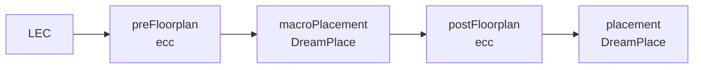

# 分阶段 Floorplan 流程

`rtl2gds` 预设将 floorplan 持久化为三个独立阶段：



普通的 `ecc run` 会顺序执行这三个阶段。拆分后，每个阶段都有独立的产物、
日志和 flow 状态，可单独查看或重跑；这**不**表示当前流程会自动为 GUI 操作暂停。

## 三个阶段

| 持久化步骤名 | 工具 | workspace 目录 | 工作内容 |
| --- | --- | --- | --- |
| `preFloorplan` | ecc | `preFloorplan_ecc/` | 建立初始 die/core 规划，并启用自动宏摆放。它从共享 floorplan 配置生成 `config/floorplan_ecc_simple.json`。 |
| `macroPlacement` | DreamPlace | `macroPlacement_dreamplace/` | 基于 pre-floorplan 数据库运行仅宏单元摆放，然后写出 Tcl 宏位置交接文件。 |
| `postFloorplan` | ecc | `postFloorplan_ecc/` | 以文件模式读取宏位置交接文件，完成 tracks、IO pin、tap/endcap、PDN、时钟网络设置、输出和分析。 |

`Floorplan` 仍只是共享配置键，不是可执行的 flow 步骤。在已有 workspace 上选择
步骤时，请使用上表中的三个持久化名称。

## 宏位置交接文件

宏单元摆放成功后，流程会写入 `config/macro_location.tcl`。改名之前创建的
workspace 若仍带有 `macro_localtion.tcl`，打开时会自动迁移。

该文件是 macro placement 和 post-floorplan 之间的 iDB/Tcl 交接文件。每个硬宏
使用如下命令表示，坐标单位为微米：

```tcl
placeInstance <instance> <x_micron> <y_micron> <orientation>
setInstancePlacementStatus -status fixed -name <instance>
```

`postFloorplan` 会通过 `floorplan_ecc.json`，以
`macro_placer.mode = "file"` 将此文件交给 iFP。没有硬宏的设计可以使用空文件；
文件中列出的每个实例都必须存在于当前设计中，旧的四列 location 文本格式不能作为
交接文件使用。生成的方向值为 `R0`、`R90`、`R180`、`R270`、`MY`、`MX90`、`MX`
和 `MY90`。

手工宏位置通过 `macro.placements` 参数和 `ecc macro` 命令管理：

```bash
ecc macro set u_ram0 --x 10 --y 20.5 --orient R0
ecc macro remove u_ram0
ecc macro show
```

只要 `macro.placements` 非空，创建或刷新 workspace 配置时都会把它渲染进
`config/macro_location.tcl`；此时 `macroPlacement` 保留 load/save 流程但跳过
DreamPlace 宏摆放，由 `postFloorplan` 依据该文件将宏以 fixed 状态提交。删除
最后一个条目会清空参数并恢复 DreamPlace 自动摆放。不支持手工编辑该文件：未设置
`macro.placements` 时，重新运行 `macroPlacement` 会重新生成交接文件。

## 恢复与重跑

普通恢复会从第一个未成功的持久化步骤继续：

```bash
ecc run --workspace default --resume
```

已有 workspace 中，`--from` 和 `--to` 需要使用持久化的驼峰步骤名。例如：

```bash
# 重新生成初始规划和宏位置交接文件。
ecc run --workspace default --from preFloorplan --to macroPlacement

# 不重跑宏摆放，直接应用现有或手工提供的 Tcl 交接文件。
ecc run --workspace default --from postFloorplan --to postFloorplan
```

重跑某一步会替换该步输出，并把下游步骤标记为需要重新执行。新建范围 workspace
时，`--from` 和 `--to` 必须同时给出，且需要预先声明入口步骤所需的设计输入。
完整规则见 [CLI 用户指南](ecc-user-guide.cn.md)。

## 配置

三个 floorplan 阶段共享 workspace 的 `config/floorplan_ecc.json`。
`preFloorplan` 使用派生出的简单配置，令 `macro_placer.mode = "auto"`；
`postFloorplan` 使用共享配置，并在 `file` 模式下读取宏位置交接文件。
请通过 `ecc param` 或 `ecc.toml` 参数修改已审核的 floorplan 设置，不要依赖每次
运行生成的字段。可调参数和 JSON 字段见
[配置参考](ecc-config-ref.cn.md)。
