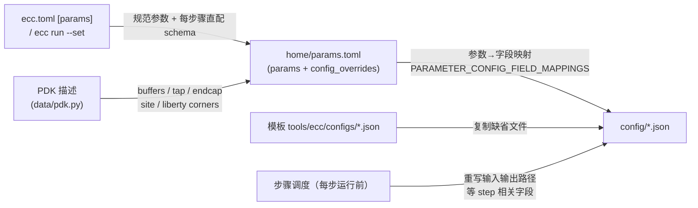

# ECC Flow 工具配置参考（按步骤）

本文整理 ECC RTL-to-Harden 流程中**每一步实际使用的工具配置文件、全部参数及其含义**。配置取值与生成逻辑均核对自 v0.1.0-alpha.11 源码（rebase main 之后；模板位于 [chipcompiler/tools/*/configs/](../chipcompiler/tools/ecc/configs/)）与一次真实的 gcd@ics55 harden 运行。

- 想了解命令用法 → [ECC CLI 用户指南](ecc-cli-ug.cn.md)；从零上手 → [入门教程](ecc-cli-tutorial.cn.md)
- 配置查看命令：`ecc config <step>`（列出该步骤实际生效的配置文件）

## 0. 配置体系总览

### 0.1 配置文件放在哪

每次运行（run）的 workspace 下有一个共享 `config/` 目录，所有步骤的 JSON 配置都落在这里，**同名文件会被后运行的步骤原地重写**（每步只更新与自己相关的字段）：

```
<workspace>/                 # 新项目/manifest 项目为 <project>/<id>；legacy 项目为 runs/<id>
├── home/
│   ├── params.toml        # 参数中枢：用户参数 + PDK 派生值（见 §1）
│   └── flow.json          # 步骤状态
├── config/                # ← 本文档的主角：9 个 JSON + macro_locations.txt
│   ├── db_ecc.json        # 数据库构建（读入 LEF/DEF/网表/LIB/SDC，每个 ecc 步骤共用）
│   ├── floorplan_ecc.json # 布局规划
│   ├── cts_ecc.json       # 时钟树综合
│   ├── route_ecc.json     # 布线
│   ├── drc_ecc.json       # DRC（空配置，规则来自 tech LEF）
│   ├── filler_ecc.json    # 填充单元
│   ├── rcx_ecc.json       # 寄生提取
│   ├── sta_ecc.json       # 静态时序分析（多 corner）
│   ├── dreamplace_ecc.json# DreamPlace 布局/合法化（placement 与 legalization 共用）
│   └── macro_locations.txt# 宏单元位置（初始为空文件）
├── Synthesis_yosys/
│   └── data/global_var.tcl  # 综合步骤的"配置"（Tcl 变量，非 JSON）
├── lec_yosys_lec/            # 综合级 LEC（Tcl 脚本驱动）
├── timing_optimization_sizer/
│   └── script/<design>.{env_file,cmd_file}  # 自动生成的 Sizer 配置
└── postRouteLec_yosys_lec/  # 布线后 LEC 步骤（Tcl 脚本驱动）
```

> 历史变化：旧版本的 `flow_ecc.json`（配置路径聚合器）与 `fixfanout_ecc.json`（高扇出修复，独立步骤）已随 ecc-tools 更新移除——高扇出约束现在只作用于 CTS（`cts.max_fanout`）。

### 0.2 配置值从哪来（生成机制）

配置文件在 workspace 创建时从模板复制，随后按三层来源刷新（实现：`init_workspace_config` / `refresh_workspace_config` / `update_step_config`）：



| 来源 | 决定的内容 | 举例 |
|---|---|---|
| 模板默认值 | 算法类参数的出厂值 | CTS `skew_bound=0.08` |
| 用户参数 | 旧语义参数 + 全部已审核静态工具字段 | `floorplan.core_util` → `die_util.utilization`；`cts.skew_bound` → CTS JSON |
| PDK | 工艺相关单元与库 | `buffer_type` ← PDK buffers 列表；STA liberty corners |
| 步骤调度 | 输入/输出路径（链式传递） | `db_ecc.json` 的 `def_path` 每步指向上一步输出 |

> ⚠️ **不要直接手改 `config/*.json`**：其中参数化字段在每次步骤运行前会按 `params.toml` + PDK 重新刷新，手改会被覆盖。正确入口是 `ecc param set`、`ecc.toml [params.*]` 或一次性 `ecc run --set`。workspace 的输入、输出、临时和生成文件路径不会作为 CLI 参数暴露；PDK 内容路径使用 `pdk.*` 参数（见 §1.2）。

### 0.3 每个步骤用到哪些配置

`ecc config <step>` 的真实输出归纳（映射源码 `_STEP_CONFIG_KEYS`，位于 [chipcompiler/data/workspace/__init__.py](../chipcompiler/data/workspace/__init__.py)）：

| 步骤 | db_ecc | 专属配置 | 说明 |
|---|---|---|---|
| synthesis | — | `global_var.tcl`（Tcl） | Yosys 用 Tcl 变量驱动，不走 JSON |
| lec | — | 无（Tcl） | 综合级 Yosys LEC；比较综合网表与 golden 网表；未证明时记录为 Warning，不阻断后续物理流程 |
| floorplan | ✓ | `floorplan_ecc.json` | |
| placement | — | `dreamplace_ecc.json` | 与 legalization 共用一个文件 |
| cts | ✓ | `cts_ecc.json` | |
| legalization | — | `dreamplace_ecc.json` | 每步重写 `def_input`/`result_dir` 等 |
| timing optimization | ✓ | `dreamplace_ecc.json` | Sizer 使用生成的脚本，随后做内部 DreamPlace 合法化；见 §6 |
| routing | ✓ | `route_ecc.json` | |
| filler | ✓ | `filler_ecc.json` | |
| rcx | ✓ | `rcx_ecc.json` | corner 由 PDK 决定（见 §12） |
| sta | ✓ | `sta_ecc.json` + `rcx_ecc.json` | 读 rcx 配置以对齐 SPEF |
| lvs | — | 无 | 工具默认行为 |
| postroutelec | — | 无（Tcl） | Yosys LEC，见 §11 |
| drc | ✓ | `drc_ecc.json`（空） | 规则来自 tech LEF |
| harden | — | 无专属配置 | 工具内部复用 `db_ecc.json` 定位输入输出，但不在 `_STEP_CONFIG_KEYS` 中；`ecc config harden` 会明确显示该步骤没有配置 |

## 1. 参数传递链（用户可调参数）

### 1.1 旧语义参数（13 个）

来源：[chipcompiler/cli/project/params.py](../chipcompiler/cli/project/params.py) 的 `_LEGACY_PARAM_REGISTRY`（`PARAM_REGISTRY` 的兼容段；直配参数见 §1.2 的 `config_params/` schema）。这些参数保持兼容；优先级：`--set` > `ecc.toml [params]` > 默认值。「写入位置」列为该参数最终落到的工具配置字段。

| 参数 | 类型 / 范围 | 默认 | 写入位置（config 字段） | 含义 |
|---|---|---|---|---|
| `design.frequency_mhz` | float [1e-6, 10000] MHz | 100.0 | 综合脚本 `clk_freq_mhz` + 自动 SDC 时钟周期 | 目标时钟频率 |
| `floorplan.core_util` | float [0.01, 1.0] | 0.4 | floorplan `die_builder.die_util.utilization` | 核心利用率（面积按单元面积/利用率反推） |
| `floorplan.core_margin` | int×2（µm） | [2, 2] | floorplan `die_builder.margin.{left,right,top,bottom}_micron` | 核心到 die 边的留白 [水平, 垂直] |
| `floorplan.aspect_ratio` | float [0.1, 10] | 1.0 | floorplan `die_builder.die_util.aspect_ratio` | 核心宽高比 |
| `cts.max_fanout` | int [1, 200] | 20 | cts `max_fanout` | 时钟树缓冲最大扇出（fixfanout 步骤移除后由 CTS 承接） |
| `place.target_density` | float [0.1, 0.95] | 0.2 | dreamplace `target_density` | 全局布局目标密度 |
| `place.target_overflow` | float [0.0, 1.0] | 0.1 | dreamplace `stop_overflow` | 全局布局溢出收敛目标 |
| `place.global_right_padding` | int [0, 100] | 0 | 仅记录于 params.toml | 布局 site 右侧全局 padding（当前版本尚未接入工具配置字段） |
| `place.cell_padding_x` | int [0, 10000]（dbu） | 300 | dreamplace `cell_padding_x` | 单元 X 方向 padding（绕线拥塞缓解） |
| `place.routability_opt` | {0, 1} | 1 | dreamplace `routability_opt_flag` | 布局阶段开启绕线拥塞驱动优化 |
| `route.bottom_layer` | MET1–MET5 | MET2 | route `RT.-bottom_routing_layer` + db `LayerSettings.routing_layer_1st` | 绕线最低层 |
| `route.top_layer` | MET2–MET6 | MET5 | route `RT.-top_routing_layer` | 绕线最高层 |
| `sta.max_paths` | int [1, 100000] | 1000 | STA 引擎参数（不落 JSON，运行时传入） | 每份 STA 时序报告的最大路径数 |

### 1.2 每步骤直配 schema 与 PDK 路径

`chipcompiler/data/config_params/` 为每个配置 owner 保留一个人工审核的 Python schema 文件。所有静态工具字段均可由 `ecc param` 修改；默认 `ecc param list` 只保留旧参数和已覆盖字段，使用以下命令检查完整字段、类型和 JSON 目标：

```bash
ecc param list --step cts
ecc param list --step floorplan
ecc param list --all
ecc param set cts.skew_bound 0.05
ecc param set floorplan.phy_placer.well_tap.distance_micron 30.0
ecc param set cts.routing_layer '[4, 5]'
ecc run --set place.num_threads=12
```

标量按 schema 类型解析；列表和对象值使用 JSON 字面量，数组整体替换。持久化值写入嵌套 TOML 表，例如：

```toml
[params.floorplan.phy_placer.well_tap]
distance_micron = 30.0

[pdk.overrides]
tech = "prtech/techLEF/N551P6M_ecos.lef"
```

`die_builder` 的 `die_util`/`margin` 等旧字段不在此列，仍通过 §1.1 的语义参数（`floorplan.core_util`、`floorplan.core_margin`、`floorplan.aspect_ratio`）设置。

允许的 PDK 路径参数为 `pdk.tech`、`pdk.lefs`、`pdk.libs`、`pdk.mapping_file`、`pdk.sdc` 和 `pdk.spef`；其中 `tech/lefs/libs/mapping_file` 是 PDK 内容路径，相对 `pdk.root` 解析，而 `pdk.sdc`/`pdk.spef` 是设计数据，相对**项目目录**解析；六者都做文件存在校验。`pdk.root` 仍使用 `ecc pdk set-root`。workspace 内置路径（DB 的 DEF/网表/输出、DreamPlace 的输入/结果目录、步骤临时目录和 STA 多 corner liberty 结构）均不提供 CLI 参数。

### 1.3 参数中枢 params.toml

`home/params.toml` 保存规范化的 workspace 参数、`config_overrides` 以及 **flow 运行后回填的结果值**（如实际 die/core 尺寸、利用率）。`config_overrides` 是 CLI 从审核 schema 生成的嵌套 TOML 补丁；每次 workspace 刷新都会在 PDK 和语义参数映射之后重新应用。`home/parameters.json` 仅在迁移旧 workspace 时读取。

文件由四个节区构成：

| 节区 | 内容 |
|---|---|
| `[design]` | `name` / `top` / `clock_port` / `frequency_mhz`，与项目级 `ecc.toml [design]` 同词汇 |
| `[pdk]` | `name` / `root` / `config`；`config` 以 workspace 相对路径存储，加载时还原为绝对路径 |
| `[flow]` | `preset = "rtl2gds"`，或 `start` + `end` 成对出现（只接受持久化规范步骤名）；缺省时由 `home/flow.json` 的首末步骤推导 |
| `[params]` | 规范扁平参数（snake_case）；嵌套值渲染为子表（如 `[params.die]`、`[params.floorplan.phy_placer.well_tap]`） |

**身份参数的双份存储是刻意设计，不是冗余错误**：`design`、`top_module`、`clock`、`frequency_max`、`pdk`、`pdk_root`、`pdk_config` 七个身份键在 `[params]` 扁平键与 `[design]`/`[pdk]` 节区各存一份（如 `[design] top` ↔ `[params] top_module`、`[design] frequency_mhz` ↔ `[params] frequency_max`、`[pdk] root` ↔ `[params] pdk_root`）。两套词汇各司其职：`[design]`/`[pdk]`/`[flow]` 是与 `ecc.toml` 同词汇的人读视图，使 workspace 自描述；`[params]` 是程序消费的规范扁平存储（步骤参数、`config_overrides` 与回填结果都在其中）。

保存时两份由同一份扁平参数渲染，正常情况下永远一致。若文件被手工改到两处不一致，加载规则为：**`[design]`/`[pdk]` 的非空值覆盖 `[params]` 副本；节区键为空或缺失时回落到 `[params]` 副本**。写入采用临时文件 + 原子 rename，不穿透 symlink。

通过 `ecc param set KEY VALUE --workspace NAME` 写入的已创建 workspace 覆盖也保存在 `[params]`：实际参数值与 `config_overrides` 共同决定刷新后的步骤配置，`workspace_param_overrides` 列表记录 `key`、首次修改前的 `baseline` 和当前 `value`，供 `ecc param diff --workspace NAME` 使用。`ecc param unset KEY --workspace NAME` 会恢复该 `baseline` 并清除这条本地覆盖记录；其所属步骤及后续步骤会失效，直到再次运行。PDK 资源路径和引用不能在此处局部修改，应更新 `ecc.toml` 后执行 `ecc workspace refresh NAME`。

## 2. 公共配置：db_ecc.json

所有 ecc 工具步骤共用。每个步骤启动时先用它把 LEF/DEF/网表/LIB 载入内存数据库（subflow 的 "load data" 阶段）。`INPUT.def_path/verilog_path` 与 `OUTPUT.output_dir_path` 三个字段**每步运行前被重写**，实现步骤间文件链。

| 字段 | 示例值（harden 步运行时） | 来源 | 含义 |
|---|---|---|---|
| `INPUT.tech_lef_path` | `…/prtech/techLEF/N551P6M_ecos.lef` | PDK | 工艺 LEF（层定义/规则） |
| `INPUT.lef_paths` | `[H7CR_lef, H7CL_lef]` | PDK | 标准单元 LEF（抽象） |
| `INPUT.def_path` | `sta_ecc/output/gcd_sta.def.gz` | 每步重写 | 输入 DEF（上一步版图） |
| `INPUT.verilog_path` | `sta_ecc/output/gcd_sta.v.gz` | 每步重写 | 输入门级网表 |
| `INPUT.lib_path` | `[H7CR_ss_rcworst, H7CL_ss_rcworst]` | PDK | 时序库（综合/等效库） |
| `INPUT.sdc_path` | `origin/gcd.sdc` | workspace | 时序约束（自动生成或用户提供） |
| `INPUT.spef` | `""` | PDK/workspace | 预置寄生文件（RCX 前一般为空） |
| `OUTPUT.output_dir_path` | `Harden_ecc/output` | 每步重写 | 本步骤产物输出目录 |
| `LayerSettings.routing_layer_1st` | `MET2` | 参数 `route.bottom_layer` | 首个可用绕线层（影响数据库层设置） |

## 3. synthesis（Yosys）

无 JSON 配置。Yosys 由两段 Tcl 驱动：`script/yosys_synthesis.tcl`（综合主脚本）+ `data/global_var.tcl`（每次运行生成，即本步骤的"配置文件"）。内容取自真实运行：

| Tcl 变量 | 示例值 | 来源 | 含义 |
|---|---|---|---|
| `top_design` | `gcd` | `ecc.toml design.top` | 综合顶层模块 |
| `clk_freq_mhz` | `100` | 参数 `design.frequency_mhz` | 目标频率（换算 `clk_period_ps` 供时序驱动综合） |
| `use_slang` | `false` | 运行时探测 | 是否用 slang 前端读 SystemVerilog（默认 Verilog 模式） |
| `rtl_file` | `[origin/gcd.v]` | `ecc.toml design.rtl` / filelist | RTL 源文件列表 |
| `final_netlist_file` | `output/gcd_Synthesis.v.gz` | 步骤调度 | 输出门级网表（供 floorplan） |
| `golden_netlist_file` | `output/gcd_Synthesis_golden.v` | 步骤调度 | 两次 LEC 共用的 golden 网表（clockgate 映射前导出） |
| `final_netlist_sim_file` | `…_sim.v.gz` | 步骤调度 | 仿真用网表（含 SDF 相关信息） |
| `synth_stat_json` / `synth_check_rpt` 等 | `report/`、`feature/` 下 | 步骤调度 | 统计与检查报告输出 |
| `keep_hierarchy` | `false` | 模板 | 是否保留模块层级 |
| `dont_use_cells` | `[DFFSRQX* … ICG*]` | PDK/模板 | 综合禁用单元（通配符） |
| `tie_low_cell/port` | `TIELOH7R` / `Z` | PDK | 低电平约束单元及输出端口 |
| `tie_high_cell/port` | `TIEHIH7R` / `Z` | PDK | 高电平约束单元及输出端口 |
| `abc_driver_cell` | `BUFX0P5H7L` | PDK | ABC 映射假设的驱动单元 |
| `abc_load` | `0.015` | PDK | ABC 映射负载电容（pF） |
| `lib_stdcell_list` / `lib_list` | H7CR/H7CL liberty | PDK | 标准单元时序库 |
| `tmp_dir` | `Synthesis_yosys/data/tmp` | 步骤调度 | 中间文件目录 |

另有环境变量 `YOSYS_SYNTH_STRATEGY`（如 `DELAY 4` / `AREA N` / `BALANCE N`）控制综合策略方向，默认 `DELAY 4`（提频优先）。

## 4. floorplan（ecc-tools）

配置 `floorplan_ecc.json`，按功能分 6 组。步骤内部子阶段：load data → init floorplan → create tracks → place io pins → tap cell → PDN → set clock net → save data → analysis。

### ifp（iFP 布图引擎）

| 参数 | 默认 | 含义 |
|---|---|---|
| `temp_directory_path` | 每步生成 → `Floorplan_ecc/data/fp` | iFP 中间数据目录 |
| `thread_number` | 16 | 并行线程数 |

### macro_placer（宏摆放）

| 参数 | 默认 | 含义 |
|---|---|---|
| `macro_placement_halo` | 3.0 | 宏单元布置 halo（µm，禁止标准单元靠近的范围） |
| `macro_routing_halo` | 3.0 | 宏单元绕线 halo（µm，禁止绕线的范围） |
| `macro_location_path` | `macro_locations.txt` | 用户指定的宏位置文件（config 目录下，初始为空 = 自动摆放） |

### die_builder（die/核心区域规划）★ 用户参数作用区

| 参数 | 默认 | 含义 |
|---|---|---|
| `mode` | `die_util` | 布图模式：`die_util`=按利用率反推尺寸；`die_size`=直接给 die 尺寸 |
| `site_name` | PDK → `core7` | 标准单元行 site 名 |
| `margin.left/right/top/bottom_micron` | 参数 `floorplan.core_margin` → 2.0 | core 到 die 边缘留白（µm） |
| `die_util.aspect_ratio` | 参数 `floorplan.aspect_ratio` → 1.0 | core 宽高比 |
| `die_util.utilization` | 参数 `floorplan.core_util` → 0.4 | core 利用率（单元面积/核心面积） |
| `die_size.width/height_micron` | 100.1 / 246.6 | `mode=die_size` 时的 die 尺寸（`die_util` 模式下不生效） |

### io_placer（IO 引脚排布）

| 参数 | 默认 | 含义 |
|---|---|---|
| `io_layer_list` | `["MET3","MET4"]` | IO 引脚允许的金属层 |

### phy_placer（物理单元插入）

| 参数 | 默认 | 含义 |
|---|---|---|
| `well_tap.cell_name` | PDK → `FILLTAPH7R` | well tap 单元 |
| `well_tap.distance_micron` | 58.0 | tap 插入间距（µm，满足阱接触规则） |
| `side_endcap.left/right_cell_name` | PDK → `FILLTAPH7R` | 行首/行尾 endcap 单元 |
| `edge_endcap.top/bottom_cell_name_list` | FILLCAP/FILLER 系列 | die 上下边缘 endcap 备选单元（按宽度择优） |
| `boundary_tap.top/bottom_cell_name_list` | 同上 | die 边界 tap 备选单元 |
| `boundary_tap.rule_micron` | 30.0 | 边界 tap 插入规则距离（µm） |

### pdn_generator（电源网络）

| 参数 | 默认 | 含义 |
|---|---|---|
| `global_connect` | VDD/VSS → 实例电源脚 | 电源/地网络与单元引脚的全局连接声明（`is_power` 区分电源/地） |
| `rail`（MET1, 0.16µm） | 见默认 | 标准单元行电源轨：层 + 宽度 |
| `stripe`（MET4/MET5） | 宽 1.0、间距 16.0、偏移 0.5 | 电源条带：层/宽度/间距（pitch）/偏移（µm） |
| `connect_layers` | MET1–MET4、MET4–MET5 | 相邻层电源过孔连接对 |

## 5. placement / legalization（DreamPlace）

两者共用 `config/dreamplace_ecc.json`；每次步骤运行前重写 `def_input`（placement 读 floorplan 输出，legalization 读 CTS 输出）、`verilog_input`、`result_dir`（分别为 `place_dreamplace/data/pl`、`legalization_dreamplace/data/pl`）。参数即上游 DreamPlace 的 JSON 参数集，分组解释如下（默认值 = 模板值；`*` = 用户参数映射点）。

### 输入输出

| 参数 | 默认 | 含义 |
|---|---|---|
| `aux_input` | `""` | Bookshelf aux 输入（可选，一般用 LEF/DEF） |
| `lef_input` | PDK tech LEF + 单元 LEF | LEF 输入列表 |
| `def_input` | 每步重写 | 输入 DEF |
| `verilog_input` | 每步重写 | 输入门级网表 |
| `result_dir` | 每步重写 | 结果输出目录 |
| `base_design_name` | 设计名（gcd） | 结果文件命名基名 |
| `route_info_input` | `default` | 绕线信息输入（拥塞预估用） |

### 流程开关（哪些阶段生效）

| 参数 | 默认 | 含义 |
|---|---|---|
| `global_place_flag` | 1 | 执行全局布局 |
| `legalize_flag` | 1 | 执行合法化 |
| `detailed_place_flag` | 0 | 执行详细布局（本流程未启用） |
| `enable_fillers` | 1 | 布局阶段允许虚拟 filler 占位（密度计算） |
| `routability_opt_flag` | 1 `*place.routability_opt` | 绕线拥塞驱动的布局优化 |
| `timing_opt_flag` / `timing_eval_flag` | 0 | 时序驱动布局（本流程未启用，需 sizer/STA 配合） |
| `macro_place_flag` | 0 | 宏单元自动摆放（floorplan 已处理） |
| `plot_flag` / `get_congestion_map` / `evaluate_pl` | 0 / 1 / 0 | 出图 / 拥塞图导出 / 布局评估 |
| `dump_global_place_solution_flag` / `dump_legalize_solution_flag` | 0 | 导出中间解 |

### 全局布局核心（★ 主要调优区）

| 参数 | 默认 | 含义 |
|---|---|---|
| `target_density` | 0.2 `*place.target_density`（模板 0.8） | 目标布局密度（越低越松、越利绕线） |
| `stop_overflow` | 0.1 `*place.target_overflow` | 溢出收敛阈值，达标即停 |
| `density_weight` | 0.00085 | 密度项初始权重（自动调整的起点） |
| `num_bins_x/y` | 32/32 | 密度网格划分数 |
| `global_place_stages[]` | 见下 | 多阶段全局布局表（可多段） |
| `global_place_stages[].iteration` | 1000 | 本阶段迭代次数 |
| `global_place_stages[].learning_rate` | 1.0 | 学习率 |
| `global_place_stages[].learning_rate_decay` | 0.99 | 学习率衰减 |
| `global_place_stages[].wirelength` | `weighted_average` | 线长模型 |
| `global_place_stages[].optimizer` | `nesterov` | 优化器 |
| `global_place_stages[].Llambda_density_weight_iteration` / `Lsub_iteration` | 1 / 1 | 密度权重自适应步长 |
| `RePlAce_ref_hpwl` | 350000 | RePlAce 参考线长（能量归一） |
| `RePlAce_LOWER_PCOF` / `UPPER_PCOF` | 0.95 / 1.05 | RePlAce 能量系数上下界 |
| `RePlAce_skip_energy_flag` | 0 | 跳过能量计算 |
| `gamma` | 4 | 抛物线线长平滑系数 |
| `gp_noise_ratio` | 0.0 | 初始布局扰动比例 |
| `random_center_init_flag` / `init_loc_perc_x/y` | 1 / 0.5 / 0.5 | 初始布局放中心及比例 |
| `auto_adjust_bins` | 1 | 自动调整网格数 |

### 绕线拥塞（routability）

| 参数 | 默认 | 含义 |
|---|---|---|
| `route_num_bins_x/y` | 512/512 | 拥塞评估网格 |
| `node_area_adjust_overflow` | 0.15 | 面积调整触发溢出阈值 |
| `two_stage_density_scaler` | 1000 | 两阶段密度缩放因子 |
| `max_num_area_adjust` | 3 | 最大面积调整轮数 |
| `adjust_nctugr_area_flag` / `adjust_rudy_area_flag` / `adjust_pin_area_flag` | 1 / 0 / 0 | 启用 NCTUgr/RUDY/引脚面积调整 |
| `area_adjust_stop_ratio` / `route_area_adjust_stop_ratio` / `pin_area_adjust_stop_ratio` | 0.01 / 0.01 / 0.05 | 各类面积调整停止比例 |
| `unit_horizontal_capacity` / `unit_vertical_capacity` / `unit_pin_capacity` | 1.5625 / 1.45 / 0.058 | 单位绕线/引脚容量 |
| `max_route_opt_adjust_rate` / `route_opt_adjust_exponent` | 2.0 / 2.0 | 绕线面积调整倍率上限/指数 |
| `pin_stretch_ratio` / `max_pin_opt_adjust_rate` | 1.4142 / 1.5 | 引脚拉伸比 / 调整倍率上限 |
| `risa_weights` | 0 | 使用 RISA 拥塞权重 |

### 单元 padding 与边界

| 参数 | 默认 | 含义 |
|---|---|---|
| `cell_padding_x` | 300 dbu `*place.cell_padding_x` | 单元 X 向 padding（数据库单位） |
| `bndry_padding_x/y` | 0 | 边界 padding |

### 宏单元

| 参数 | 默认 | 含义 |
|---|---|---|
| `macro_halo_x/y` / `macro_pin_halo_x/y` | 0 | 宏/宏引脚 halo |
| `macro_overlap_flag` / `macro_overlap_weight` / `macro_overlap_mult_weight` | 0 / 8e-6 / 1 | 宏重叠处理 |

### 时序驱动（本流程默认关闭）

| 参数 | 默认 | 含义 |
|---|---|---|
| `with_sta` / `enable_net_weighting` / `differentiable_timing_obj` | 0 | 内嵌 STA / 网络加权 / 可微时序目标 |
| `pin2pin_max/min_weight` / `pin2pin_accumulate_weight` / `pin2pin_weight` / `pin2pin_net_weighting` | 1 / 1 / 0.1 / 2.5e-5 / 0 | 引脚间时序权重参数 |
| `net_weighting_scheme` | `lilith` | 网络加权方案 |
| `max_net_weight` | `inf` | 网络权重上限 |
| `momentum_decay_factor` / `start_iter` | 0.5 / 0 | 动量衰减 / 起始迭代 |

### 运行时与数值

| 参数 | 默认 | 含义 |
|---|---|---|
| `gpu` / `gpu_id` | 0 / 0 | 是否用 GPU 及设备号（CPU 模式为主） |
| `num_threads` | 8 | CPU 线程数 |
| `dtype` | `float32` | 计算精度 |
| `random_seed` | 3000 | 随机种子（复现用） |
| `deterministic_flag` | 1 | 强制确定性运行 |
| `scale_factor` / `shift_factor` | 1.0 / [0,0] | 坐标缩放/平移 |
| `ignore_net_weight` / `ignore_net_degree` | 1 / 100 | 忽略网表权重 / 最大处理网度 |
| `sort_nets_by_degree` | 0 | 按网度排序 |
| `detailed_place_engine` / `detailed_place_command` | `""` | 外部详细布局引擎及命令 |
| `pin_density` | 0.6 | 引脚密度阈值 |
| `use_bb` | 0 | 使用包围盒线长 |

## 6. timing optimization（Sizer）

Timing optimization 是三阶段子流程：运行 Sizer，用 DreamPlace 对 Sizer 的暂存 DEF/网表做合法化，再发布得到的 ECC 产物。`ecc config timing optimization` 会列出 `db_ecc.json` 与 `dreamplace_ecc.json`，因为内部合法化使用常规 workspace 配置映射；**Sizer 本身由生成的脚本文件驱动，不直接使用这两个 JSON**。

| 生成文件或选项 | 来源 | 含义 |
|---|---|---|
| `timing_optimization_sizer/script/<design>.env_file` | 存在时取 Sizer 的 `submit/env_base_file`，否则为 `-num_vt 1`；再追加 PDK | Sizer 环境：追加工艺/单元 LEF（`-lef`）、liberty（`-lib`）及 `<sizer-root>/src/sizer_os.tcl`（`-tclFile`） |
| `timing_optimization_sizer/script/<design>.cmd_file` | workspace 步骤 + PDK | Sizer 命令：`-useOpenSTA`、顶层模块、输入 `-def`/`-v`、`-sdc`、可选 `-spef` 及暂存输出路径 |
| `-min_route_layer` / `-max_route_layer` | 设置后取 `route.bottom_layer` / `route.top_layer` | 直接传给 Sizer 的布线层限制 |
| `data/to/sizer.def.gz` / `sizer.v.gz` | Sizer 输出 | 被内部 DreamPlace 合法化消费的暂存产物；合法化成功后保存为 Timing optimization 步骤输出 |

运行时根目录必须含 `src/sizer_os.tcl`；ECC 从 `CHIPCOMPILER_ECC_SIZER_ROOT`，或从 `PATH` 上的 `Sizer` 二进制逐级向上查找。`ecc doctor` 同时要求此 runtime root 与 Sizer 可执行文件。完整 `rtl2gds` 链需要 Sizer；对新建或 `--overwrite` 的 `rtl2gds` 目标，`ecc run` 环境预检也会检查它，缺失时会在创建 workspace 前以 `env_not_ready` 失败。已有 workspace 或 `--workspace` 重跑不执行该预检，仍可能在 Timing optimization 执行时失败。

## 7. cts（ecc-tools）

配置 `cts_ecc.json`。子阶段：load data → run CTS → save data → analysis。

| 参数 | 模板默认 | 示例（gcd） | 含义 |
|---|---|---|---|
| `skew_bound` | `"0.08"` | 0.08 | 允许的时钟偏斜上限（ns） |
| `max_buf_tran` | `"0.5"` | 0.5 | 时钟缓冲最大翻转时间（ns） |
| `root_input_slew` | `"0.0"` | 0.0 | 时钟根节点输入翻转（ns） |
| `max_sink_tran` | `"0.5"` | 0.5 | 时钟叶节点（sink）最大翻转（ns） |
| `max_cap` | `"0.15"` | 0.15 | 缓冲最大负载电容（pF） |
| `max_fanout` | `"32"` | 20 `*cts.max_fanout` | 时钟缓冲最大扇出 |
| `max_length` | `"300"` | 300 | 单级缓冲最大线长（µm） |
| `wirelength_iterations` | `"3"` | 3 | 线长平衡迭代次数 |
| `slew_steps` / `cap_steps` | `"10"` / `"10"` | 10 / 10 | 翻转/电容查找表插值步数 |
| `routing_layer` | `[4,5]` | [4,5] | 时钟走线层范围（层序号，MET4–MET5） |
| `buffer_type` | `[]` | PDK → `[BUFX8H7L, BUFX12H7L, BUFX16H7L, BUFX20H7L]` | 可选时钟缓冲单元（驱动强度递增） |
| `use_netlist` / `net_list` | `"OFF"` / `[]` | OFF / [] | 指定特定网络做 CTS（默认全部时钟网络） |

## 8. routing（ecc-tools）

配置 `route_ecc.json`，`RT` 组即绕线器参数。子阶段：load data → run routing → save data → analysis。

| 参数 | 模板默认 | 示例（gcd） | 含义 |
|---|---|---|---|
| `RT.-bottom_routing_layer` | `""` | MET2 `*route.bottom_layer` | 绕线最低金属层 |
| `RT.-top_routing_layer` | `""` | MET5 `*route.top_layer` | 绕线最高金属层 |
| `RT.-thread_number` | `"50"` | 50 | 布线并行线程数 |
| `RT.-enable_timing` | `"0"` | 0 | 时序驱动布线（默认关） |
| `RT.-output_csv` / `-output_inter_result` | `"0"` | 0 | 导出 CSV / 中间结果 |
| `RT.-temp_directory_path` | 每步生成 → `route_ecc/data/rt` | 布线中间数据目录 |

## 9. drc / lvs（ecc-tools）

- **drc**：`drc_ecc.json` 为空对象 `{}`——检查规则来自 tech LEF 的层定义与规则，无可调参数。
- **lvs**：无配置文件，工具按默认流程比对版图与网表（输入输出经 `db_ecc.json` 链式传递）。

两者的子阶段均为 load data → run DRC/LVS → save data → analysis。

## 10. filler（ecc-tools）

配置 `filler_ecc.json`。子阶段：load data → run filler → save data → analysis。

| 参数 | 默认 | 含义 |
|---|---|---|
| `-min_filler_width` | 1 | 允许填充的最小 filler 宽度（site 数；间隙小于该值不填充） |

## 11. postroutelec（Yosys LEC）

无 JSON 配置，由 `script/run_lec.tcl` 驱动（读 liberty → 双方网表规范化 → 等价性证明）。放在 LVS 之后、DRC 之前：

| 项 | 内容 |
|---|---|
| 输入（golden） | 综合映射网表（如 `Synthesis_yosys/output/gcd_Synthesis.v.gz`） |
| 输入（gate） | 上一步（LVS）输出网表（`lvs_ecc/output/gcd_lvs.v.gz`，链式取 `pre_step.output.verilog`） |
| 输出 | `output/<设计>_postRouteLec_result.json`：`status`（`proven` / 失败）+ 双方 `sha256` + 报告路径；`report/equiv_status.rpt`、`report/run_lec_status.rpt` |
| 签核 | `status=proven` 计入签核清单（LEC 结果进签核包 `final/reports/postRouteLec/`） |

完整 `rtl2gds` preset 会在 synthesis 后立即执行 `lec`。另有 `synthesis_lec` preset（仅 synthesis + lec 两步）可单独做综合级等价检查。

## 12. rcx（ecc-tools）

配置 `rcx_ecc.json` 仅含运行参数；**corner 组合由 PDK 内部决定**（ecc-tools 按 PDK 名加载对应提取规则），因此配置里看不到 corner 列表。子阶段：load data → run rcx。

| 参数 | 模板默认 | 示例（gcd） | 含义 |
|---|---|---|---|
| `thread_num` | 64 | 64 | 提取并行线程数 |
| `output` | `/RCX_ecc/output` | `RCX_ecc/data` | 提取结果（SPEF）输出目录 |

输出 SPEF 按 `<设计>_<RCcorner>_<温度>C.spef` 命名（如 `gcd_Cworst_125C.spef`），corner 集合与 STA 的 `signoff` 对齐（由 STA 步骤按 sta_ecc.json 校验 SPEF 完整性）。

## 13. sta（ecc-tools）

配置 `sta_ecc.json`，由 `liberty`（corner → liberty 列表）与 `signoff`（签核 corner 组合）两部分构成；liberty 相对路径在配置刷新时展开为 PDK 绝对路径。子阶段：load data → run sta。`STA max paths` 参数（默认 1000）在运行时直接传入引擎，不落此文件。

| 字段 | 示例（gcd@ics55） | 含义 |
|---|---|---|
| `liberty[].corner` | `MAX` / `WCL` / `TYP` / `MIN` / `ML` | 时序 corner 类型（慢/最差低温/典型/快/快高温库组） |
| `liberty[].temperature` | 125 / -40 / 25 / -40 / 125 | 对应结温（℃），与 SPEF 温度点对齐 |
| `liberty[].path` | H7CR+H7CL liberty ×2 | 该 corner 的 liberty 文件（PDK 相对路径自动展开） |
| `signoff[0]` | MAX:[Cworst,RCworst]；WCL:[Cworst,RCworst]；TYP:[TYPICAL]；MIN/ML:[Cworst,RCworst,Cbest,RCbest] | 签核要跑的「liberty corner × RC corner」组合，共 13 个分析 corner |

ics55 的 corner 命名：`Cworst/Cbest`=电容最差/最好，`RCworst/RCbest`=RC 均最差/最好，`TYPICAL`=典型。

每个 corner 的报告由 ecc-tools 按路径类型拆分输出（`sta_ecc/report/<lib_corner>_<温度>/<RCcorner>/`）：

| 文件 | 说明 |
|---|---|
| `qor_summary.rpt` | 时序/功耗质量摘要 |
| `timing_max_{in2out,in2reg,reg2out,reg2reg}.rpt` | setup 报告（按路径类型：输入到输出/输入到寄存器/寄存器到输出/寄存器到寄存器），**签核要求 4 份齐全** |
| `timing_min_{in2out,in2reg,reg2out,reg2reg}.rpt` | hold 报告（同上拆分，非签核必需） |
| `power.rpt` | 功耗报告（签核包可选收集） |

## 14. harden（ecc-tools）

无专属配置文件：复用 `db_ecc.json` 定位输入（STA 输出的 DEF/网表）与输出（`Harden_ecc/output`）。子阶段仅 load data → run harden。产物为 `<设计>_Harden.gds/.lef/.lib/.png`（版图 / 抽象 LEF / 时序 LIB / 版图快照）。

## 15. 配置查看与修改速查

```bash
ecc config floorplan          # 看 floorplan 实际用的配置文件列表
ecc config --plain            # 项目级配置（ecc.toml 解析后）
ecc param list --step cts                 # 查看 CTS 全部可调字段
ecc param list --all                      # 查看完整审核 schema
ecc param show KEY / diff                 # 单参数 / 与默认差异
ecc param set place.target_density 0.55  # 改参数（写入 ecc.toml，下次 run 生效）
ecc param set cts.skew_bound 0.05         # 直配 CTS JSON 字段
ecc run --set place.target_density=0.55  # 只对本次 run 生效
```

修改层级建议：**统一走 `ecc param`；用 `--step` / `--all` 发现字段；不要直接改 `params.toml` 或 `config/*.json`**（刷新会覆盖手改）。

---

*参数默认值核对自 v0.1.0-alpha.11（rebase main 后）源码模板与 ics55 PDK 下 gcd 设计的真实运行；`*` 标记表示该字段由用户参数驱动。*
