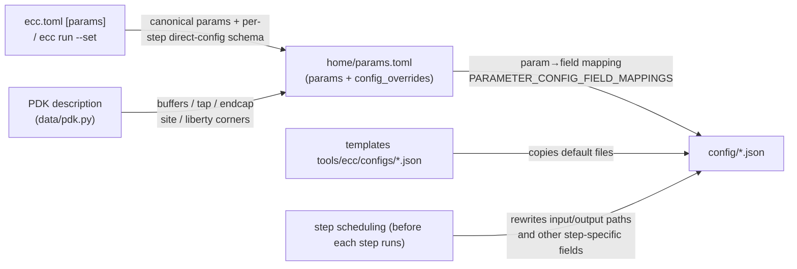

# ECC Flow Tool Configuration Reference (by step)

This document consolidates **the tool configuration files actually used by each step of the ECC RTL-to-Harden flow, all of their parameters, and what each parameter means**. Configuration values and generation logic were verified against the v0.1.0-alpha.11 source (after the rebase onto main; templates live in [chipcompiler/tools/*/configs/](../chipcompiler/tools/ecc/configs/)) and a real gcd@ics55 harden run.

- For command usage, see the [ECC CLI User Guide](ecc-cli-ug.en.md); to get started from scratch, see the [Tutorial](ecc-cli-tutorial.en.md)
- Config inspection command: `ecc config <step>` (lists the configuration files actually in effect for that step)

## 0. Configuration System Overview

### 0.1 Where the configuration files live

Each run's workspace has a shared `config/` directory where the JSON configurations of all steps land; **files with the same name are rewritten in place by whichever step runs later** (each step only updates the fields relevant to it):

```
<workspace>/                 # <project>/<id> for fresh/manifest projects; runs/<id> for legacy projects
├── home/
│   ├── params.toml        # parameter hub: user params + PDK-derived values (see §1)
│   └── flow.json          # step status
├── config/                # ← this document's focus: 9 JSON files + macro_locations.txt
│   ├── db_ecc.json        # database build (loads LEF/DEF/netlist/LIB/SDC; shared by every ecc step)
│   ├── floorplan_ecc.json # floorplanning
│   ├── cts_ecc.json       # clock tree synthesis
│   ├── route_ecc.json     # routing
│   ├── drc_ecc.json       # DRC (empty config; rules come from the tech LEF)
│   ├── filler_ecc.json    # filler cells
│   ├── rcx_ecc.json       # parasitic extraction
│   ├── sta_ecc.json       # static timing analysis (multi-corner)
│   ├── dreamplace_ecc.json# DreamPlace placement/legalization (shared by placement and legalization)
│   └── macro_locations.txt# macro locations (initially an empty file)
├── Synthesis_yosys/
│   └── data/global_var.tcl  # the synthesis step's "config" (Tcl variables, not JSON)
├── lec_yosys_lec/            # synthesis-level LEC (Tcl-script driven)
├── timing_optimization_sizer/
│   └── script/<design>.{env_file,cmd_file}  # generated Sizer configuration
└── postRouteLec_yosys_lec/  # post-route LEC step (Tcl-script driven)
```

> History: the old `flow_ecc.json` (configuration-path aggregator) and `fixfanout_ecc.json` (high-fanout fixing, a standalone step) were removed along with an ecc-tools update — the high-fanout constraint now applies only to CTS (`cts.max_fanout`).

### 0.2 Where configuration values come from (generation mechanism)

Configuration files are copied from templates when the workspace is created, then refreshed from three layers of sources (implementation: `init_workspace_config` / `refresh_workspace_config` / `update_step_config`):



| Source | What it determines | Example |
|---|---|---|
| Template defaults | Factory values of algorithm parameters | CTS `skew_bound=0.08` |
| User parameters | Legacy-semantic params + all reviewed static tool fields | `floorplan.core_util` → `die_util.utilization`; `cts.skew_bound` → CTS JSON |
| PDK | Process-specific cells and libraries | `buffer_type` ← PDK buffers list; STA liberty corners |
| Step scheduling | Input/output paths (chained between steps) | `db_ecc.json`'s `def_path` points to the previous step's output at every step |

> ⚠️ **Do not hand-edit `config/*.json`**: parameterized fields are re-refreshed from `params.toml` + PDK before every step run, so manual edits get overwritten. The proper entry points are `ecc param set`, `ecc.toml [params.*]`, or a one-off `ecc run --set`. Workspace input, output, temporary, and generated file paths are not exposed as CLI parameters; PDK content paths use the `pdk.*` parameters (see §1.2).

### 0.3 Which configurations each step uses

Distilled from real `ecc config <step>` output (maps to the source `_STEP_CONFIG_KEYS` in [chipcompiler/data/workspace/__init__.py](../chipcompiler/data/workspace/__init__.py)):

| Step | db_ecc | Step-specific config | Notes |
|---|---|---|---|
| synthesis | — | `global_var.tcl` (Tcl) | Yosys is driven by Tcl variables, not JSON |
| lec | — | none (Tcl) | Synthesis-level Yosys LEC; compares the mapped and golden synthesis netlists; an unproven result is recorded as Warning and does not block the physical flow |
| floorplan | ✓ | `floorplan_ecc.json` | |
| placement | — | `dreamplace_ecc.json` | shares one file with legalization |
| cts | ✓ | `cts_ecc.json` | |
| legalization | — | `dreamplace_ecc.json` | `def_input`/`result_dir` etc. rewritten per step |
| timing optimization | ✓ | `dreamplace_ecc.json` | Sizer uses generated scripts, then runs an inner DreamPlace legalization; see §6 |
| routing | ✓ | `route_ecc.json` | |
| filler | ✓ | `filler_ecc.json` | |
| rcx | ✓ | `rcx_ecc.json` | corner set decided by the PDK (see §12) |
| sta | ✓ | `sta_ecc.json` + `rcx_ecc.json` | reads the rcx config to align SPEFs |
| lvs | — | none | tool default behavior |
| postroutelec | — | none (Tcl) | Yosys LEC, see §11 |
| drc | ✓ | `drc_ecc.json` (empty) | rules come from the tech LEF |
| harden | — | no step-specific config | the tool reuses `db_ecc.json` internally to locate inputs/outputs, but it is not in `_STEP_CONFIG_KEYS`; `ecc config harden` explicitly reports that the step has no configuration |

## 1. The Parameter Chain (user-tunable parameters)

### 1.1 Legacy-semantic parameters (13)

Source: `_LEGACY_PARAM_REGISTRY` in [chipcompiler/cli/project/params.py](../chipcompiler/cli/project/params.py) (the compatibility section of `PARAM_REGISTRY`; the direct-config parameters are the `config_params/` schemas in §1.2). These parameters are kept for compatibility; precedence: `--set` > `ecc.toml [params]` > defaults. The "Written to" column shows the tool configuration field each parameter ultimately lands in.

| Parameter | Type / range | Default | Written to (config field) | Meaning |
|---|---|---|---|---|
| `design.frequency_mhz` | float [1e-6, 10000] MHz | 100.0 | synthesis script `clk_freq_mhz` + auto-generated SDC clock period | Target clock frequency |
| `floorplan.core_util` | float [0.01, 1.0] | 0.4 | floorplan `die_builder.die_util.utilization` | Core utilization (area back-calculated as cell area / utilization) |
| `floorplan.core_margin` | int×2 (µm) | [2, 2] | floorplan `die_builder.margin.{left,right,top,bottom}_micron` | Margin from core to die edge [horizontal, vertical] |
| `floorplan.aspect_ratio` | float [0.1, 10] | 1.0 | floorplan `die_builder.die_util.aspect_ratio` | Core width/height ratio |
| `cts.max_fanout` | int [1, 200] | 20 | cts `max_fanout` | Max fanout of clock tree buffers (taken over by CTS after the fixfanout step was removed) |
| `place.target_density` | float [0.1, 0.95] | 0.2 | dreamplace `target_density` | Global placement target density |
| `place.target_overflow` | float [0.0, 1.0] | 0.1 | dreamplace `stop_overflow` | Global placement overflow convergence target |
| `place.global_right_padding` | int [0, 100] | 0 | recorded only in params.toml | Global padding on the right side of placement sites (not yet wired into a tool config field in the current version) |
| `place.cell_padding_x` | int [0, 10000] (dbu) | 300 | dreamplace `cell_padding_x` | Cell padding in X (routing congestion relief) |
| `place.routability_opt` | {0, 1} | 1 | dreamplace `routability_opt_flag` | Enable routability (congestion-driven) optimization during placement |
| `route.bottom_layer` | MET1–MET5 | MET2 | route `RT.-bottom_routing_layer` + db `LayerSettings.routing_layer_1st` | Lowest routing layer |
| `route.top_layer` | MET2–MET6 | MET5 | route `RT.-top_routing_layer` | Highest routing layer |
| `sta.max_paths` | int [1, 100000] | 1000 | STA engine parameter (not written to JSON; passed at runtime) | Maximum number of paths per STA timing report |

### 1.2 Per-step direct-config schemas and PDK paths

`chipcompiler/cli/project/config_params/` keeps a human-reviewed Python schema file for each configuration owner. Every static tool field can be modified via `ecc param`; by default `ecc param list` shows only the legacy parameters and already-overridden fields — use the following commands to inspect the full set of fields, their types, and their JSON targets:

```bash
ecc param list --step cts
ecc param list --step floorplan
ecc param list --all
ecc param set cts.skew_bound 0.05
ecc param set floorplan.phy_placer.well_tap.distance_micron 30.0
ecc param set cts.routing_layer '[4, 5]'
ecc run --set place.num_threads=12
```

Scalars are parsed according to the schema type; list and object values use JSON literals, and arrays are replaced wholesale. Persisted values are written to nested TOML tables, for example:

```toml
[params.floorplan.phy_placer.well_tap]
distance_micron = 30.0

[pdk.overrides]
tech = "prtech/techLEF/N551P6M_ecos.lef"
```

`die_builder` fields such as `die_util` and `margin` remain semantic parameters in §1.1 (`floorplan.core_util`, `floorplan.core_margin`, and `floorplan.aspect_ratio`). The allowed PDK path parameters are `pdk.tech`, `pdk.lefs`, `pdk.libs`, `pdk.mapping_file`, `pdk.sdc`, and `pdk.spef`; `tech/lefs/libs/mapping_file` are PDK content paths resolved against `pdk.root`, while `pdk.sdc`/`pdk.spef` are design data resolved against the **project directory**; all six get file-existence validation. `pdk.root` still uses `ecc pdk set-root`. Workspace built-in paths (the DB's DEF/netlist/output, DreamPlace's input/result directories, per-step temporary directories, and the STA multi-corner liberty structure) are not exposed as CLI parameters.

### 1.3 The parameter hub: params.toml

`home/params.toml` holds canonical workspace parameters, `config_overrides`, and **result values back-filled after a flow run** (for example actual die/core dimensions and utilization). `config_overrides` is a nested TOML patch generated by the CLI from reviewed schemas and reapplied after PDK and semantic parameter mappings on each workspace refresh. `home/parameters.json` is read only when migrating a legacy workspace.

The file has four sections:

| Section | Contents |
|---|---|
| `[design]` | `name` / `top` / `clock_port` / `frequency_mhz`, matching the project-level `ecc.toml [design]` vocabulary |
| `[pdk]` | `name` / `root` / `config`; `config` is stored workspace-relative and resolved back to an absolute path on load |
| `[flow]` | `preset = "rtl2gds"`, or a `start` + `end` pair (canonical persisted step names only); when absent, it is derived from the first/last steps of `home/flow.json` |
| `[params]` | canonical flat snake_case parameters; nested values render as subtables (for example `[params.die]`, `[params.floorplan.phy_placer.well_tap]`) |

**The duplicated identity parameters are by design, not an error**: the seven identity keys `design`, `top_module`, `clock`, `frequency_max`, `pdk`, `pdk_root`, and `pdk_config` are stored both as flat `[params]` keys and mirrored in the `[design]`/`[pdk]` sections (for example `[design] top` ↔ `[params] top_module`, `[design] frequency_mhz` ↔ `[params] frequency_max`, `[pdk] root` ↔ `[params] pdk_root`). The two vocabularies serve different readers: `[design]`/`[pdk]`/`[flow]` are the human-facing view in the same vocabulary as `ecc.toml`, keeping the workspace self-describing; `[params]` is the canonical flat store consumed by the program (step parameters, `config_overrides`, and back-filled results all live there).

On save, both copies are rendered from the same flat payload, so they never diverge in normal operation. If the file is hand-edited into disagreement, the load rule is: **a non-empty `[design]`/`[pdk]` value overrides its `[params]` copy; an empty or missing section key falls back to the `[params]` copy**. Writes are staged to a temp file and installed with an atomic rename, never through a symlink.

Workspace-local overrides written by `ecc param set KEY VALUE --workspace NAME` also live under `[params]`: the effective parameter value and `config_overrides` together determine the refreshed step configuration, while the `workspace_param_overrides` list records each `key`, its first pre-edit `baseline`, and current `value` for `ecc param diff --workspace NAME`. `ecc param unset KEY --workspace NAME` restores that baseline and removes the local override record; the owning step and its suffix become invalid until they run again. PDK resource paths and references cannot be changed locally; update `ecc.toml` and use `ecc workspace refresh NAME` instead.

## 2. Shared configuration: db_ecc.json

Shared by all ecc tool steps. At step startup it is used to load LEF/DEF/netlist/LIB into the in-memory database (the subflow's "load data" phase). `INPUT.def_path/verilog_path` and `OUTPUT.output_dir_path` are **rewritten before every step run**, implementing the file chain between steps.

| Field | Example value (during the harden step) | Source | Meaning |
|---|---|---|---|
| `INPUT.tech_lef_path` | `…/prtech/techLEF/N551P6M_ecos.lef` | PDK | Process LEF (layer definitions/rules) |
| `INPUT.lef_paths` | `[H7CR_lef, H7CL_lef]` | PDK | Standard-cell LEFs (abstract views) |
| `INPUT.def_path` | `sta_ecc/output/gcd_sta.def.gz` | rewritten per step | Input DEF (previous step's layout) |
| `INPUT.verilog_path` | `sta_ecc/output/gcd_sta.v.gz` | rewritten per step | Input gate-level netlist |
| `INPUT.lib_path` | `[H7CR_ss_rcworst, H7CL_ss_rcworst]` | PDK | Timing libraries (synthesis/equivalence libraries) |
| `INPUT.sdc_path` | `origin/gcd.sdc` | workspace | Timing constraints (auto-generated or user-provided) |
| `INPUT.spef` | `""` | PDK/workspace | Pre-set parasitics file (usually empty before RCX) |
| `OUTPUT.output_dir_path` | `Harden_ecc/output` | rewritten per step | Output directory for this step's artifacts |
| `LayerSettings.routing_layer_1st` | `MET2` | parameter `route.bottom_layer` | First usable routing layer (affects database layer settings) |

## 3. synthesis (Yosys)

No JSON configuration. Yosys is driven by two Tcl pieces: `script/yosys_synthesis.tcl` (the main synthesis script) + `data/global_var.tcl` (generated on every run — effectively this step's "configuration file"). Contents below are taken from a real run:

| Tcl variable | Example value | Source | Meaning |
|---|---|---|---|
| `top_design` | `gcd` | `ecc.toml design.top` | Top module for synthesis |
| `clk_freq_mhz` | `100` | parameter `design.frequency_mhz` | Target frequency (converted to `clk_period_ps` for timing-driven synthesis) |
| `use_slang` | `false` | runtime detection | Whether to use the slang front end to read SystemVerilog (default is Verilog mode) |
| `rtl_file` | `[origin/gcd.v]` | `ecc.toml design.rtl` / filelist | RTL source file list |
| `final_netlist_file` | `output/gcd_Synthesis.v.gz` | step scheduling | Output gate-level netlist (consumed by floorplan) |
| `golden_netlist_file` | `output/gcd_Synthesis_golden.v` | step scheduling | Golden netlist handed off for both LEC checks (exported before clock-gate mapping) |
| `final_netlist_sim_file` | `…_sim.v.gz` | step scheduling | Netlist for simulation (contains SDF-related information) |
| `synth_stat_json` / `synth_check_rpt` etc. | under `report/`, `feature/` | step scheduling | Statistics and check report outputs |
| `keep_hierarchy` | `false` | template | Whether to preserve module hierarchy |
| `dont_use_cells` | `[DFFSRQX* … ICG*]` | PDK/template | Cells banned from synthesis (wildcards) |
| `tie_low_cell/port` | `TIELOH7R` / `Z` | PDK | Tie-low cell and its output port |
| `tie_high_cell/port` | `TIEHIH7R` / `Z` | PDK | Tie-high cell and its output port |
| `abc_driver_cell` | `BUFX0P5H7L` | PDK | Driver cell assumed by ABC mapping |
| `abc_load` | `0.015` | PDK | Load capacitance for ABC mapping (pF) |
| `lib_stdcell_list` / `lib_list` | H7CR/H7CL liberty | PDK | Standard-cell timing libraries |
| `tmp_dir` | `Synthesis_yosys/data/tmp` | step scheduling | Intermediate file directory |

There is also the environment variable `YOSYS_SYNTH_STRATEGY` (e.g. `DELAY 4` / `AREA N` / `BALANCE N`) that steers the synthesis strategy; the default is `DELAY 4` (frequency-first).

## 4. floorplan (ecc-tools)

Configuration file `floorplan_ecc.json`, organized into 6 functional groups. Internal sub-phases of the step: load data → init floorplan → create tracks → place io pins → tap cell → PDN → set clock net → save data → analysis.

### ifp (the iFP floorplan engine)

| Parameter | Default | Meaning |
|---|---|---|
| `temp_directory_path` | generated per step → `Floorplan_ecc/data/fp` | iFP intermediate data directory |
| `thread_number` | 16 | Number of parallel threads |

### macro_placer (macro placement)

| Parameter | Default | Meaning |
|---|---|---|
| `macro_placement_halo` | 3.0 | Placement halo around macros (µm; region where standard cells may not come close) |
| `macro_routing_halo` | 3.0 | Routing halo around macros (µm; region where routing is banned) |
| `macro_location_path` | `macro_locations.txt` | User-specified macro location file (in the config directory; initially empty = automatic placement) |

### die_builder (die/core area planning) ★ where user parameters land

| Parameter | Default | Meaning |
|---|---|---|
| `mode` | `die_util` | Floorplan mode: `die_util` = back-calculate size from utilization; `die_size` = give the die size directly |
| `site_name` | PDK → `core7` | Site name of standard-cell rows |
| `margin.left/right/top/bottom_micron` | parameter `floorplan.core_margin` → 2.0 | Margin from core to die edge (µm) |
| `die_util.aspect_ratio` | parameter `floorplan.aspect_ratio` → 1.0 | Core width/height ratio |
| `die_util.utilization` | parameter `floorplan.core_util` → 0.4 | Core utilization (cell area / core area) |
| `die_size.width/height_micron` | 100.1 / 246.6 | Die size when `mode=die_size` (ignored in `die_util` mode) |

### io_placer (IO pin placement)

| Parameter | Default | Meaning |
|---|---|---|
| `io_layer_list` | `["MET3","MET4"]` | Metal layers allowed for IO pins |

### phy_placer (physical cell insertion)

| Parameter | Default | Meaning |
|---|---|---|
| `well_tap.cell_name` | PDK → `FILLTAPH7R` | Well-tap cell |
| `well_tap.distance_micron` | 58.0 | Tap insertion pitch (µm; satisfies well-contact rules) |
| `side_endcap.left/right_cell_name` | PDK → `FILLTAPH7R` | Row head/tail endcap cells |
| `edge_endcap.top/bottom_cell_name_list` | FILLCAP/FILLER families | Candidate endcap cells for the die's top/bottom edges (chosen by width) |
| `boundary_tap.top/bottom_cell_name_list` | same as above | Candidate tap cells for the die boundary |
| `boundary_tap.rule_micron` | 30.0 | Rule distance for boundary tap insertion (µm) |

### pdn_generator (power distribution network)

| Parameter | Default | Meaning |
|---|---|---|
| `global_connect` | VDD/VSS → instance power pins | Global connection declaration between power/ground nets and cell pins (`is_power` distinguishes power from ground) |
| `rail` (MET1, 0.16µm) | see defaults | Standard-cell row power rails: layer + width |
| `stripe` (MET4/MET5) | width 1.0, pitch 16.0, offset 0.5 | Power stripes: layer/width/pitch (spacing)/offset (µm) |
| `connect_layers` | MET1–MET4, MET4–MET5 | Adjacent-layer via connection pairs for power |

## 5. placement / legalization (DreamPlace)

The two steps share `config/dreamplace_ecc.json`; before each step runs, `def_input` (placement reads the floorplan output, legalization reads the CTS output), `verilog_input`, and `result_dir` are rewritten (`place_dreamplace/data/pl` and `legalization_dreamplace/data/pl` respectively). The parameters are exactly the upstream DreamPlace JSON parameter set, explained group by group below (defaults = template values; `*` marks user-parameter mapping points).

### Inputs and outputs

| Parameter | Default | Meaning |
|---|---|---|
| `aux_input` | `""` | Bookshelf aux input (optional; LEF/DEF is the usual path) |
| `lef_input` | PDK tech LEF + cell LEFs | LEF input list |
| `def_input` | rewritten per step | Input DEF |
| `verilog_input` | rewritten per step | Input gate-level netlist |
| `result_dir` | rewritten per step | Result output directory |
| `base_design_name` | design name (gcd) | Base name for result file naming |
| `route_info_input` | `default` | Routing information input (for congestion estimation) |

### Pipeline switches (which phases take effect)

| Parameter | Default | Meaning |
|---|---|---|
| `global_place_flag` | 1 | Run global placement |
| `legalize_flag` | 1 | Run legalization |
| `detailed_place_flag` | 0 | Run detailed placement (not enabled in this flow) |
| `enable_fillers` | 1 | Allow virtual filler occupancy during placement (for density computation) |
| `routability_opt_flag` | 1 `*place.routability_opt` | Routing-congestion-driven placement optimization |
| `timing_opt_flag` / `timing_eval_flag` | 0 | Timing-driven placement (not enabled in this flow; requires sizer/STA support) |
| `macro_place_flag` | 0 | Automatic macro placement (already handled by floorplan) |
| `plot_flag` / `get_congestion_map` / `evaluate_pl` | 0 / 1 / 0 | Plotting / congestion-map export / placement evaluation |
| `dump_global_place_solution_flag` / `dump_legalize_solution_flag` | 0 | Export intermediate solutions |

### Global placement core (★ the main tuning area)

| Parameter | Default | Meaning |
|---|---|---|
| `target_density` | 0.2 `*place.target_density` (template 0.8) | Target placement density (lower = looser, friendlier to routing) |
| `stop_overflow` | 0.1 `*place.target_overflow` | Overflow convergence threshold; stop once met |
| `density_weight` | 0.00085 | Initial weight of the density term (starting point of auto-adjustment) |
| `num_bins_x/y` | 32/32 | Number of density grid bins |
| `global_place_stages[]` | see below | Multi-stage global placement table (multiple entries allowed) |
| `global_place_stages[].iteration` | 1000 | Iterations in this stage |
| `global_place_stages[].learning_rate` | 1.0 | Learning rate |
| `global_place_stages[].learning_rate_decay` | 0.99 | Learning-rate decay |
| `global_place_stages[].wirelength` | `weighted_average` | Wirelength model |
| `global_place_stages[].optimizer` | `nesterov` | Optimizer |
| `global_place_stages[].Llambda_density_weight_iteration` / `Lsub_iteration` | 1 / 1 | Density-weight adaptation step sizes |
| `RePlAce_ref_hpwl` | 350000 | RePlAce reference wirelength (energy normalization) |
| `RePlAce_LOWER_PCOF` / `UPPER_PCOF` | 0.95 / 1.05 | RePlAce energy coefficient lower/upper bounds |
| `RePlAce_skip_energy_flag` | 0 | Skip energy computation |
| `gamma` | 4 | Parabolic wirelength smoothing coefficient |
| `gp_noise_ratio` | 0.0 | Initial placement perturbation ratio |
| `random_center_init_flag` / `init_loc_perc_x/y` | 1 / 0.5 / 0.5 | Center the initial placement, and placement ratios |
| `auto_adjust_bins` | 1 | Auto-adjust the number of bins |

### Routing congestion (routability)

| Parameter | Default | Meaning |
|---|---|---|
| `route_num_bins_x/y` | 512/512 | Congestion evaluation grid |
| `node_area_adjust_overflow` | 0.15 | Overflow threshold that triggers area adjustment |
| `two_stage_density_scaler` | 1000 | Two-stage density scaling factor |
| `max_num_area_adjust` | 3 | Maximum number of area-adjustment rounds |
| `adjust_nctugr_area_flag` / `adjust_rudy_area_flag` / `adjust_pin_area_flag` | 1 / 0 / 0 | Enable NCTUgr/RUDY/pin area adjustment |
| `area_adjust_stop_ratio` / `route_area_adjust_stop_ratio` / `pin_area_adjust_stop_ratio` | 0.01 / 0.01 / 0.05 | Stop ratios for each kind of area adjustment |
| `unit_horizontal_capacity` / `unit_vertical_capacity` / `unit_pin_capacity` | 1.5625 / 1.45 / 0.058 | Unit routing/pin capacities |
| `max_route_opt_adjust_rate` / `route_opt_adjust_exponent` | 2.0 / 2.0 | Max multiplier / exponent for routing-area adjustment |
| `pin_stretch_ratio` / `max_pin_opt_adjust_rate` | 1.4142 / 1.5 | Pin stretch ratio / max adjustment multiplier |
| `risa_weights` | 0 | Use RISA congestion weights |

### Cell padding and boundaries

| Parameter | Default | Meaning |
|---|---|---|
| `cell_padding_x` | 300 dbu `*place.cell_padding_x` | Cell padding in X (database units) |
| `bndry_padding_x/y` | 0 | Boundary padding |

### Macros

| Parameter | Default | Meaning |
|---|---|---|
| `macro_halo_x/y` / `macro_pin_halo_x/y` | 0 | Macro/macro-pin halos |
| `macro_overlap_flag` / `macro_overlap_weight` / `macro_overlap_mult_weight` | 0 / 8e-6 / 1 | Macro overlap handling |

### Timing-driven (off by default in this flow)

| Parameter | Default | Meaning |
|---|---|---|
| `with_sta` / `enable_net_weighting` / `differentiable_timing_obj` | 0 | Embedded STA / net weighting / differentiable timing objective |
| `pin2pin_max/min_weight` / `pin2pin_accumulate_weight` / `pin2pin_weight` / `pin2pin_net_weighting` | 1 / 1 / 0.1 / 2.5e-5 / 0 | Pin-to-pin timing weight parameters |
| `net_weighting_scheme` | `lilith` | Net weighting scheme |
| `max_net_weight` | `inf` | Net weight cap |
| `momentum_decay_factor` / `start_iter` | 0.5 / 0 | Momentum decay / start iteration |

### Runtime and numerics

| Parameter | Default | Meaning |
|---|---|---|
| `gpu` / `gpu_id` | 0 / 0 | Whether to use the GPU, and the device id (CPU mode is the norm) |
| `num_threads` | 8 | CPU thread count |
| `dtype` | `float32` | Computation precision |
| `random_seed` | 3000 | Random seed (for reproducibility) |
| `deterministic_flag` | 1 | Force deterministic execution |
| `scale_factor` / `shift_factor` | 1.0 / [0,0] | Coordinate scaling/shift |
| `ignore_net_weight` / `ignore_net_degree` | 1 / 100 | Ignore netlist weights / max net degree handled |
| `sort_nets_by_degree` | 0 | Sort nets by degree |
| `detailed_place_engine` / `detailed_place_command` | `""` | External detailed placement engine and command |
| `pin_density` | 0.6 | Pin density threshold |
| `use_bb` | 0 | Use bounding-box wirelength |

## 6. timing optimization (Sizer)

Timing optimization is a three-stage subflow: run Sizer, legalize the Sizer staging DEF/netlist with DreamPlace, then publish the resulting ECC artifacts. `ecc config timing optimization` lists `db_ecc.json` and `dreamplace_ecc.json` because the inner legalization uses the normal workspace configuration mapping; **Sizer itself is driven by generated script files, not either JSON file**.

| Generated file or option | Source | Meaning |
|---|---|---|
| `timing_optimization_sizer/script/<design>.env_file` | Sizer `submit/env_base_file` when present, otherwise `-num_vt 1`; plus PDK | Sizer environment: appends tech/cell LEFs (`-lef`), liberty files (`-lib`), and `<sizer-root>/src/sizer_os.tcl` (`-tclFile`) |
| `timing_optimization_sizer/script/<design>.cmd_file` | workspace step + PDK | Sizer command: `-useOpenSTA`, top module, input `-def`/`-v`, `-sdc`, optional `-spef`, and staging output paths |
| `-min_route_layer` / `-max_route_layer` | `route.bottom_layer` / `route.top_layer` when set | Routing-layer limits passed directly to Sizer |
| `data/to/sizer.def.gz` / `sizer.v.gz` | Sizer output | Staging artifacts consumed by the inner DreamPlace legalization; successful legalization is then saved as the Timing optimization step output |

The runtime root must contain `src/sizer_os.tcl`; ECC discovers it from `CHIPCOMPILER_ECC_SIZER_ROOT` or by walking upward from the `Sizer` binary on `PATH`. `ecc doctor` requires both this runtime root and the Sizer executable. Sizer is required by the complete `rtl2gds` chain; for a fresh or `--overwrite` `rtl2gds` target, `ecc run` also checks it during environment preflight and returns `env_not_ready` before creating the workspace if it is missing. Existing workspaces and `--workspace` reruns skip this preflight and can still fail while executing Timing optimization.

## 7. cts (ecc-tools)

Configuration file `cts_ecc.json`. Sub-phases: load data → run CTS → save data → analysis.

| Parameter | Template default | Example (gcd) | Meaning |
|---|---|---|---|
| `skew_bound` | `"0.08"` | 0.08 | Allowed clock skew upper bound (ns) |
| `max_buf_tran` | `"0.5"` | 0.5 | Max transition time of clock buffers (ns) |
| `root_input_slew` | `"0.0"` | 0.0 | Input slew at the clock root (ns) |
| `max_sink_tran` | `"0.5"` | 0.5 | Max slew at clock sinks (ns) |
| `max_cap` | `"0.15"` | 0.15 | Max buffer load capacitance (pF) |
| `max_fanout` | `"32"` | 20 `*cts.max_fanout` | Max fanout of clock buffers |
| `max_length` | `"300"` | 300 | Max wirelength per buffer level (µm) |
| `wirelength_iterations` | `"3"` | 3 | Wirelength balancing iteration count |
| `slew_steps` / `cap_steps` | `"10"` / `"10"` | 10 / 10 | Slew/capacitance lookup-table interpolation steps |
| `routing_layer` | `[4,5]` | [4,5] | Clock routing layer range (layer indices, MET4–MET5) |
| `buffer_type` | `[]` | PDK → `[BUFX8H7L, BUFX12H7L, BUFX16H7L, BUFX20H7L]` | Candidate clock buffer cells (increasing drive strength) |
| `use_netlist` / `net_list` | `"OFF"` / `[]` | OFF / [] | Restrict CTS to specific nets (default: all clock nets) |

## 8. routing (ecc-tools)

Configuration file `route_ecc.json`; the `RT` group holds the router parameters. Sub-phases: load data → run routing → save data → analysis.

| Parameter | Template default | Example (gcd) | Meaning |
|---|---|---|---|
| `RT.-bottom_routing_layer` | `""` | MET2 `*route.bottom_layer` | Lowest routing metal layer |
| `RT.-top_routing_layer` | `""` | MET5 `*route.top_layer` | Highest routing metal layer |
| `RT.-thread_number` | `"50"` | 50 | Router parallel thread count |
| `RT.-enable_timing` | `"0"` | 0 | Timing-driven routing (off by default) |
| `RT.-output_csv` / `-output_inter_result` | `"0"` | 0 | Export CSV / intermediate results |
| `RT.-temp_directory_path` | generated per step → `route_ecc/data/rt` | Router intermediate data directory |

## 9. drc / lvs (ecc-tools)

- **drc**: `drc_ecc.json` is an empty object `{}` — the check rules come from the tech LEF's layer definitions and rules; there is nothing to tune.
- **lvs**: no configuration file; the tool compares layout against netlist with its default flow (inputs/outputs are chained via `db_ecc.json`).

Both steps' sub-phases are: load data → run DRC/LVS → save data → analysis.

## 10. filler (ecc-tools)

Configuration file `filler_ecc.json`. Sub-phases: load data → run filler → save data → analysis.

| Parameter | Default | Meaning |
|---|---|---|
| `-min_filler_width` | 1 | Minimum filler width allowed to fill (in sites; gaps smaller than this are left unfilled) |

## 11. postroutelec (Yosys LEC)

No JSON configuration; driven by `script/run_lec.tcl` (read liberty → normalize both netlists → prove equivalence). It sits after LVS and before DRC:

| Item | Content |
|---|---|
| Input (golden) | Synthesis mapped netlist (e.g. `Synthesis_yosys/output/gcd_Synthesis.v.gz`) |
| Input (gate) | Previous (LVS) step's output netlist (`lvs_ecc/output/gcd_lvs.v.gz`; chaining uses `pre_step.output.verilog`) |
| Output | `output/<design>_postRouteLec_result.json`: `status` (`proven` / failure) + both sides' `sha256` + report paths; `report/equiv_status.rpt`, `report/run_lec_status.rpt` |
| Signoff | `status=proven` counts toward the signoff checklist (LEC results go into the signoff package `final/reports/postRouteLec/`) |

The `lec` step runs immediately after synthesis in the complete `rtl2gds` preset. There is also a `synthesis_lec` preset (just the two steps synthesis + lec) for standalone synthesis-level equivalence checking.

## 12. rcx (ecc-tools)

The `rcx_ecc.json` configuration contains only runtime parameters; **the corner set is decided internally by the PDK** (ecc-tools loads the matching extraction rules by PDK name), so no corner list appears in the config. Sub-phases: load data → run rcx.

| Parameter | Template default | Example (gcd) | Meaning |
|---|---|---|---|
| `thread_num` | 64 | 64 | Extraction parallel thread count |
| `output` | `/RCX_ecc/output` | `RCX_ecc/data` | Output directory for extraction results (SPEF) |

Output SPEFs are named `<design>_<RCcorner>_<temp>C.spef` (e.g. `gcd_Cworst_125C.spef`); the corner set aligns with STA's `signoff` (the STA step validates SPEF completeness against sta_ecc.json).

## 13. sta (ecc-tools)

Configuration file `sta_ecc.json`, made of two parts: `liberty` (corner → liberty list) and `signoff` (the signoff corner combinations); relative liberty paths are expanded to absolute PDK paths on config refresh. Sub-phases: load data → run sta. The `STA max paths` parameter (default 1000) is passed to the engine directly at runtime and does not land in this file.

| Field | Example (gcd@ics55) | Meaning |
|---|---|---|
| `liberty[].corner` | `MAX` / `WCL` / `TYP` / `MIN` / `ML` | Timing corner type (slow / worst-cold / typical / fast / fast-hot library groups) |
| `liberty[].temperature` | 125 / -40 / 25 / -40 / 125 | Corresponding junction temperature (°C), aligned with SPEF temperature points |
| `liberty[].path` | H7CR+H7CL liberty ×2 | Liberty files for this corner (PDK-relative paths auto-expanded) |
| `signoff[0]` | MAX:[Cworst,RCworst]; WCL:[Cworst,RCworst]; TYP:[TYPICAL]; MIN/ML:[Cworst,RCworst,Cbest,RCbest] | "liberty corner × RC corner" combinations to run for signoff — 13 analysis corners in total |

ics55 corner naming: `Cworst/Cbest` = worst/best capacitance; `RCworst/RCbest` = worst/best for both R and C; `TYPICAL` = typical.

For each corner, ecc-tools splits the reports by path type (`sta_ecc/report/<lib_corner>_<temp>/<RCcorner>/`):

| File | Description |
|---|---|
| `qor_summary.rpt` | Timing/power quality summary |
| `timing_max_{in2out,in2reg,reg2out,reg2reg}.rpt` | Setup reports (by path type: input-to-output / input-to-register / register-to-output / register-to-register); **signoff requires all 4** |
| `timing_min_{in2out,in2reg,reg2out,reg2reg}.rpt` | Hold reports (same split; not required for signoff) |
| `power.rpt` | Power report (optionally collected into the signoff package) |

## 14. harden (ecc-tools)

No step-specific configuration file: it reuses `db_ecc.json` to locate its inputs (the DEF/netlist output by STA) and its output (`Harden_ecc/output`). Sub-phases are just load data → run harden. Artifacts are `<design>_Harden.gds/.lef/.lib/.png` (layout / abstract LEF / timing LIB / layout snapshot).

## 15. Configuration inspection and modification cheat sheet

```bash
ecc config floorplan          # list the config files floorplan actually uses
ecc config --plain            # project-level config (ecc.toml after resolution)
ecc param list --step cts                 # list all tunable CTS fields
ecc param list --all                      # show the full reviewed schema
ecc param show KEY / diff                 # single parameter / diff against defaults
ecc param set place.target_density 0.55  # change a parameter (written to ecc.toml, effective on the next run)
ecc param set cts.skew_bound 0.05         # set a CTS JSON field directly
ecc run --set place.target_density=0.55  # effective for this run only
```

Recommended practice for making changes: **always go through `ecc param`; use `--step` / `--all` to discover fields; never edit `params.toml` or `config/*.json` directly** (refresh will overwrite manual edits).

---

*Parameter defaults were verified against the v0.1.0-alpha.11 source templates (after the rebase onto main) and a real run of the gcd design under the ics55 PDK; a `*` mark means the field is driven by a user parameter.*
