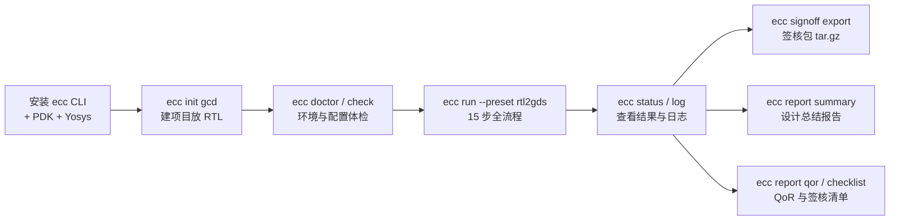
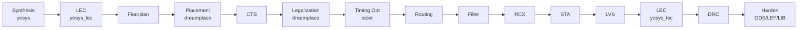

# ECC CLI 入门教程：从零跑通 RTL → Harden 并产出签核包

本教程面向第一次接触 ECC 的用户：从一台只有 Linux 系统的机器开始，安装 `ecc` 命令行工具，把一个 Verilog RTL 设计（[gcd](examples/gcd/gcd.v)，最大公约数计算单元）一路跑完 **综合 → 布局布线 → 物理验证 → 逻辑等价性检查（LEC）→ 时序签核 → Harden** 全流程，最终拿到：

- **Harden 交付物**：GDS 版图、抽象 LEF、时序 LIB、版图快照 PNG；
- **签核包** `gcd_signoff_package.tar.gz`（含 RTL/配置/交付物/LEC 证明/报告等 300+ 文件）；
- **三份报告**：设计总结（文本）、QoR 总分、签核清单。

全程以官方 [ICS55 PDK](https://github.com/openecos-projects/icsprout55-pdk)（开源 55nm 工艺）为目标工艺。教程中所有命令输出均为真实执行结果（基于 v0.1.0-alpha.11，示例路径统一写作 `~/ecc-demo`）。

> 参考耗时：首次安装（下载 CLI 包 / OSS CAD Suite / PDK 数据，共约 3 GB 下载量）20–60 分钟，视网络而定；gcd 全流程运行约 **4–5 分钟**。

## 全流程一览



## 1. 环境要求

| 项 | 要求 |
|---|---|
| 操作系统 | Linux x86_64（其他架构需自行交叉验证） |
| 基础命令 | `bash`、`curl` 或 `wget`、`tar`、`git`、`make`、`bzip2` |
| 磁盘空间 | ≥ 10 GB 空闲（安装后实测：ecc CLI ≈ 3.6 GB + OSS CAD Suite ≈ 2.9 GB + PDK ≈ 1.9 GB） |
| 网络 | 能访问 GitHub（下载 CLI / PDK / OSS CAD Suite；受限环境见 §2.1 的 `GH_PROXY`） |
| Python / 依赖 | **无需**。ecc-tools、DreamPlace 等已捆绑在 CLI 包内 |

## 2. 安装 ecc CLI（从零）

### 2.1 一键安装（推荐）

仓库自带安装脚本 [ecc-cli-setup.sh](ecc-cli-setup.sh)，一条命令完成：下载安装 ecc CLI → 配置 PATH → 环境自检 → 补齐 ICS55 PDK（clone + `make unzip` 下载 liberty/GDS）、Yosys（OSS CAD Suite 最新版，内置 slang 前端）和 Timing optimization 所需的 Sizer。幂等可重复运行，已就绪的部件自动跳过。

```bash
# 获取脚本（clone 仓库可同时拿到本教程用的 gcd 示例 RTL）
git clone --depth 1 https://github.com/openecos-projects/ecc.git
cd ecc

bash docs/ecc-cli-setup.sh
```

安装完成后**当前终端立即生效**（新终端自动生效）：

```bash
source ~/.ecc-env.sh
```

脚本产出一览：

| 产物 | 位置 | 说明 |
|---|---|---|
| ecc CLI | `~/.local/ecc/` | PyInstaller 打包的 `ecc` + `_internal/`，两者须保持在一起 |
| PDK | `~/.local/icsprout55-pdk/` | 环境变量 `CHIPCOMPILER_ICS55_PDK_ROOT` 指向它 |
| Yosys | `~/.local/oss-cad-suite/` | 环境变量 `CHIPCOMPILER_OSS_CAD_DIR` 指向它 |
| Sizer | `~/.local/ecc-sizer/` | `bin/Sizer` 与 `src/sizer_os.tcl`；`ecc doctor` 的必需组件 |
| 环境文件 | `~/.ecc-env.sh` | PATH + 上述变量，已幂等写入 `~/.bashrc`（zsh 则 `~/.zshrc`） |
| 便利软链接 | `~/.local/bin/ecc` | 多数发行版该目录已在 PATH |

常用变体：

```bash
bash docs/ecc-cli-setup.sh --check-only    # 只做环境体检，不安装任何东西
bash docs/ecc-cli-setup.sh --force         # 强制重装 ecc CLI（升级同理）
bash docs/ecc-cli-setup.sh --skip-pdk --skip-tools --skip-sizer   # 只装 ecc CLI 本体；必需依赖未就绪时最终自检会失败
GH_PROXY=https://gh-proxy.org/ bash docs/ecc-cli-setup.sh   # 网络受限走代理
```

### 2.2 安装本地源码构建包

在 Linux x86_64 的本地 checkout 中，先构建压缩包，再把它交给常规安装器：

```bash
cd ecc
bash docs/ecc-cli-local-build.sh

# 替换 CLI 并补齐必需依赖。
ECC_CLI_URL="$PWD/dist/release/ecc-cli-linux-x86_64.tar.gz" \
  bash docs/ecc-cli-setup.sh --force
```

PDK、Yosys 与 Sizer 都已就绪时，只替换 CLI：

```bash
ECC_CLI_URL="file://$PWD/dist/release/ecc-cli-linux-x86_64.tar.gz" \
  bash docs/ecc-cli-setup.sh --force --skip-pdk --skip-tools --skip-sizer
```

最终自检仍要求全部必需依赖就绪，否则会以非零状态退出。

### 2.3 手动安装（可选）

不想用脚本时，三步手动完成同样的事：

```bash
# ① ecc CLI：从 Releases 下载预编译包
mkdir -p ~/.local/ecc
curl -fL -o ecc-cli.tar.gz \
  https://github.com/openecos-projects/ecc/releases/latest/download/ecc-cli-linux-x86_64.tar.gz
tar -xzf ecc-cli.tar.gz -C ~/.local/ecc
mkdir -p ~/.local/bin && ln -sf ~/.local/ecc/ecc ~/.local/bin/ecc   # ~/.local/bin 需在 PATH 中

# ② PDK：icsprout55-pdk，liberty/GDS 需 make unzip（约 1 GB，来自 PDK 官方 Releases）
git clone --depth 1 https://github.com/openecos-projects/icsprout55-pdk.git ~/.local/icsprout55-pdk
make -C ~/.local/icsprout55-pdk unzip
export CHIPCOMPILER_ICS55_PDK_ROOT=~/.local/icsprout55-pdk   # 建议写入 ~/.bashrc

# ③ Yosys：OSS CAD Suite（需 yosys ≥ v0.67，内置 slang 前端）
#    从 https://github.com/YosysHQ/oss-cad-suite-build/releases 下载 linux-x64 包后：
tar -xzf oss-cad-suite-*.tgz -C ~/.local && mv ~/.local/oss-cad-suite* ~/.local/oss-cad-suite
export CHIPCOMPILER_OSS_CAD_DIR=~/.local/oss-cad-suite
```

也可以在建项目后用 CLI 自带的 PDK 子命令接入（二选一）：

```bash
ecc pdk setup                    # clone + make unzip + 接入，一条到位
ecc pdk set-root ~/pdk/icsprout55-pdk   # 已就绪的 PDK 直接接入（写入 ecc.toml）
ecc pdk show                     # 查看生效的 PDK root 与来源
ecc pdk unset                    # 清除 ecc.toml 的 pdk.root，回落到环境变量/仓库默认
```

### 2.4 验证安装

```console
$ ecc version
ecc 0.1.0a11
dreamplace 0.1.0a7
ecc_tools 0.1.0a12
runtime ECC CLI
yosys 0.68+132
sizer not installed
klayout 0.30.2
```

再做一次环境体检（在任意目录均可；只有**必需项**失败才返回非零）：

```console
$ ecc doctor
[status]
  doctor: environment
  status: failed             # 缺少必需组件时返回 rc=1
  checked: 7
  failed: 1
  attention: 0
  run: ecc run
  component: yosys
  status: pass
  required: True
  detail: ~/.local/oss-cad-suite/bin/yosys
  component: yosys-slang
  status: pass
  required: True
  detail: read_slang frontend available
  component: ecc-tools       # dreamplace / klayout / pdk 同理，逐项列出
  ...
  component: sizer
  status: fail
  required: True             # doctor 和 Timing optimization 均要求该组件
  ...
```

必需项（yosys、yosys-slang、ecc-tools、dreamplace、sizer、pdk）全部 `pass` 后，`ecc doctor` 才会成功。就绪的 Sizer 同时需要可执行文件和 runtime root。完整 `rtl2gds` 流包含 Timing optimization 步骤；新建或 `--overwrite` 的 `rtl2gds` 会在启动预检中检查 Sizer，缺失时以 `env_not_ready` 失败。已有 workspace 或 `--workspace` 重跑不预检，缺 Sizer 时仍可能在流中段失败。[ecc-cli-setup.sh](ecc-cli-setup.sh) 会在有预编译 Release 时尝试安装；必需组件未齐时以非零退出。

## 3. 创建第一个项目

### 3.1 初始化

```console
$ mkdir ~/ecc-demo && cd ~/ecc-demo
$ ecc init gcd
[init]
  project: gcd
  status: created
  path: gcd
  check: ecc check --project gcd
  run: ecc run --project gcd

$ cd gcd
```

生成项目骨架：

```
gcd/
├── ecc.toml       # 项目配置（下一步按需修改）
├── rtl/           # 放 Verilog 源码或 filelist
└── constraints/   # 约束预留目录（本教程无需手写约束，见 §3.3）

# workspace 由首个 ecc run 创建：缺省为 gcd/default/，并写入 project.json 登记；
# 可用 ecc run --workspace <名称> 创建其他受管 workspace。旧布局 runs/<id>/ 必须先 ecc migrate。
```

### 3.2 放入 RTL

本教程用仓库自带的 gcd 示例——一个 16/16 bit 减法型 GCD 计算单元（FSM 控制器 + 数据通路，综合后数百个标准单元），小而完整，是验证后端流程的经典教学设计：

```bash
# 从克隆的 ecc 仓库拷贝（或任意你自己的 .v 文件）
cp /path/to/ecc/docs/examples/gcd/gcd.v rtl/

# 没有 clone 仓库时，直接下载单文件也可以：
# curl -fL -o rtl/gcd.v \
#   https://raw.githubusercontent.com/openecos-projects/ecc/main/docs/examples/gcd/gcd.v
```

多文件设计请改用 filelist（`rtl = ["rtl/filelist.f"]`），语法见 [examples/gcd/README.md](examples/gcd/README.md#using-filelist) 与 [filelist 语法](specification/filelist-grammar.md)。

### 3.3 认识 ecc.toml

```toml
[design]
name = "gcd"
top = "gcd"              # 顶层模块名
rtl = ["rtl/gcd.v"]      # 单个 Verilog 文件，或多源时指向 filelist
# 非 RTL 范围可按需声明入口输入：
# netlist = "inputs/gcd.v"
# golden_netlist = "inputs/gcd-golden.v"
# def = "inputs/gcd.def"
# sdc = "constraints/gcd.sdc"
# spef = "inputs/gcd.spef"
clock_port = "clk"       # 时钟端口名
frequency_mhz = 100.0    # 目标频率（MHz）

[pdk]
name = "ics55"           # 目前支持 ics55
root = ""                # 留空则用 CHIPCOMPILER_ICS55_PDK_ROOT 环境变量

[flow]
# preset: rtl2gds | syn_sta | synthesis_lec
preset = "rtl2gds"       # 本教程使用的完整 RTL-to-Harden 流程
```

对 gcd 示例来说，`init` 生成的默认值恰好全部正确（顶层就叫 `gcd`，时钟端口 `clk`），**一个字都不用改**。换你自己的设计时，需要核对 `top`、`rtl`、`clock_port`、`frequency_mhz` 四项。

除了用编辑器改 `ecc.toml`，也可以用 `ecc project` 命令组直接改声明（写入 `ecc.toml`，保留注释；详见[用户指南 §8.5](ecc-cli-ug.cn.md#85-project--workspace--编辑项目资源与刷新-workspace)）：

```bash
ecc project set design.top my_chip            # 设置一条声明
ecc project set design.rtl rtl/cpu.v rtl/uart.v   # 整体替换 RTL 列表
ecc project add design.rtl rtl/sram.v         # 追加一个 RTL 源
ecc project remove design.rtl rtl/sram.v      # 删除一个 RTL 源
ecc project set design.clock_port clk_i       # 改时钟端口名
ecc project set flow.preset syn_sta           # 切换 preset
ecc project show                              # 查看 ecc.toml 里声明的字段
```

两个要点：

- **无需手写 SDC**：flow 会根据 `clock_port` 与 `frequency_mhz` 自动生成约束（`create_clock` + I/O 延迟比例），生成的 SDC 落在 workspace 的 `origin/gcd.sdc`；
- **PDK 解析优先级**：`ecc.toml` 的 `pdk.root` > 环境变量 `CHIPCOMPILER_ICS55_PDK_ROOT` > `ICS55_PDK_ROOT`。`ecc pdk show` 为方便查看还会显示仓库默认路径，但 `ecc check` 与 `ecc run` 必须使用前三种显式来源之一。用了一键安装脚本则环境变量已就绪，`root` 留空即可。

### 3.4 校验

```console
$ ecc check
[check]
  project: gcd
  status: checked
  config: ecc.toml
  inspect: ecc status
  run: ecc run
  rtl: pass
    path: rtl/gcd.v
  inspect: ecc check --json
rc=0
```

`ecc check` 校验配置必填项与 PDK 内容（tech LEF / LEF / liberty）；RTL 源文件的存在性由 `ecc run` 在创建 workspace 时按入口步骤校验。**先 check 再 run**——配置错误在这里就能发现，不必等到 flow 中途失败。

## 4. 运行 RTL → Harden 全流程

### 4.1 启动

`rtl2gds` preset 是完整 15 步链，一步到位跑到 Harden（产出 GDS + 抽象 LEF + 时序 LIB）：

```bash
ecc run --preset rtl2gds
```

（生成的 `ecc.toml` 已选择 `rtl2gds`；`--preset` 只对本次运行生效，不写回配置。）

交互终端下会实时渲染各步骤进度与日志尾部；输出重定向到文件时则静默执行，结束时打印汇总。`rtl2gds` 的 15 步依次为：

| # | 步骤 | 工具 | 作用 |
|---|------|------|------|
| 1 | synthesis | yosys | RTL 综合、工艺映射（slang 前端读入 SystemVerilog） |
| 2 | lec | yosys_lec | 逻辑等价性检查：综合网表与 golden 网表 |
| 3 | floorplan | ecc | 布局规划：die/core 区域、IO pin 排布 |
| 4 | placement | dreamplace | 全局布局 |
| 5 | cts | ecc | 时钟树综合（含扇出约束） |
| 6 | legalization | dreamplace | 布局合法化 |
| 7 | timing optimization | sizer | 时序优化（cell sizing） |
| 8 | routing | ecc | 布线 |
| 9 | filler | ecc | 填充单元插入 |
| 10 | rcx | ecc | 寄生参数提取（多 corner SPEF） |
| 11 | sta | ecc | 多 corner 静态时序分析 |
| 12 | lvs | ecc | 版图与原理图一致性检查 |
| 13 | postroutelec | yosys_lec | 逻辑等价性检查：综合网表 vs 布线后网表 |
| 14 | drc | ecc | 物理规则检查 |
| 15 | harden | ecc | 硬化交付：GDS + 抽象 LEF + 时序 LIB + 版图快照 |



对新建或 `--overwrite` 的目标，`ecc run` 启动前会预检捆绑的 ecc-tools，以及 preset 选中的 Yosys、DreamPlace 和 Sizer（仅含 Timing optimization 的 flow，如 `rtl2gds`）；缺失则以 `env_not_ready` fail-fast 并提示 `ecc doctor`。已有 workspace 或 `--workspace` 重跑不做预检，缺 Sizer 时仍可能在 Timing optimization 步骤失败。

### 4.2 观察进度（另开一个终端）

```bash
ecc status                 # 概览：run 状态 + 每步状态与耗时
ecc log                    # 列出全部日志文件（含尾部预览）
ecc log placement          # 直接查看某步日志内容（自动高亮 ERROR/WARNING 行）
```

```console
$ ecc status
[status]
  workspace id: default
  status: ongoing
  workspace: /home/user/ecc-demo/gcd/default
  inspect: ecc status --workspace default
  log: ecc log --workspace default

  steps:
    synthesis (yosys) success 0:0:17
      log: ecc log synthesis --workspace default
    lec (yosys_lec) success 0:0:1
      log: ecc log lec --workspace default
    floorplan (ecc) success 0:0:1
      log: ecc log floorplan --workspace default
    placement (dreamplace) ongoing 0:0:40
      log: ecc log placement --workspace default
    cts (ecc) unstart
      log: ecc log cts --workspace default
    ...
```

### 4.3 完成

运行结束时（本文参考机器：流程总耗时 **4 分 23 秒**，峰值内存约 1.5 GB，大头是 DreamPlace 布局与多 corner STA）：

```console
$ ecc status
[status]
  workspace id: default
  status: success
  workspace: /home/user/ecc-demo/gcd/default
  inspect: ecc status --workspace default
  log: ecc log --workspace default

  steps:
    synthesis (yosys) success 0:0:17
      log: ecc log synthesis --workspace default
    lec (yosys_lec) success 0:0:1
    floorplan (ecc) success 0:0:1
    placement (dreamplace) success 0:0:47
    cts (ecc) success 0:0:19
    legalization (dreamplace) success 0:0:1
    timing_optimization (sizer) success 0:0:4
    routing (ecc) success 0:0:6
    filler (ecc) success 0:0:2
    rcx (ecc) success 0:0:0
    sta (ecc) success 0:2:35
    lvs (ecc) success 0:0:1
    postroutelec (yosys_lec) success 0:0:1
    drc (ecc) success 0:0:2
    harden (ecc) success 0:0:11
rc=0
```

运行结束的汇总同样给出下一步提示（真实输出节选）：

```console
$ ecc run --preset rtl2gds
[workspace]
  workspace id: default
  status: success
  workspace: /home/user/ecc-demo/gcd/default
  inspect: ecc status --workspace default
  log: ecc log --workspace default
```

某步失败时 `status` 为 `failed`，用 `ecc log <step>` 定位原因，处理方式见 §6 与 §7。再次执行 `ecc run`：已全部成功时是空操作（no_op），中断或失败时则从第一个非成功步骤自动续跑，已成功的步骤不会重跑。

### 4.4 结果都放在哪

每个受管 workspace 独立落在 `gcd/<workspace 名称>/`，创建前先登记到 `project.json`，声明的输入会复制到其 `origin/`。workspace 不保存第二份项目输入清单，每个步骤一个子目录，互不干扰：

```
default/
├── home/               # flow.json（步骤状态）+ params.toml + checklist.json
├── origin/             # 冻结的输入：gcd.v + 自动生成的 gcd.sdc
├── config/             # 各步骤实际生效的配置（ecc config <step> 查看）
├── Synthesis_yosys/    # 每步子目录内含 log/ script/ output/ report/ 等分类
├── lec_yosys_lec/       # 综合级 LEC 等价性检查
├── Floorplan_ecc/
├── ...
├── postRouteLec_yosys_lec/   # LEC 等价性检查（output/<design>_postRouteLec_result.json）
├── Harden_ecc/
│   └── output/
│       ├── gcd_Harden.gds     # 最终版图
│       ├── gcd_Harden.lef     # 抽象 LEF（供上层集成做布线阻挡）
│       ├── gcd_Harden.lib     # 时序 LIB（供上层集成做 STA）
│       └── gcd_Harden.png     # 版图快照
├── log/                # 全局日志
└── signoff/            # §5 生成的报告落在这里
```

Harden 交付物（真实产物）：

```console
$ ls -la default/Harden_ecc/output/
gcd_Harden.gds    7.3 KB   # GDSII 版图
gcd_Harden.lef     14 KB   # 抽象 LEF
gcd_Harden.lib    7.7 KB   # 时序 LIB
gcd_Harden.png    211 KB   # 版图快照
```

## 5. 产出签核包与报告

flow 全部步骤 Success 后，用 `signoff` / `report` 两组命令收尾。

本教程以下命令均在 `gcd/` 项目目录中执行，因此不必指定 selector。从其他目录操作时，传项目和受管 workspace 名称：

```bash
ecc signoff inspect --project /path/to/gcd --workspace default
ecc signoff export --project /path/to/gcd --workspace default -o /path/to/gcd_signoff_package.tar.gz
```

### 5.1 检查签核就绪度：ecc signoff inspect

先刷新已完成步骤的 analysis，再查看交付物是否齐全（即使 `blocked` 也返回 rc=0，真正的门禁在 export）：

```console
$ ecc signoff inspect
[signoff]
  status    : attention
  workspace : default
  export    : ecc signoff export -o <path>
  report    : ecc report summary

  groups:
    initial        ready      (2/2)     # 原始 RTL + SDC
    config         attention  (3/4)     # 各步骤配置
    harden         ready      (4/4)     # GDS / LEF / LIB / PNG
    final_design   ready      (10/10)   # 最终 DEF/GDS/网表 + 各步报告
    sta            ready      (6/6)     # 多 corner 时序报告
    spef           ready      (4/4)     # 寄生参数文件
    reports        attention  (4/6)

  risks:
    [warning] Config signoff attention
              Optional file is missing or empty
    [warning] Reports signoff attention
              Optional file is missing or empty
```

两处 `attention` 都来自**可选**文件缺失：`config.macro_locations`（纯数字设计不需要）与 LEC 的调试转储文件（`lec.failed_rtlil` / `lec.failed_verilog`，只在 LEC **未通过**时才会产生，等价性已证明时不存在属正常），不阻断导出；只有 `blocked`（必需项缺失）才会在 export 时被拒绝。

### 5.2 导出签核包：ecc signoff export

```console
$ ecc signoff export -o gcd_signoff_package.tar.gz
[status]
  signoff: export
  status: exported
  path: /home/user/ecc-demo/gcd/gcd_signoff_package.tar.gz
  inspect: ecc signoff inspect
rc=0
```

包内 356 个文件，按交付逻辑分组：

```
gcd_signoff_package/
├── README.md / manifest.json / summary.json   # 包说明与清单
├── initial/          # 设计输入：gcd.v、gcd.sdc、params.toml
├── config/           # 全部步骤配置（db/floorplan/cts/route/sta/... 共 9 个 json）
├── harden/           # Harden 交付物：gcd.gds / gcd.lef / gcd.lib / gcd.png
├── synthesis/        # 综合网表等中间交付
└── final/
    ├── design/       # 最终 DEF、GDS、网表、版图快照
    ├── timing/       # STA 各 corner 报告 + spef/（多 corner 寄生参数）
    └── reports/      # 各步骤 QoR 指标 + lec/、postRouteLec/（两次 LEC 证明）
```

### 5.3 设计总结报告：ecc report summary

与 GUI「导出报告（文本）」同源，8 个分区（物理面积 / 时序收敛 / 时钟树 / 多 corner / 布线 / 功耗 / 物理验证 / 执行成本）：

```console
$ ecc report summary
[status]
  report: summary
  status: written
  path: /home/user/ecc-demo/gcd/default/signoff/gcd_design_summary.txt
  design: gcd
  bytes: 5894
  view: cat default/signoff/gcd_design_summary.txt
```

本次 gcd 运行的报告节选（完整报告 `cat` 上面那个文件）：

```
[ 1. PHYSICAL & AREA METRICS ]
  Die Area                2342.40 um² (0.0023 mm²)
  Core Utilization        40 %
  Total Instances         457                  Cells placed

[ 2. TIMING CLOSURE & PERFORMANCE ]
  Target Clock Period     10 ns                Target freq: 100 MHz
  Achieved Fmax           562 MHz              Max operating frequency
  Setup Slack (WNS / TNS) 8.22 ns / 0 ns       TIMING MET
  Hold Slack (WNS / TNS)  0.11 ns / 0 ns       TIMING MET

[ 4. MULTI-CORNER TIMING ]
  Corner                     Setup WNS   Setup TNS    Hold WNS    Hold TNS  Status
  MAX_125/Cworst               8.22 ns        0 ns     0.34 ns        0 ns  PASS
  ...（共 13 个 corner，全部 PASS）

[ 7. PHYSICAL VERIFICATION ]
  DRC Status               CLEAN (0 violations)  PASS
  LVS Status               MATCHED (Clean)       PASS

[ 8. FLOW EXECUTION COST ]
  Total Runtime            4m 23s
  Peak Memory Usage        1501.14 MB
```

> 报告不要求 flow 跑完——跑到哪一步就总结到哪一步，缺数据的指标显示 `—`。

### 5.4 QoR 总分：ecc report qor

按 GUI 项目看板同一套规则打分：每条指标折算 0–100 分，按维度加权（Timing 0.35 / Power 0.25 / Routability 0.2 / Area 0.1 / Clock-DFM 0.1），60 分为通过线；缺项维度不重归一化（缺项会拉低总分）：

```console
$ ecc report qor
[status]
  report: qor
  path: default/signoff/gcd_qor_report.txt
  bytes: 9661
  view: cat default/signoff/gcd_qor_report.txt
  design: gcd
  overall score: 58.1
  qor status: Green
  gate status: pass
  dimensions: [{'dimension': 'Timing', 'score': 100.0, 'weight': 0.35, 'metrics': 7},
               {'dimension': 'Routability / Physical', 'score': 56.8, 'weight': 0.2, 'metrics': 14},
               {'dimension': 'Area', 'score': 44.0, 'weight': 0.1, 'metrics': 3},
               {'dimension': 'Clock / DFM', 'score': 73.5, 'weight': 0.1, 'metrics': 8}]
  status: written
```

怎么读这个结果：

- **Flow status: Green、gate: pass** 是核心结论——DRC/LVS/RCX/STA 四个质量门全部通过，时序维度满分，设计可签核交付；
- 总分 58.1 略低于 60 通过线，主要因为小规模设计在 **Area / 绕线长度类绝对值指标**上天然吃亏（如 core 面积、时钟线长度按固定阈值折算），且 **Power 维度缺项**（本流程未含功耗分析步骤，该维度 0.25 权重直接落空）。这是 gcd 这类小设计的常见现象，不代表 flow 有问题；
- 逐指标明细在报告文件的 `[ METRIC SCORES ]` 区。

### 5.5 签核清单：ecc report checklist

渲染 `home/checklist.json`（v3 签核清单）为状态报告，聚焦 **BLOCKED 项**：

```console
$ ecc report checklist
[status]
  report: checklist
  path: default/signoff/checklist_report.txt
  bytes: 3334
  checklist status: attention
  items: 36
  blocked: 0
  attention: 3
  summary counts: {'passed': 33, 'blocked': 0, 'attention': 3, 'unavailable': 0}
  status: written
```

本次 36 项中 33 项 PASS（映射网表、DRC clean、LVS clean、**LEC 等价性 proven**、SPEF 完整性、setup/hold 收敛、Harden GDS/LEF/LIB……），3 项 ATTENTION 均为可选文件缺失（`config.macro_locations` 与 LEC 调试转储 `lec.failed_rtlil`/`lec.failed_verilog`，后者仅 LEC 失败时才存在）。

### 5.6 渲染版图图片（可选）：ecc layout-image

环境里有 KLayout 时，可把任意 GDS 渲染成快照（Harden 步骤其实已自动生成 `gcd_Harden.png`，此命令用于渲染其他 GDS 或自定义尺寸）：

```bash
ecc layout-image --gds default/Harden_ecc/output/gcd_Harden.gds \
                 --image gcd_layout.png --width 2560 --height 1600
```

## 6. 调参与重跑

跑通只是起点，后端迭代的日常是「改参数 → 重跑 → 对比」。

### 6.1 查看与修改参数

```bash
ecc param list                          # 简明列表：旧参数与已显式覆盖项
ecc param list --step cts               # CTS 的全部已审核字段
ecc param list --all                    # 所有步骤的完整 schema
ecc param show place.target_density     # 单个参数：值/默认/范围/映射到哪个工具
ecc param diff                          # 只看与默认值不同的
ecc param set place.target_density 0.55 # 写入 ecc.toml（保留注释与格式）
ecc param set cts.skew_bound 0.05       # 直接修改 CTS 配置字段
ecc param set cts.routing_layer '[4, 5]' # 列表使用 JSON 字面量
ecc param unset place.target_density    # 恢复默认
# workspace 局部覆盖——同样的命令加 --workspace；不改动 ecc.toml：
ecc param set place.target_density 0.60 --workspace exp1   # 写入 exp1 的 home/params.toml
ecc param diff --workspace exp1                            # 与 exp1 创建时的取值对比
ecc param unset place.target_density --workspace exp1      # 恢复 exp1 的原值
```

常用旧参数：`design.frequency_mhz`、`floorplan.core_util`、`place.target_density`、`route.top_layer`、`sta.max_paths`。其余静态工具字段通过每步 schema 提供，用 `--step` / `--all` 查找。workspace 的输入、输出、临时和生成路径不允许修改；PDK 路径参数可用 `ecc param set KEY VALUE` 设置：`pdk.tech`、`pdk.lefs`、`pdk.libs`、`pdk.mapping_file` 相对 `pdk.root` 解析，`pdk.sdc`/`pdk.spef` 是设计数据、相对项目目录解析，`pdk.root` 使用 `ecc pdk set-root`。完整说明见[用户指南 §9](ecc-cli-ug.cn.md#9-param--参数管理)。

`--workspace` 局部设置会把参数所属步骤及其后缀标记为待执行，下一次 `ecc run --workspace exp1` 只重跑这一段——只想微调一个参数时，比 `--overwrite` 整体重建便宜得多。注意只支持已审核参数（`ecc param list --all`），且参数所属步骤必须存在于该 workspace 的 flow 中。

### 6.2 创建受管 workspace

创建时命名 workspace，它会自动登记到 `project.json`：

```bash
ecc run --workspace exp1 --preset rtl2gds --set place.target_density=0.55
ecc status --workspace exp1
ecc report qor --workspace exp1
```

`--set KEY=VALUE` 只对本次 workspace 创建生效并记入 provenance，不改 `ecc.toml`。`project.json` 生成后，项目级查看、签核和报告命令按已声明的 workspace 选择；多个活跃 workspace 时显式传 `--workspace NAME`。

### 6.3 重跑

后端迭代中常见的四种重跑场景（示例均针对 `default` workspace）：

**① 中断后继续**（最常用）：从第一个非成功步骤接着跑，已成功的步骤直接复用，不会重跑。

```bash
ecc run --workspace default --resume
# 不带 --resume 裸跑 ecc run --workspace default 效果相同：
# 已全部成功 → no_op；有失败/未跑步骤 → 自动从断点续跑
```

**② 调参后整体重跑**：`--set` 只在新建 workspace 时生效，重跑旧 workspace 改参数要用 `--overwrite`（或干脆开一个新 workspace 对比，见 §6.2）。只想微调一个参数时，§6.1 的 `--workspace` 局部设置更省——只会让受影响的步骤后缀失效。

```bash
ecc run --workspace default --overwrite            # 重建 default（有安全校验，只删真正的 ECC workspace 目录）
ecc run --workspace default --overwrite --set place.target_density=0.55
```

同样的 `--overwrite` 重跑也是已有 workspace 吸收**入口输入、PDK 路径、`flow.preset`** 变更的方式——这些改动会改变 workspace 的输入快照或 flow 结构。若只想按当前 `ecc.toml` 重建 workspace 而**不执行**，用专用命令（适合批量运行前准备，或当前机器缺少所需工具时）：

```bash
ecc workspace refresh default                      # 按 ecc.toml 重建输入/配置，但不运行
ecc run --workspace default                        # 之后想跑再跑
```

**③ 原地重跑一段/一步**（调试某步工具行为时用）：被重跑步骤的 `output/` 会被替换，其下游步骤标记为待重跑（输出保留）。

```bash
ecc run --workspace default --from CTS --to route  # 重跑 CTS→route 这一段（含两端）
ecc run --workspace default --from CTS             # 从 CTS 重跑到底
ecc run --workspace default --only place           # 只跑 place 一步（已成功则 no_op）
ecc run --workspace default --only place --force   # 已成功也强制重跑这一步
```

**④ 从中间步骤新建范围 workspace**（手上已有现成网表/DEF 时）：新建时必须同时传 `--from` 与 `--to`，两端的步骤名这时写小写别名也可以（如 `cts`、`route`）：

```bash
ecc run --workspace cts-only --from cts --to cts     # 只跑 CTS 一步的 workspace
ecc run --workspace pnr --from floorplan --to route  # 从布局规划到布线
```

**复用已有 Floorplan 输出的完整示例**：从已有 workspace `2` 的 Floorplan 输出创建一个新的 placement 到 routing workspace 时，不能把 DEF 直接传给 `ecc run`。placement 入口要求匹配的 `design.def` 和 `design.netlist`；先用 `ecc project` 写入项目配置，再创建新范围：

```bash
PROJECT=~/projects/benchmark/gcd
SOURCE="$PROJECT/2/Floorplan_ecc/output"

ecc project set design.def "$SOURCE/gcd_Floorplan.def.gz" --project "$PROJECT"
ecc project set design.netlist "$SOURCE/gcd_Floorplan.v.gz" --project "$PROJECT"
ecc run --project "$PROJECT" --workspace floorplan-2-place-route \
  --from placement --to routing
```

这会将 DEF/网表复制到新 workspace 的 `origin/`，从 placement 运行至 routing，不会重新运行 Floorplan；`placement`、`routing` 是新建范围时可用的别名。`ecc project set` 修改的是项目级 `ecc.toml`，也会影响之后新建的 workspace。若这两个字段原来没有设置，在新 workspace 创建后执行 `ecc project unset design.def --project "$PROJECT"` 和 `ecc project unset design.netlist --project "$PROJECT"` 可恢复原先的项目入口。

入口文件按首步要求校验：Synthesis 要 `rtl`；LEC 要 `netlist` 和 `golden_netlist`；Floorplan 要 `netlist`；物理步骤（place/CTS/legalization/timing optimization/route/filler/rcx/drc/lvs/harden）要 `def` 和 `netlist`；STA 要 `def`、`netlist`、`spef`；`sdc` 可选。缺什么会明确报错：

```console
$ ecc run --from cts --to route
[error]
  step_input_missing step_input_missing: cts requires design.def
  step_input_missing step_input_missing: cts requires design.netlist
rc=1
```

> **步骤名怎么写**：`ecc status`/`ecc log` 展示的是小写展示名（如 `placement`、`timing_optimization`）；而 **已有** workspace 上的 `--from`/`--only`/`--to` 要用 `home/flow.json` 里的持久化名（如 `place`、`CTS`、`Timing optimization`）；只有**新建**范围（`--from A --to B` 成对出现）接受小写别名。记不住没关系——拼错时会报 `unknown_step` 并列出全部可用名，照抄即可：
>
> ```console
> $ ecc run --workspace default --only placement   # 持久化名是 "place"
> [error]
>   unknown_step unknown step 'placement'; available steps: Synthesis, lec, Floorplan,
>   place, CTS, legalization, Timing optimization, route, filler, RCX, sta, lvs,
>   postRouteLec, drc, Harden
> ```

### 6.4 查看某步实际生效的配置

```bash
ecc config placement    # 该步在 workspace config/ 下实际用的配置文件
ecc config --plain      # 项目级配置（键值 + 解析后绝对路径）
```

## 7. 常见问题

| 症状 | 原因 | 处理 |
|---|---|---|
| `ecc: command not found` | PATH 未生效 | `source ~/.ecc-env.sh`；重开终端；或检查 `~/.local/bin` 在 PATH |
| `[error] env_not_ready`（run 时） | preset 必需工具缺失 | 按 `ecc doctor` 输出补齐；通常是 yosys/slang，重跑 `bash docs/ecc-cli-setup.sh` |
| `[error] run_exists` | workspace 目录已存在但不是有效 ECC workspace | `ecc run --overwrite`，或换 `--workspace NAME`。注意：**跑完再执行 `ecc run` 不会报这个错**——已成功时是 no_op，中断时自动续跑 |
| `[error] workspace_required` | 项目里有多个活跃 workspace，没指明用哪个 | 按报错列出的名称传 `--workspace NAME` |
| `[error] unknown_step` | `--from`/`--only` 的步骤名拼写与 `home/flow.json` 持久化名不符（如写了 `placement`，持久化名是 `place`） | 照抄报错列出的可用步骤名；详见 §6.3 的「步骤名怎么写」 |
| `[error] set_requires_fresh_run` | 对已有 workspace 用 `--set` | `--set` 只在新建时生效；改用 `--overwrite` 或新 `--workspace` |
| run 汇总带 `warning: ecc.toml values override different project.json base values`（`config_layer_diverged`） | `ecc.toml` 与首次运行记录到 `project.json` 的基线实际不一致：`pdk.root` 解析到了与首次运行不同的 PDK（如环境变量改指向），或 `flow.preset` 与 workspace 声明的范围不一致（如用 `--preset synthesis_lec` 建的 workspace 配 `rtl2gds` 的 ecc.toml） | 不影响执行结果，可忽略；对齐两边即消失（`ecc pdk set-root` 或修正 `flow.preset`） |
| `[error] signoff_incomplete`（export 时） | 必需交付物缺失（如某步失败） | `ecc signoff inspect` 看 blocked 项；`ecc status`/`ecc log` 排查失败步骤后重跑 |
| `ecc check` 报 `pdk.root is required` | 未找到 PDK | `ecc pdk setup` 或 `ecc pdk set-root <路径>`，或设 `CHIPCOMPILER_ICS55_PDK_ROOT` |
| PDK liberty 缺失 | 只 clone 了 PDK 没下数据 | `make -C ~/.local/icsprout55-pdk unzip`（可加 `USE_PROXY=true GH_PROXY=...`） |
| 下载 GitHub 资源超时 | 网络受限 | `GH_PROXY=https://gh-proxy.org/ bash docs/ecc-cli-setup.sh` |
| doctor 显示 `sizer: fail` | 必需的 Sizer 组件未安装 | `ecc doctor` 返回非零。完整 `rtl2gds` 链含 Timing optimization 步骤，运行前应安装 Sizer。重跑 [ecc-cli-setup.sh](ecc-cli-setup.sh)（官方发布预编译包后自动安装），或按 remediation 提示源码构建 |
| synthesis 日志报 `yosys slang frontend check failed` | yosys 无 slang 前端 | 换 OSS CAD Suite ≥ v0.67 的 yosys，`ecc log synthesis` 排查 |
| synthesis 在 DFFLIBMAP 报 `uncaught exception during Yosys command invoked from TCL` 后退出 | 当前 shell 未加载 ecc 环境（如非交互终端），ecc 回落到系统 PATH 里的旧版 yosys（解析 ics55 liberty 会直接崩溃，异常详情被 TCL 吞掉） | `which yosys` 确认指向 OSS CAD Suite；`source ~/.ecc-env.sh` 后重跑 |

## 8. 下一步

- 换你自己的设计：改 `ecc.toml` 的 `top`/`rtl`/`clock_port`/`frequency_mhz`，多文件用 [filelist](examples/gcd/README.md#using-filelist)；
- 了解 preset 差异：`rtl2gds`（完整 15 步综合到 Harden 链，含综合级 LEC）、`syn_sta`（仅综合）、`synthesis_lec`（综合 + LEC，两步）；
- 全部命令细节见 **[ECC CLI 用户指南](ecc-cli-ug.cn.md)**；CLI 扩展开发见 [ecc-cli-dev.cn.md](ecc-cli-dev.cn.md)；
- 用 Python API 直接编排 flow（`EngineFlow`）见 [examples/gcd/ics55flow.py](examples/gcd/ics55flow.py)。

---

*本教程的示例输出采集自 v0.1.0-alpha.11 + ICS55 PDK 在 Linux x86_64 上的真实运行。*
