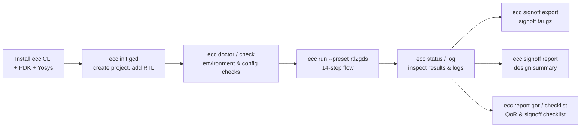
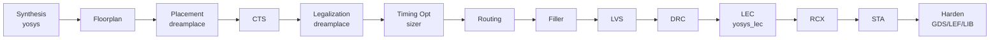

# ECC CLI Tutorial: From Zero to RTL → Harden with a Signoff Package

This tutorial is for first-time ECC users: starting from a bare Linux machine, install the `ecc` command-line tool and drive a Verilog RTL design ([gcd](examples/gcd/gcd.v), a greatest-common-divisor unit) through the full **synthesis → place & route → physical verification → logic equivalence check (LEC) → timing signoff → Harden** flow, ending up with:

- **Harden deliverables**: GDS layout, abstract LEF, timing LIB, and a layout snapshot PNG;
- A **signoff package** `gcd_signoff_package.tar.gz` (300+ files: RTL / configs / deliverables / LEC proof / reports);
- **Three reports**: design summary (text), QoR score, and signoff checklist.

The target process is the official [ICS55 PDK](https://github.com/openecos-projects/icsprout55-pdk) (an open-source 55 nm educational PDK). Every command output in this tutorial is a real execution result (captured on v0.1.0a11; example paths are written as `~/ecc-demo`).

> Reference timing: first-time install (downloads the PDK and OSS CAD Suite, roughly 3 GB total) takes 20–60 minutes depending on network; the gcd flow itself runs in about **4–5 minutes**.

## The Big Picture



## 1. Requirements

| Item | Requirement |
|---|---|
| OS | Linux x86_64 (other architectures are untested) |
| Basic commands | `bash`, `curl` or `wget`, `tar`, `git`, `make`, `bzip2` |
| Disk | ≥ 10 GB free (measured after install: ecc CLI ≈ 3.6 GB + OSS CAD Suite ≈ 2.9 GB + PDK ≈ 1.9 GB) |
| Network | Access to GitHub (to download the CLI / PDK / OSS CAD Suite; see `GH_PROXY` in §2.1 for restricted networks) |
| Python / deps | **None**. ecc-tools, DreamPlace, etc. are bundled inside the CLI package |

## 2. Installing the ecc CLI (from zero)

### 2.1 One-shot installer (recommended)

The repository ships an installer script, [ecc-cli-setup.sh](ecc-cli-setup.sh), which does everything in one command: download and install the ecc CLI → set up PATH → run an environment self-check → provision the ICS55 PDK (clone + `make unzip` to fetch liberty/GDS), Yosys (latest OSS CAD Suite with the slang frontend built in), and Sizer for Timing optimization. It is idempotent — rerunning skips anything already in place.

```bash
# Get the script (cloning the repo also gives you the gcd example RTL used here)
git clone --depth 1 https://github.com/openecos-projects/ecc.git
cd ecc

bash docs/ecc-cli-setup.sh
```

After installation, make it effective **in the current terminal immediately** (new terminals pick it up automatically):

```bash
source ~/.ecc-env.sh
```

What the script installs:

| Artifact | Location | Notes |
|---|---|---|
| ecc CLI | `~/.local/ecc/` | PyInstaller bundle: `ecc` + `_internal/`; the two must stay together |
| PDK | `~/.local/icsprout55-pdk/` | pointed to by `CHIPCOMPILER_ICS55_PDK_ROOT` |
| Yosys | `~/.local/oss-cad-suite/` | pointed to by `CHIPCOMPILER_OSS_CAD_DIR` |
| Sizer | `~/.local/ecc-sizer/` | `bin/Sizer` plus `src/sizer_os.tcl`; required by `ecc doctor` |
| Environment file | `~/.ecc-env.sh` | PATH + the variables above; idempotently appended to `~/.bashrc` (or `~/.zshrc` for zsh) |
| Convenience symlink | `~/.local/bin/ecc` | that directory is already on PATH on most distros |

Common variants:

```bash
bash docs/ecc-cli-setup.sh --check-only    # environment check only, installs nothing
bash docs/ecc-cli-setup.sh --force         # force-reinstall the ecc CLI (also how you upgrade)
bash docs/ecc-cli-setup.sh --skip-pdk --skip-tools --skip-sizer   # install only the ecc CLI; the final check fails until required dependencies are ready
GH_PROXY=https://gh-proxy.org/ bash docs/ecc-cli-setup.sh   # use a proxy on restricted networks
```

### 2.2 Install a local source-built bundle

From a local checkout on Linux x86_64, build the bundle and pass the archive to
the normal installer:

```bash
cd ecc
bash docs/ecc-cli-local-build.sh

# Replace the CLI and provision any required dependencies.
ECC_CLI_URL="$PWD/dist/release/ecc-cli-linux-x86_64.tar.gz" \
  bash docs/ecc-cli-setup.sh --force
```

When the PDK, Yosys, and Sizer are already ready, replace only the CLI:

```bash
ECC_CLI_URL="file://$PWD/dist/release/ecc-cli-linux-x86_64.tar.gz" \
  bash docs/ecc-cli-setup.sh --force --skip-pdk --skip-tools --skip-sizer
```

The final self-check still requires every dependency to be ready.

### 2.3 Manual install (optional)

If you prefer not to use the script, the same result takes three steps:

```bash
# ① ecc CLI: download the prebuilt package from Releases
mkdir -p ~/.local/ecc
curl -fL -o ecc-cli.tar.gz \
  https://github.com/openecos-projects/ecc/releases/latest/download/ecc-cli-linux-x86_64.tar.gz
tar -xzf ecc-cli.tar.gz -C ~/.local/ecc
mkdir -p ~/.local/bin && ln -sf ~/.local/ecc/ecc ~/.local/bin/ecc   # ~/.local/bin must be on PATH

# ② PDK: icsprout55-pdk; liberty/GDS need `make unzip` (~1 GB, from the PDK's own Releases)
git clone --depth 1 https://github.com/openecos-projects/icsprout55-pdk.git ~/.local/icsprout55-pdk
make -C ~/.local/icsprout55-pdk unzip
export CHIPCOMPILER_ICS55_PDK_ROOT=~/.local/icsprout55-pdk   # recommended: add to ~/.bashrc

# ③ Yosys: OSS CAD Suite (needs yosys ≥ v0.67 for the built-in slang frontend)
#    Download the linux-x64 package from https://github.com/YosysHQ/oss-cad-suite-build/releases, then:
tar -xzf oss-cad-suite-*.tgz -C ~/.local && mv ~/.local/oss-cad-suite* ~/.local/oss-cad-suite
export CHIPCOMPILER_OSS_CAD_DIR=~/.local/oss-cad-suite
```

Alternatively, hook the PDK up with the CLI's own `pdk` subcommands after creating a project:

```bash
ecc pdk setup                    # clone + make unzip + wire up, all in one
ecc pdk set-root ~/pdk/icsprout55-pdk   # attach an already-provisioned PDK (written to ecc.toml)
ecc pdk show                     # show the effective PDK root and where it came from
ecc pdk unset                    # clear pdk.root in ecc.toml (falls back to env vars / repo default)
```

### 2.4 Verify the installation

```console
$ ecc version
ecc 0.1.0a11
dreamplace 0.1.0a7
ecc_tools 0.1.0a12
runtime ECC CLI
yosys 0.68+132
sizer not installed
klayout 0.30.2
```

Then run an environment check (works from any directory; only **required** failures produce a non-zero exit code):

```console
$ ecc doctor
[status]
  doctor: environment
  status: failed             # a missing required component returns rc=1
  checked: 7
  failed: 1
  attention: 0
  run: ecc run
  component: yosys
  status: pass
  required: True
  detail: ~/.local/oss-cad-suite/bin/yosys
  component: yosys-slang
  status: pass
  required: True
  detail: read_slang frontend available
  component: ecc-tools       # dreamplace / klayout / pdk are listed the same way, one by one
  ...
  component: sizer
  status: fail
  required: True             # required by doctor and by Timing optimization
  ...
```

All required components (yosys, yosys-slang, ecc-tools, dreamplace, sizer, and pdk) must `pass` before `ecc doctor` succeeds. A ready Sizer has both its executable and runtime root. The complete `rtl2gds` flow contains a Timing optimization step, so **a missing Sizer also fails mid-flow**; it is not currently part of `ecc run` preflight. [ecc-cli-setup.sh](ecc-cli-setup.sh) attempts a prebuilt installation when a release is available and exits non-zero until the required components are ready.

## 3. Creating Your First Project

### 3.1 Initialize

```console
$ mkdir ~/ecc-demo && cd ~/ecc-demo
$ ecc init gcd
[init]
  project: gcd
  status: created
  path: gcd
  check: ecc check --project gcd
  run: ecc run --project gcd

$ cd gcd
```

This generates the project skeleton:

```
gcd/
├── ecc.toml       # project config (edit as needed in the next step)
├── rtl/           # put Verilog sources or a filelist here
└── constraints/   # reserved for constraints (none needed in this tutorial, see §3.3)

# the workspace is created by the first `ecc run`: `gcd/<run-id>/` for fresh projects,
# registered in an auto-created `project.json`; choose --run-id on that first run when
# you want a non-default tracked workspace. Legacy `runs/<id>/` is upgraded by `ecc migrate`
```

### 3.2 Add the RTL

This tutorial uses the bundled gcd example — a 16/16-bit subtractive GCD unit (FSM controller + datapath, a few hundred standard cells after synthesis). Small but complete, it is a classic teaching design for exercising a backend flow:

```bash
# Copy it from your clone of the ecc repo (or use any .v file of your own)
cp /path/to/ecc/docs/examples/gcd/gcd.v rtl/

# No clone? Download the single file directly:
# curl -fL -o rtl/gcd.v \
#   https://raw.githubusercontent.com/openecos-projects/ecc/main/docs/examples/gcd/gcd.v
```

For multi-file designs, switch to a filelist (`rtl = ["rtl/filelist.f"]`); see [examples/gcd/README.md](examples/gcd/README.md#using-filelist) and the [filelist grammar](specification/filelist-grammar.md).

### 3.3 Understanding ecc.toml

```toml
[design]
name = "gcd"
top = "gcd"              # top module name
rtl = ["rtl/gcd.v"]      # a single Verilog file, or a filelist for multi-source designs
clock_port = "clk"       # clock port name
frequency_mhz = 100.0    # target frequency (MHz)

[pdk]
name = "ics55"           # ics55 is currently the only supported PDK
root = ""                # empty = fall back to the CHIPCOMPILER_ICS55_PDK_ROOT env var

[flow]
# preset: rtl2gds | syn_sta | synthesis_lec
preset = "rtl2gds"       # the complete RTL-to-Harden flow used in this tutorial
run = "default"          # run id (workspace defaults to <project>/<id>; legacy projects use runs/<id>)
```

For the gcd example, the defaults produced by `init` happen to be exactly right (the top module is literally `gcd`, the clock port is `clk`) — **you don't need to change a single character**. For your own design, check the four fields `top`, `rtl`, `clock_port`, and `frequency_mhz`.

Two things worth knowing:

- **No hand-written SDC needed**: the flow generates constraints automatically from `clock_port` and `frequency_mhz` (`create_clock` + an I/O delay ratio); the generated SDC lands in the workspace's `origin/gcd.sdc`;
- **PDK resolution order**: `pdk.root` in `ecc.toml` > env var `CHIPCOMPILER_ICS55_PDK_ROOT` > `ICS55_PDK_ROOT`. `ecc pdk show` also reports a repository-default path for convenience, but `ecc check` and `ecc run` require one of the three explicit sources. If you used the one-shot installer, the env var is already set, so leaving `root` empty is fine.

### 3.4 Validate

```console
$ ecc check
[check]
  project: gcd
  status: checked
  config: ecc.toml
  inspect: ecc status
  run: ecc run
  rtl: pass
    path: rtl/gcd.v
  inspect: ecc check --json
rc=0
```

`ecc check` validates required config fields, RTL paths, and PDK contents (tech LEF / LEF / liberty). **Always check before run** — config mistakes surface here instead of failing the flow halfway through.

## 4. Running the RTL → Harden Flow

### 4.1 Start

The `rtl2gds` preset is the full 14-step chain, running all the way through Harden (which produces the GDS + abstract LEF + timing LIB):

```bash
ecc run --preset rtl2gds
```

(The generated `ecc.toml` already selects `rtl2gds`; `--preset` applies to this run only and is not written back.)

In an interactive terminal the CLI renders live per-step progress and log tails; with output redirected to a file it runs silently and prints a summary at the end. The 14 `rtl2gds` steps are:

| # | Step | Tool | What it does |
|---|------|------|--------------|
| 1 | synthesis | yosys | RTL synthesis and technology mapping (slang frontend reads SystemVerilog) |
| 2 | floorplan | ecc | Floorplan: die/core regions, IO pin placement |
| 3 | placement | dreamplace | Global placement |
| 4 | cts | ecc | Clock tree synthesis (incl. fanout limits) |
| 5 | legalization | dreamplace | Placement legalization |
| 6 | timing optimization | sizer | Timing optimization (cell sizing) |
| 7 | routing | ecc | Routing |
| 8 | filler | ecc | Filler cell insertion |
| 9 | lvs | ecc | Layout-vs-schematic check |
| 10 | drc | ecc | Design rule check |
| 11 | postroutelec | yosys_lec | Logic equivalence check: synthesis netlist vs post-route netlist |
| 12 | rcx | ecc | Parasitic extraction (multi-corner SPEF) |
| 13 | sta | ecc | Multi-corner static timing analysis |
| 14 | harden | ecc | Hardened handoff: GDS + abstract LEF + timing LIB + layout snapshot |



Before starting, `ecc run` pre-checks bundled ecc-tools plus Yosys and DreamPlace when selected by the preset, and fails fast with a pointer to `ecc doctor` if they are missing. Sizer is not part of this preflight; because the complete `rtl2gds` flow contains Timing optimization, a missing Sizer fails at that step.

### 4.2 Watching progress (in a second terminal)

```bash
ecc status                 # overview: run status + per-step status and runtime
ecc log                    # list all log files (with tail previews)
ecc log placement          # print a step's log (ERROR/WARNING lines are highlighted)
```

```console
$ ecc status
[status]
  run: default
  status: ongoing
  workspace: /home/user/ecc-demo/gcd/default
  inspect: ecc status
  log: ecc log

  steps:
    synthesis (yosys) success 0:0:17
      log: ecc log synthesis
    floorplan (ecc) success 0:0:1
    placement (dreamplace) ongoing 0:0:40
      log: ecc log placement
    cts (ecc) unstart
    timing optimization (sizer) unstart
    ...
```

### 4.3 Completion

When the run finishes (reference machine for this article: total flow time **4 min 23 s**, peak memory ~1.5 GB, dominated by DreamPlace placement and multi-corner STA):

```console
$ ecc status
[status]
  run: default
  status: success
  workspace: /home/user/ecc-demo/gcd/default
  inspect: ecc status
  log: ecc log

  steps:
    synthesis (yosys) success 0:0:17
    floorplan (ecc) success 0:0:1
    placement (dreamplace) success 0:0:47
    cts (ecc) success 0:0:19
    legalization (dreamplace) success 0:0:1
    timing optimization (sizer) success 0:0:4
    routing (ecc) success 0:0:6
    filler (ecc) success 0:0:2
    lvs (ecc) success 0:0:1
    drc (ecc) success 0:0:2
    postroutelec (yosys_lec) success 0:0:1
    rcx (ecc) success 0:0:0
    sta (ecc) success 0:2:35
    harden (ecc) success 0:0:11
rc=0
```

If a step fails, `status` shows `failed`; locate the cause with `ecc log <step>` — remedies in §6 and §7.

### 4.4 Where everything lands

Each run gets an isolated workspace (`gcd/<run-id>/` for fresh projects — the first run also writes a `project.json` registering it; `runs/<run-id>/` for legacy projects), one subdirectory per step:

```
default/
├── home/               # flow.json (step states) + params.toml + checklist.json
├── origin/             # frozen inputs: gcd.v + the auto-generated gcd.sdc
├── config/             # configs actually in effect per step (view: ecc config <step> --resolved)
├── Synthesis_yosys/    # each step dir is organized into log/ script/ output/ report/ ...
├── Floorplan_ecc/
├── ...
├── postRouteLec_yosys_lec/   # LEC equivalence check (output/<design>_postRouteLec_result.json)
├── Harden_ecc/
│   └── output/
│       ├── gcd_Harden.gds     # final layout
│       ├── gcd_Harden.lef     # abstract LEF (routing blockage for chip-level integration)
│       ├── gcd_Harden.lib     # timing LIB (for STA at the integration level)
│       └── gcd_Harden.png     # layout snapshot
├── log/                # global log
└── signoff/            # reports from §5 land here
```

Harden deliverables (real artifacts):

```console
$ ls -la default/Harden_ecc/output/
gcd_Harden.gds    7.3 KB   # GDSII layout
gcd_Harden.lef     14 KB   # abstract LEF
gcd_Harden.lib    7.7 KB   # timing LIB
gcd_Harden.png    211 KB   # layout snapshot
```

## 5. Producing the Signoff Package and Reports

Once every step reports Success, finish with the `signoff` / `report` command groups.

### 5.1 Check signoff readiness: ecc signoff inspect

First refresh completed-step analysis and inspect deliverable completeness (even `blocked` returns rc=0 — the real gate is at export):

```console
$ ecc signoff inspect
[signoff]
  status    : attention
  workspace : default
  export    : ecc signoff export -o <path>
  report    : ecc signoff report

  groups:
    initial        ready      (2/2)     # original RTL + SDC
    config         attention  (3/4)     # per-step configs
    harden         ready      (4/4)     # GDS / LEF / LIB / PNG
    final_design   ready      (10/10)   # final DEF/GDS/netlist + per-step reports
    sta            ready      (6/6)     # multi-corner timing reports
    spef           ready      (4/4)     # parasitic files
    reports        attention  (4/6)

  risks:
    [warning] Config signoff attention
              Optional file is missing or empty
    [warning] Reports signoff attention
              Optional file is missing or empty
```

Both `attention` items come from **optional** files being absent: `config.macro_locations` (not needed for a pure digital design) and the LEC debug dumps (`lec.failed_rtlil` / `lec.failed_verilog`, which only exist when LEC *fails* — their absence after a proven run is expected). They do not block export; only `blocked` (a missing *required* item) gets rejected at export time.

### 5.2 Export the signoff package: ecc signoff export

```console
$ ecc signoff export -o gcd_signoff_package.tar.gz
[status]
  signoff: export
  status: exported
  path: /home/user/ecc-demo/gcd/gcd_signoff_package.tar.gz
  inspect: ecc signoff inspect
rc=0
```

The package contains 356 files, grouped by handoff logic:

```
gcd_signoff_package/
├── README.md / manifest.json / summary.json   # package readme & manifests
├── initial/          # design inputs: gcd.v, gcd.sdc, params.toml
├── config/           # all step configs (db/floorplan/cts/route/sta/... — 9 json files)
├── harden/           # Harden deliverables: gcd.gds / gcd.lef / gcd.lib / gcd.png
├── synthesis/        # intermediate handoffs such as the mapped netlist
└── final/
    ├── design/       # final DEF, GDS, netlist, layout snapshot
    ├── timing/       # per-corner STA reports + spef/ (multi-corner parasitics)
    └── reports/      # per-step QoR metrics + postRouteLec/ (LEC equivalence proof)
```

### 5.3 Design summary report: ecc signoff report

Same source as the GUI's "export text report", with 8 sections (physical & area / timing closure / clock tree / multi-corner / routing / power / physical verification / execution cost):

```console
$ ecc signoff report
[status]
  signoff: report
  status: written
  path: /home/user/ecc-demo/gcd/default/signoff/gcd_design_summary.txt
  design: gcd
  bytes: 5894
  view: cat default/signoff/gcd_design_summary.txt
```

Excerpts from this gcd run (full report: `cat` the file above):

```
[ 1. PHYSICAL & AREA METRICS ]
  Die Area                2342.40 um² (0.0023 mm²)
  Core Utilization        40 %
  Total Instances         457                  Cells placed

[ 2. TIMING CLOSURE & PERFORMANCE ]
  Target Clock Period     10 ns                Target freq: 100 MHz
  Achieved Fmax           562 MHz              Max operating frequency
  Setup Slack (WNS / TNS) 8.22 ns / 0 ns       TIMING MET
  Hold Slack (WNS / TNS)  0.11 ns / 0 ns       TIMING MET

[ 4. MULTI-CORNER TIMING ]
  Corner                     Setup WNS   Setup TNS    Hold WNS    Hold TNS  Status
  MAX_125/Cworst               8.22 ns        0 ns     0.34 ns        0 ns  PASS
  ...(13 corners in total, all PASS)

[ 7. PHYSICAL VERIFICATION ]
  DRC Status               CLEAN (0 violations)  PASS
  LVS Status               MATCHED (Clean)       PASS

[ 8. FLOW EXECUTION COST ]
  Total Runtime            4m 23s
  Peak Memory Usage        1501.14 MB
```

> The report does not require the flow to be complete — it summarizes whatever has run so far; metrics without data show `—`.

### 5.4 QoR score: ecc report qor

Scores the workspace with the same rules as the GUI project dashboard: each metric maps to 0–100, dimensions are weighted (Timing 0.35 / Power 0.25 / Routability 0.2 / Area 0.1 / Clock-DFM 0.1), 60 is the pass line; absent dimensions are not renormalized (absence drags the overall score down):

```console
$ ecc report qor
[status]
  report: qor
  path: default/signoff/gcd_qor_report.txt
  bytes: 9661
  view: cat default/signoff/gcd_qor_report.txt
  design: gcd
  overall score: 58.1
  qor status: Green
  gate status: pass
  dimensions: [{'dimension': 'Timing', 'score': 100.0, 'weight': 0.35, 'metrics': 7},
               {'dimension': 'Routability / Physical', 'score': 56.8, 'weight': 0.2, 'metrics': 14},
               {'dimension': 'Area', 'score': 44.0, 'weight': 0.1, 'metrics': 3},
               {'dimension': 'Clock / DFM', 'score': 73.5, 'weight': 0.1, 'metrics': 8}]
  status: written
```

How to read this:

- **Flow status: Green, gate: pass** is the key conclusion — all four quality gates (DRC/LVS/RCX/STA) passed and Timing scored full marks; the design is signoff-ready;
- The overall 58.1 sits slightly below the 60 pass line, mostly because small designs lose out on **absolute Area / wirelength metrics** (core area and clock wirelength are scored against fixed thresholds) and because the **Power dimension is absent** (this flow has no power analysis step, so that 0.25 weight goes to waste). This is normal for a design the size of gcd, not a flow problem;
- Per-metric details are in the `[ METRIC SCORES ]` section of the report file.

### 5.5 Signoff checklist: ecc report checklist

Renders `home/checklist.json` (the v3 signoff checklist) into a status report focused on **BLOCKED items**:

```console
$ ecc report checklist
[status]
  report: checklist
  path: default/signoff/checklist_report.txt
  bytes: 3334
  checklist status: attention
  items: 36
  blocked: 0
  attention: 3
  summary counts: {'passed': 33, 'blocked': 0, 'attention': 3, 'unavailable': 0}
  status: written
```

Of the 36 items, 33 PASS (mapped netlist, DRC clean, LVS clean, **LEC equivalence proven**, SPEF integrity, setup/hold closure, Harden GDS/LEF/LIB, ...); the 3 ATTENTION items are all missing optional files (`config.macro_locations` and the LEC debug dumps `lec.failed_rtlil`/`lec.failed_verilog`, which only exist when LEC fails).

### 5.6 Render a layout image (optional): ecc layout-image

With KLayout available in the environment, any GDS can be rendered to a snapshot (the Harden step already auto-generates `gcd_Harden.png`; use this command for other GDS files or custom sizes):

```bash
ecc layout-image --gds default/Harden_ecc/output/gcd_Harden.gds \
                 --image gcd_layout.png --width 2560 --height 1600
```

## 6. Tuning Parameters and Rerunning

Getting through once is only the start — the daily backend loop is "tweak → rerun → compare".

### 6.1 Viewing and changing parameters

```bash
ecc param list                          # concise list: legacy parameters and explicit overrides
ecc param list --step cts               # all reviewed CTS fields
ecc param list --all                    # complete schema for every step
ecc param show place.target_density     # one parameter: value/default/range/tool mapping
ecc param diff                          # only those differing from defaults
ecc param set place.target_density 0.55 # written to ecc.toml (comments & formatting preserved)
ecc param set cts.skew_bound 0.05       # change a direct CTS configuration field
ecc param set cts.routing_layer '[4, 5]' # lists use JSON literals
ecc param unset place.target_density    # back to default
```

Frequently used legacy parameters are `design.frequency_mhz`, `floorplan.core_util`, `place.target_density`, `route.top_layer`, and `sta.max_paths`. Other static tool fields are supplied by per-step schemas; find them with `--step` or `--all`. Workspace input, output, temporary, and generated paths cannot be changed. PDK path parameters use `ecc param set KEY VALUE`: `pdk.tech`, `pdk.lefs`, `pdk.libs`, and `pdk.mapping_file` resolve against `pdk.root`, while `pdk.sdc`/`pdk.spef` are design data resolved against the project directory; keep `pdk.root` on `ecc pdk set-root`. See [User Guide §9](ecc-cli-ug.en.md#9-param--parameter-management) for the full contract.

### 6.2 Choosing a tracked run

Choose a non-default id before the first run so the automatically generated manifest records it:

```bash
ecc run --run-id exp1 --preset rtl2gds --set place.target_density=0.55
ecc status --run-id exp1
ecc report qor --run-id exp1     # report commands also accept --run-id
```

`--set KEY=VALUE` applies to that run only (recorded in its provenance) and does not modify `ecc.toml`. Once `project.json` exists, project-scoped inspection selects only declared workspaces. `ecc run --run-id` can create an undeclared single-segment workspace, but it reports `workspace_not_registered` and cannot later be selected by project-scoped `status`, `log`, or `config`; add further tracked workspaces through the manifest-owning UI.

### 6.3 Rerunning

```bash
ecc run --overwrite --preset rtl2gds      # wipe and redo the whole run (deletes the run dir, with safety checks)
ecc run --workspace default --from CTS        # rerun from CTS through the end
ecc run --workspace default --only place --force   # rerun a single step (--force needed if it already succeeded)
ecc run --workspace default --resume   # continue from the first non-successful step
```

Note: `--from`/`--only` take the raw step names from `home/flow.json` (e.g. `place`, `CTS`), not the lower-case display names.

### 6.4 Inspecting a step's effective configuration

```bash
ecc config placement --resolved    # config files actually used by that step under the workspace's config/
ecc config --resolved --plain      # project-level config (key=value + resolved absolute paths)
```

## 7. Troubleshooting

| Symptom | Cause | Fix |
|---|---|---|
| `ecc: command not found` | PATH not effective | `source ~/.ecc-env.sh`; open a new terminal; check `~/.local/bin` is on PATH |
| `[error] env_not_ready` (at run) | tools required by the preset are missing | Follow `ecc doctor`; usually yosys/slang — rerun `bash docs/ecc-cli-setup.sh` |
| `[error] run_exists` | the run directory already exists | `ecc run --overwrite`, or use a different `--run-id` |
| `[error] signoff_incomplete` (at export) | required deliverables missing (e.g. a failed step) | `ecc signoff inspect` for blocked items; debug with `ecc status`/`ecc log`, then rerun |
| `ecc check` reports `pdk.root is required` | no PDK found | `ecc pdk setup` or `ecc pdk set-root <path>`, or set `CHIPCOMPILER_ICS55_PDK_ROOT` |
| PDK liberty missing | PDK cloned without data files | `make -C ~/.local/icsprout55-pdk unzip` (add `USE_PROXY=true GH_PROXY=...` if needed) |
| GitHub downloads time out | restricted network | `GH_PROXY=https://gh-proxy.org/ bash docs/ecc-cli-setup.sh` |
| doctor shows `sizer: fail` | required Sizer component not installed | `ecc doctor` exits non-zero. The complete `rtl2gds` chain contains Timing optimization, so install Sizer before running it. Re-run [ecc-cli-setup.sh](ecc-cli-setup.sh) (installs the prebuilt package automatically once published), or build ecc-sizer per the remediation hint |
| synthesis log says `yosys slang frontend check failed` | yosys lacks the slang frontend | use an OSS CAD Suite yosys ≥ v0.67; debug with `ecc log synthesis` |
| synthesis aborts at DFFLIBMAP with `uncaught exception during Yosys command invoked from TCL` | the current shell never loaded the ecc env (e.g. a non-interactive terminal), so ecc fell back to an old yosys on system PATH, which crashes parsing the ics55 liberty (the TCL wrapper swallows the exception detail) | verify `which yosys` points at the OSS CAD Suite; `source ~/.ecc-env.sh` and rerun |

## 8. Next Steps

- Try your own design: edit `top`/`rtl`/`clock_port`/`frequency_mhz` in `ecc.toml`; use a [filelist](examples/gcd/README.md#using-filelist) for multi-file designs;
- Preset differences: `rtl2gds` (the complete 14-step synthesis-to-Harden chain), `syn_sta` (synthesis only), and `synthesis_lec` (synthesis + LEC, two steps);
- Full command details in the **[ECC CLI User Guide](ecc-cli-ug.en.md)**; extending the CLI is covered in [ecc-cli-dev.en.md](ecc-cli-dev.en.md);
- Driving the flow directly via the Python API (`EngineFlow`): [examples/gcd/ics55flow.py](examples/gcd/ics55flow.py).

---

*Outputs in this tutorial were captured from a real run of v0.1.0a11 + the ICS55 PDK on Linux x86_64.*
